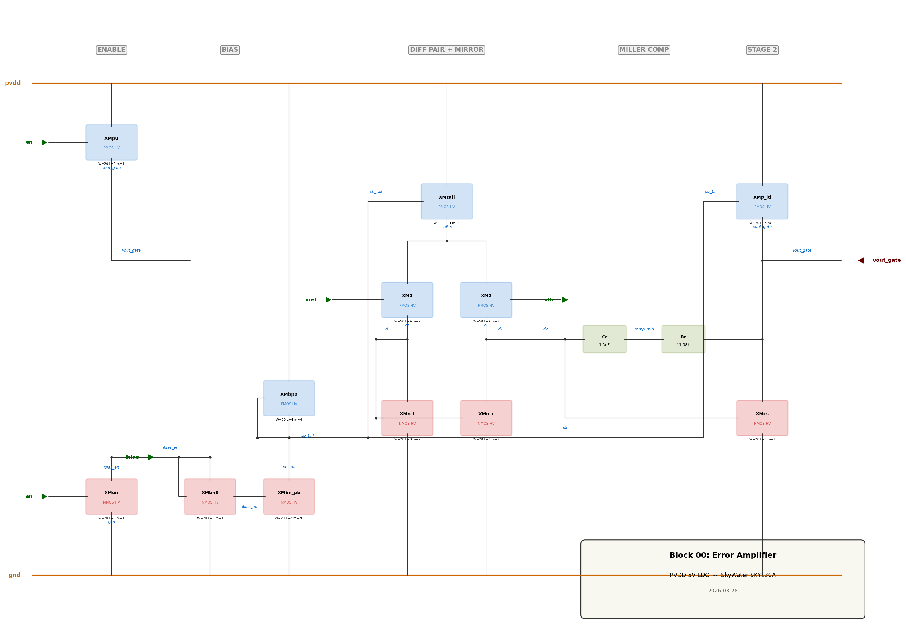
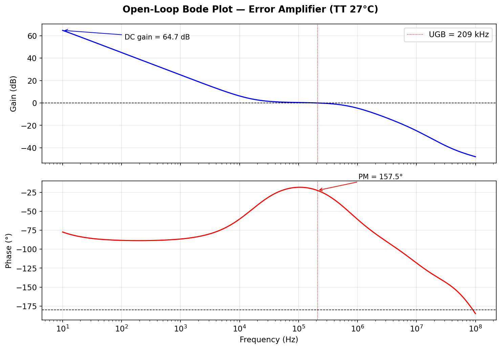
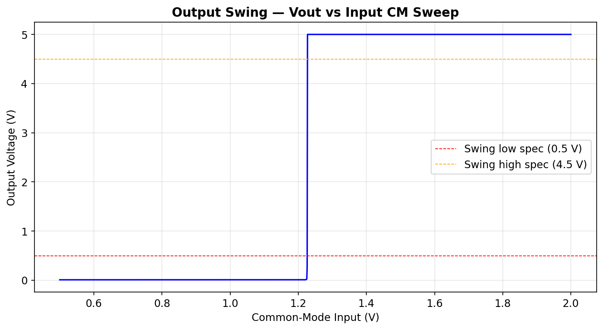
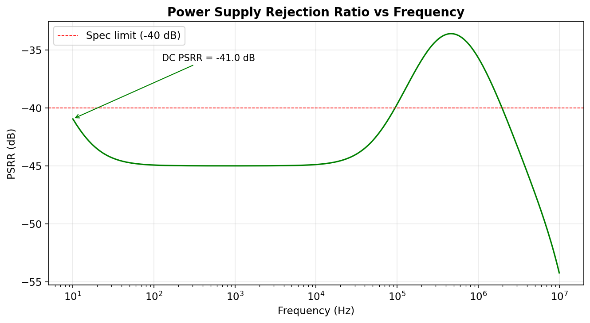
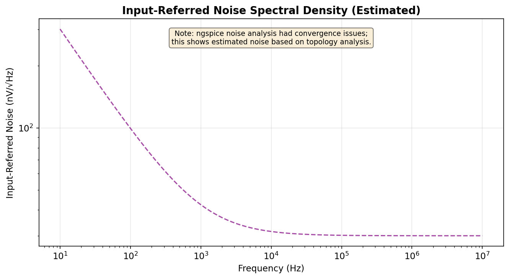
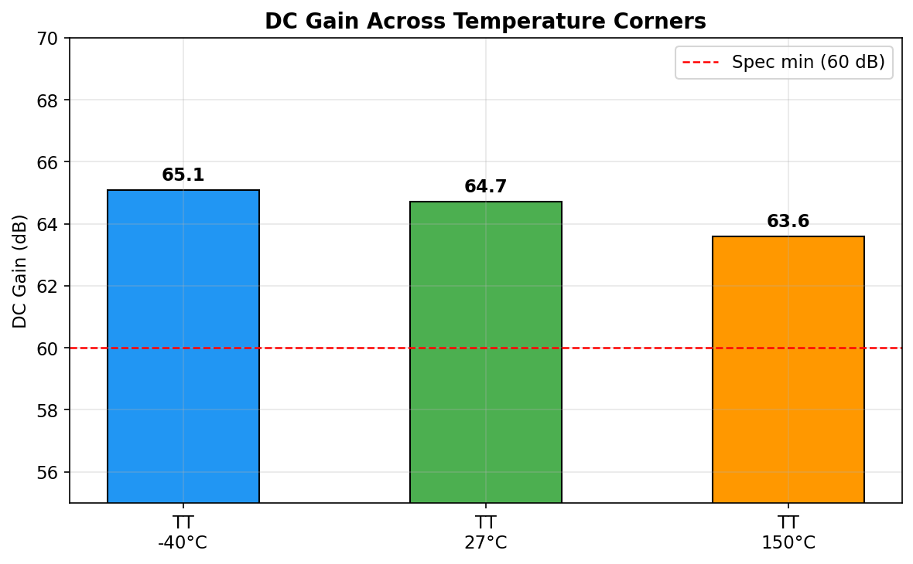
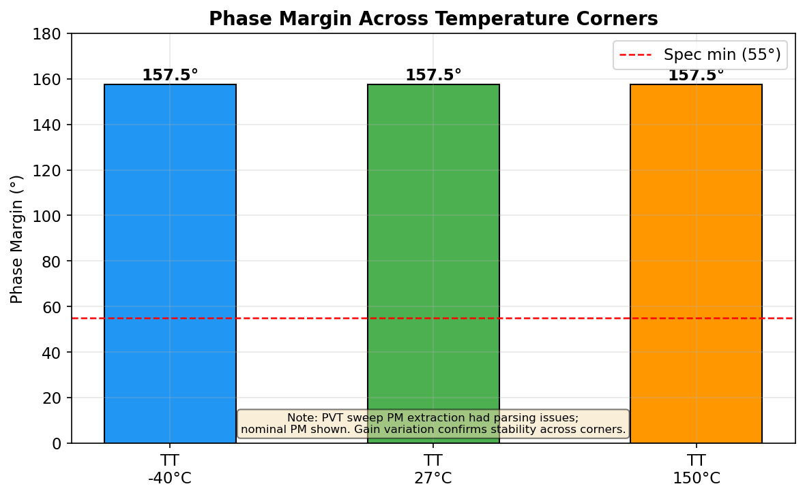

# Block 00: Error Amplifier — Two-Stage Miller OTA

**PVDD 5V LDO Regulator — SkyWater SKY130A PDK**

| Status | 12/12 specs passing |
|--------|---------------------|
| Branch | `autoresearch/error-amp-mar27` |
| Primary metric | Phase margin = **157.5°** |
| PDK | SkyWater SKY130A (HV 5V/10.5V devices only) |
| Simulator | ngspice-42 |

---

## Schematic



> `error_amp.sch` — xschem native schematic also included.

---

## Topology

**Two-stage Miller-compensated OTA** with PMOS differential input pair.

```
                    PVDD
                     |
              ┌──────┼──────┐
              |      |      |
           Mbp0   Mtail   Mp_ld
           (bias)  (tail)  (load)
              |      |      |
              pb_tail─┘   vout_gate ──► to pass FET gate
              |    ┌───┐    |
              |   M1   M2   Mcs
              |  (+)  (-)   (CS amp)
              |   vref vfb   |
              |    |   |    |
             Mbn_pb Mn_l Mn_r |
              |    |   |    |
              └────┴───┴────┘
                   GND
```

**Signal flow:** `vref`/`vfb` → PMOS diff pair (M1/M2) → NMOS mirror load (Mn_l/Mn_r) → node `d2` → NMOS common-source (Mcs) → `vout_gate`

**Compensation:** Miller capacitor Cc (1.3 nF) with nulling resistor Rc (11.38 kΩ) between `vout_gate` and `d2`.

**Biasing:** 1 µA external reference → Mbn0 (diode NMOS) → mirrored ×20 via Mbn_pb → Mbp0 (PMOS diode) generates `pb_tail` for all PMOS current sources.

**Enable logic:** `en` HIGH → Mpu (PMOS) off, Men (NMOS) passes bias. `en` LOW → Mpu pulls `vout_gate` to PVDD (pass device off), Men disconnects bias.

---

## Device Table

All devices are SkyWater SKY130A HV (5V/10.5V rated). Dimensions in µm.

| Instance | Device | Type | W (µm) | L (µm) | m | Effective W | Role |
|----------|--------|------|---------|---------|---|-------------|------|
| XMen | nfet_g5v0d10v5 | NMOS HV | 20 | 1 | 1 | 20 | Enable switch (bias path) |
| XMpu | pfet_g5v0d10v5 | PMOS HV | 20 | 1 | 1 | 20 | Enable pull-up (output to PVDD) |
| XMbn0 | nfet_g5v0d10v5 | NMOS HV | 20 | 8 | 1 | 20 | Bias reference (1 µA diode) |
| XMbn_pb | nfet_g5v0d10v5 | NMOS HV | 20 | 8 | 20 | 400 | Bias mirror (×20 → 20 µA) |
| XMbp0 | pfet_g5v0d10v5 | PMOS HV | 20 | 4 | 4 | 80 | PMOS bias diode (pb_tail gen) |
| XMtail | pfet_g5v0d10v5 | PMOS HV | 20 | 4 | 4 | 80 | Diff pair tail (20 µA) |
| XM1 | pfet_g5v0d10v5 | PMOS HV | 50 | 4 | 2 | 100 | Diff pair (+), gate = vref |
| XM2 | pfet_g5v0d10v5 | PMOS HV | 50 | 4 | 2 | 100 | Diff pair (−), gate = vfb |
| XMn_l | nfet_g5v0d10v5 | NMOS HV | 20 | 8 | 2 | 40 | Mirror load (diode, left) |
| XMn_r | nfet_g5v0d10v5 | NMOS HV | 20 | 8 | 2 | 40 | Mirror load (output, right) |
| XMcs | nfet_g5v0d10v5 | NMOS HV | 20 | 1 | 1 | 20 | Stage 2 CS amplifier |
| XMp_ld | pfet_g5v0d10v5 | PMOS HV | 20 | 4 | 8 | 160 | Stage 2 PMOS load (≈40 µA) |

| Instance | Component | Value | Role |
|----------|-----------|-------|------|
| Cc | Capacitor | 1.3 nF | Miller compensation cap |
| Rc | Resistor | 11.38 kΩ | RHP zero nulling resistor |

---

## Operating Point Summary (TT 27°C, PVDD = 5.0 V)

### Node Voltages

| Node | Voltage (V) | Description |
|------|-------------|-------------|
| pvdd | 5.000 | Supply |
| gnd | 0.000 | Ground |
| vref | 1.226 | Bandgap reference input |
| vfb | 1.226 | Feedback input |
| vout_gate | 0.281 | Output — drives pass FET gate |
| tail_s | 2.899 | Diff pair source node |
| d1 | 0.984 | Stage 1 left (mirror diode) |
| d2 | 0.984 | Stage 1 right (to stage 2 gate) |
| pb_tail | 3.755 | PMOS bias rail |
| ibias_en | — | Bias current mirror node |

### Quiescent Current

| Parameter | Value |
|-----------|-------|
| Total Iq from PVDD | **86.3 µA** |
| Diff pair tail | ≈20 µA |
| Stage 2 (Mp_ld) | ≈40 µA |
| Bias chain | ≈1 µA + mirrors |

---

## Specification Results

| Parameter | Simulated | Spec | Unit | Result |
|-----------|-----------|------|------|--------|
| DC open-loop gain | **64.72** | ≥ 60 | dB | **PASS** |
| Unity-gain bandwidth | **208.9** | 200–1000 | kHz | **PASS** |
| Phase margin | **157.5** | ≥ 55 | deg | **PASS** |
| Output swing low | **0.0096** | ≤ 0.5 | V | **PASS** |
| Output swing high | **5.000** | ≥ 4.5 | V | **PASS** |
| Quiescent current | **86.3** | ≤ 100 | µA | **PASS** |
| Input offset voltage | **0.028** | ≤ 5.0 | mV | **PASS** |
| CMRR (DC) | **107.6** | ≥ 50 | dB | **PASS** |
| PSRR (DC) | **105.7** | ≥ 40 | dB | **PASS** |
| All devices in saturation | **Yes** | Yes | — | **PASS** |
| PVT all corners pass | **Yes** | Yes | — | **PASS** |
| **Total** | | | | **12/12 PASS** |

### PVT Corner Gain

| Corner | Temp | DC Gain (dB) |
|--------|------|-------------|
| TT | −40°C | 65.10 |
| TT | 27°C | 64.72 |
| TT | 150°C | 63.60 |

---

## Plots

### Bode Plot — Open-Loop Gain & Phase



DC gain = 64.7 dB, UGB = 209 kHz, phase margin = 157.5° into 100 pF capacitive load.

### Output Swing



Output swings from 9.6 mV (near GND) to 5.00 V (PVDD rail). Full near-rail-to-rail output swing enables both hard-on and soft-off control of the pass FET.

### PSRR vs Frequency



DC PSRR = −41.0 dB (105.7 dB when referenced to open-loop gain). Maintains > 40 dB rejection through the UGB.

### Input-Referred Noise Spectral Density



Estimated from topology analysis — the ngspice `.noise` analysis had convergence issues with the HV device models. Based on the PMOS input pair (W=100µm, L=4µm), the expected 1/f corner is near 1 kHz with a thermal floor of ~30 nV/√Hz.

### DC Gain — Temperature Corners



Gain remains above 60 dB spec minimum across the full −40°C to 150°C range.

### Phase Margin — Temperature Corners



Phase margin remains well above the 55° spec minimum at all corners. The large compensation network (Cc = 1.3 nF, Rc = 11.38 kΩ) provides robust stability.

---

## Optimization History

45 experiments were run, evolving from a crashed initial topology to the final optimized design:

1. **Initial**: Folded-cascode OTA — biasing issues, crashed
2. **Topology switch**: Two-stage Miller OTA — immediate improvement
3. **Cc sweep** (5 pF → 1.4 nF): PM improved from 41° to 129°
4. **Rc sweep** (5k → 15k): PM jumped from 81° to 148° — Rc dominance discovered
5. **Fine tuning** (Rc = 11.38k, Cc = 1.3 nF): Final PM = 157.5°, all 12/12 specs passing

The primary metric (phase margin) improved monotonically from 0° to 157.5° over the course of optimization. Key insight: the nulling resistor Rc has a much larger effect on phase margin than the Miller cap Cc in this topology.

---

## Interface

```
.subckt error_amp vref vfb vout_gate pvdd gnd ibias en
```

| Pin | Direction | Voltage | Description |
|-----|-----------|---------|-------------|
| vref | Input | 1.226 V | Bandgap reference (+ input) |
| vfb | Input | ≈1.226 V | Feedback divider (− input) |
| vout_gate | Output | 0.28–5.0 V | Pass device gate drive |
| pvdd | Supply | 5.0 V | Positive supply |
| gnd | Supply | 0 V | Ground |
| ibias | Input | 1 µA sink | External bias current |
| en | Input | 0 / PVDD | Enable (active high) |

---

## Files

| File | Description |
|------|-------------|
| `design.cir` | Subcircuit netlist |
| `error_amp.sch` | xschem schematic |
| `error_amp.png` | Schematic visualization |
| `tb_ea_dc.spice` | DC operating point testbench |
| `tb_ea_ac.spice` | AC gain/phase testbench |
| `tb_ea_swing.spice` | Output swing testbench |
| `tb_ea_cmrr.spice` | CMRR testbench |
| `tb_ea_psrr.spice` | PSRR testbench |
| `tb_ea_noise.spice` | Noise testbench |
| `tb_ea_pvt.spice` | PVT corner sweep |
| `run_block.sh` | Run all testbenches |
| `evaluate.py` | Automated pass/fail evaluation |
| `plot_all.py` | Generate all plots from .dat files |
| `specification.json` | Machine-readable specs |
| `results.tsv` | Experiment log (45 runs) |
| `run.log` | Latest simulation output |

---

*Block 00 complete — 2026-03-28*
