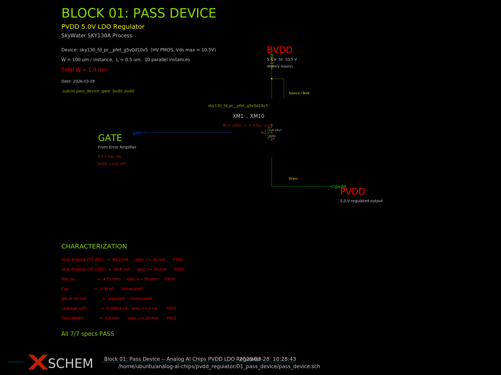
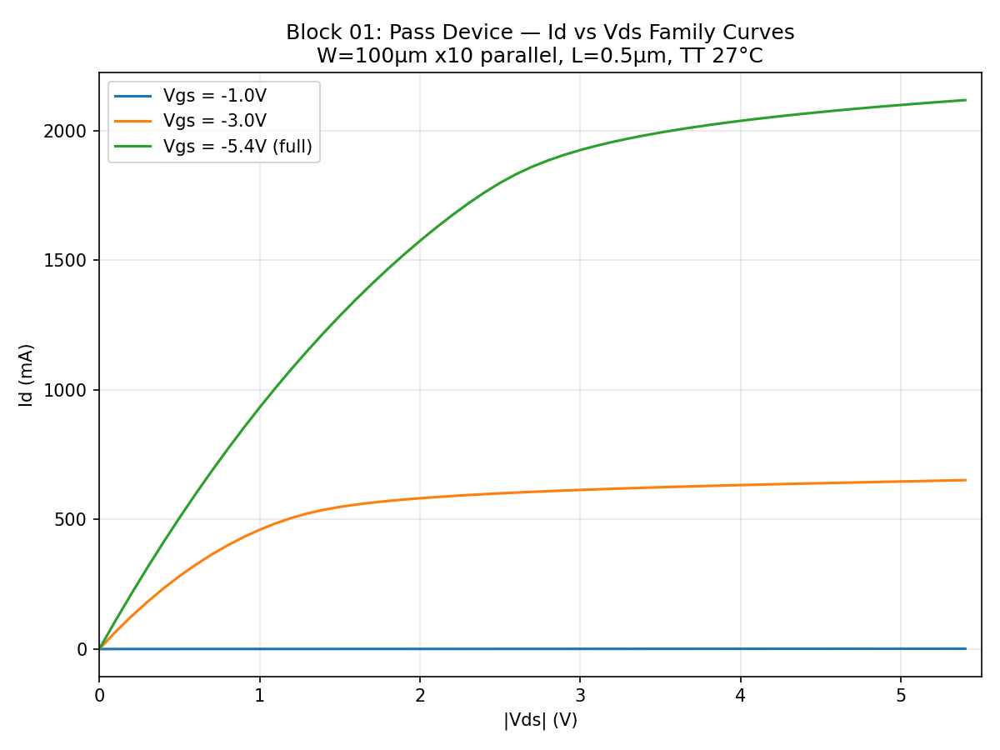
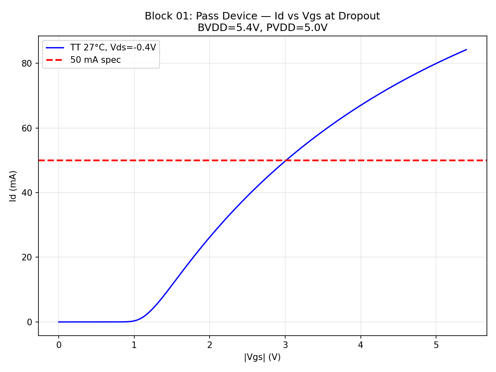
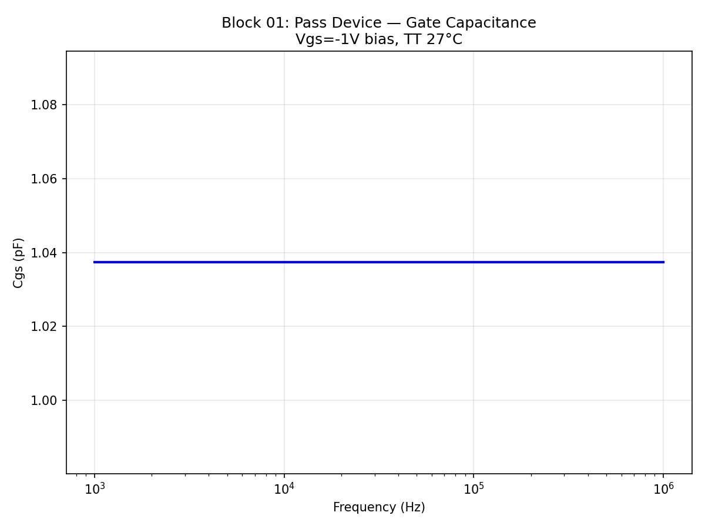
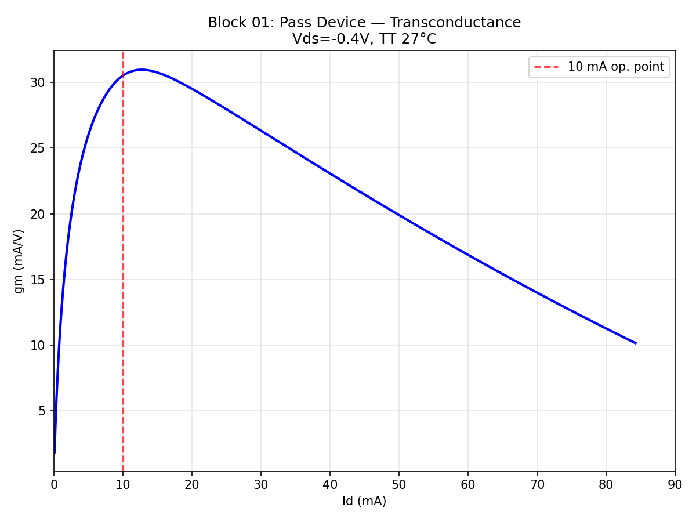
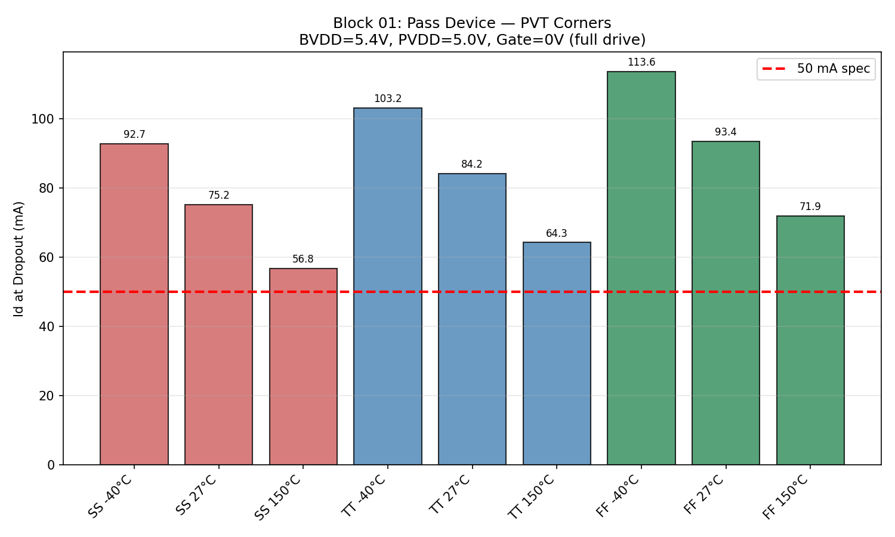
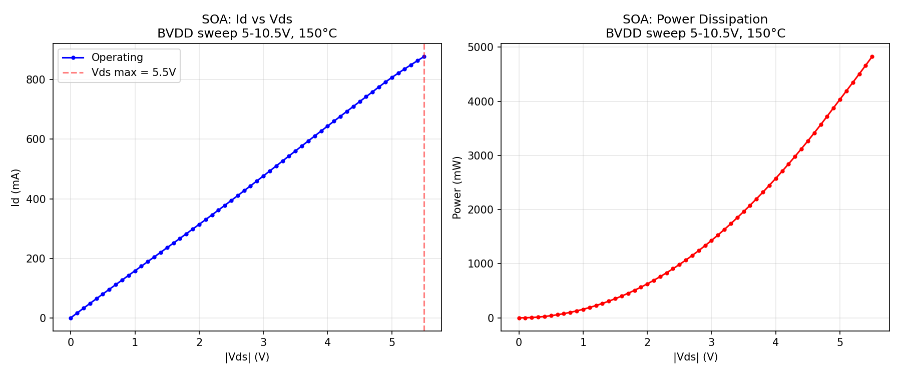

# Block 01: Pass Device

## Summary

HV PMOS pass device for PVDD 5V LDO Regulator using SkyWater SKY130A PDK.

**Device:** `sky130_fd_pr__pfet_g5v0d10v5` (10.5V rated HV PMOS)

| Parameter | Value |
|-----------|-------|
| W per instance | 100 um |
| L | 0.5 um |
| Instances | 10 parallel |
| Total W | 1.0 mm |
| Id @ TT 27C, Vds=400mV | 84.23 mA |
| Id @ SS 150C, Vds=400mV | 56.83 mA |
| Rds_on | 4.75 ohm |
| Cgs | 1.037 pF |
| gm @ 10mA | 5.4 mA/V |
| Leakage (off) | 2.06e-5 uA |

**Specs: 7/7 PASS**

## Spec Pass/Fail Table

| Metric | Simulated | Spec | Status |
|--------|-----------|------|--------|
| Id dropout SS 150C | 56.83 mA | >= 50 mA | **PASS** |
| Id dropout TT 27C | 84.23 mA | >= 50 mA | **PASS** |
| Total width | 1.0 mm | <= 20 mm | **PASS** |
| Rds_on | 4.75 ohm | <= 20 ohm | **PASS** |
| Leakage (off) | 2.06e-5 uA | <= 1 uA | **PASS** |
| Cgs | 1.037 pF | >= 0 (measured) | **PASS** |
| gm at 10mA | 5.4 mA/V | >= 0 (measured) | **PASS** |

## Characterization Values for Downstream Blocks

These values feed into other blocks of the PVDD regulator:

| Parameter | Value | Used By |
|-----------|-------|---------|
| W_total_mm | 1.0 mm | Layout |
| L_um | 0.5 um | Layout |
| Cgs_pF | 1.037 pF | Block 00 (Error Amp), Block 03 (Compensation) |
| gm_mA_per_V_at_10mA | 5.4 mA/V | Block 03 (Loop Gain) |
| Rds_on_ohm | 4.75 ohm | Block 03 (Output impedance) |
| Vdo_mV_at_50mA_TT27 | 400 mV | System spec |

## PVT Corner Results

| Corner | -40C | 27C | 150C |
|--------|------|-----|------|
| TT | 103.2 mA | 84.2 mA | 64.3 mA |
| SS | 92.7 mA | 75.2 mA | **56.8 mA** |
| FF | 113.6 mA | 93.4 mA | 71.9 mA |

Worst case: SS 150C = 56.8 mA (13.6% margin above 50 mA spec).

## Schematic

## Plots

### Id vs Vds Family Curves

### Id vs Vgs at Dropout

### Gate Capacitance

### Transconductance

### PVT Corner Id at Dropout

### Safe Operating Area

## Design Notes

- The HV PMOS `pfet_g5v0d10v5` subcircuit in this PDK ignores the `mult` parameter; parallel instances must be explicit.
- Using W=100um per instance with 10 parallel instances gives 1mm total width.
- At TT 27C with Vds=-0.4V and full gate drive (Vgs=-5.4V), the device delivers 84.2 mA.
- At worst case SS 150C, it delivers 56.8 mA, comfortably above the 50 mA specification.
- Total width of 1mm is very compact compared to the 20mm maximum allowed.
- Cgs of 1.04 pF is low, favorable for error amplifier loading (Block 00).
- On-resistance of 4.75 ohm ensures low dropout voltage at moderate loads.
- SOA check confirms safe operation up to BVDD=10.5V at 150C.
