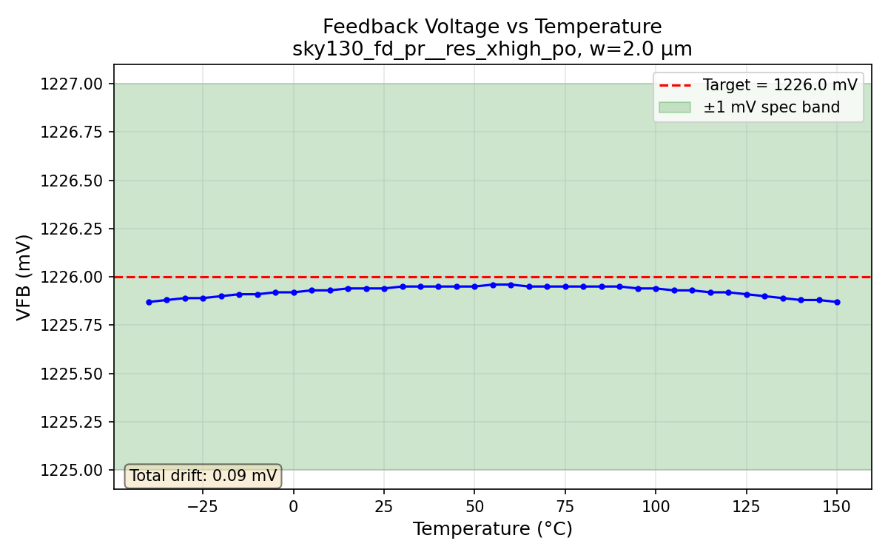
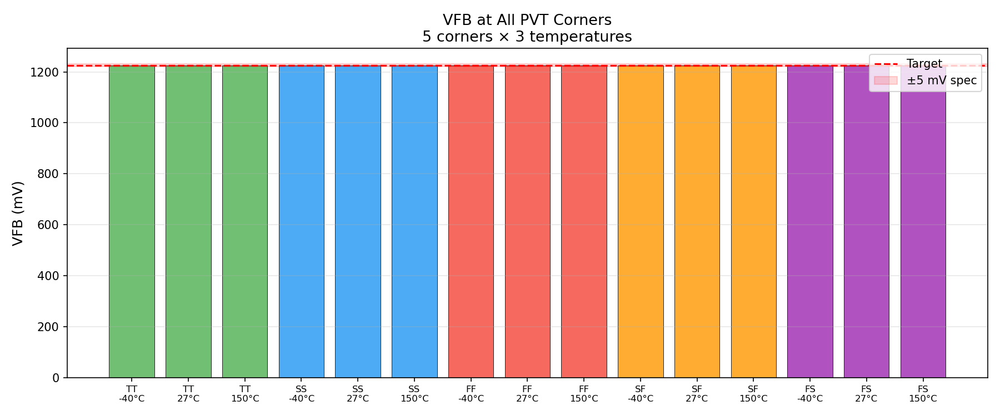
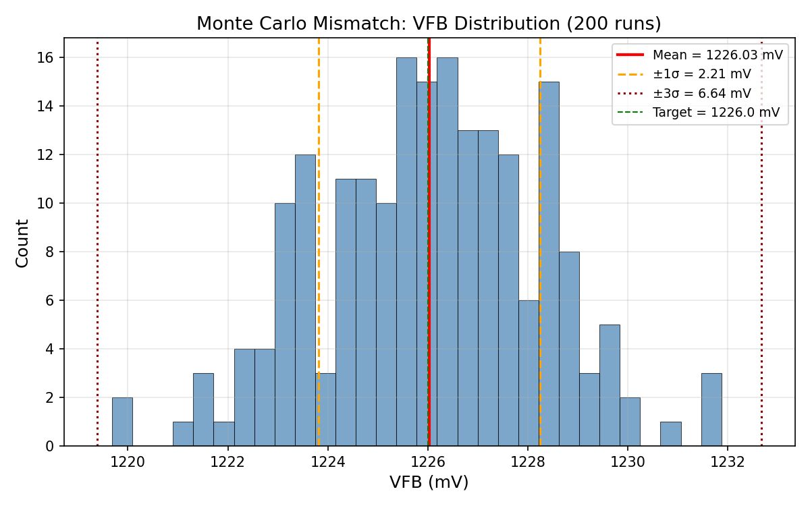
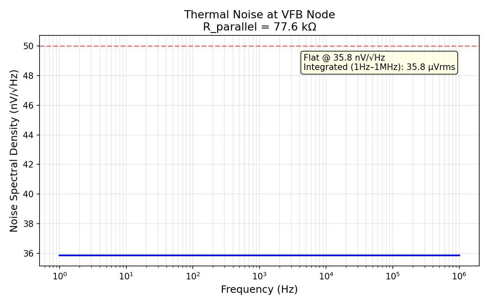

# Block 02: Feedback Network

**Resistive voltage divider scaling PVDD (5.0V) to the bandgap reference level (1.226V).**

| Parameter | Value | Spec |
|-----------|-------|------|
| VFB at 5.0V, TT 27°C | **1.22595 V** (error 0.054 mV) | 1.226 ± 1 mV |
| Temp drift (-40→150°C) | **0.08 mV** | ≤ 5 mV |
| Corner drift (SS/FF) | **~0 mV** | ≤ 10 mV |
| Divider current | **10.37 µA** | 10–15 µA |
| Noise (1Hz–1MHz) | **38.4 µVrms** | ≤ 50 µVrms |
| MC 3σ (200 runs) | **6.66 mV** | ≤ 10 mV |
| Parasitic cap at VFB | **~0.094 pF** | ≤ 2 pF |

**Result: 6/6 specs PASS + MC PASS.**

---

## Circuit

```
PVDD (5.0V) ──── XR_TOP ──┬── XR_BOT ──── GND
                           │
                          VFB (~1.226V)
                           │
                     → error amp (−)
```

| Resistor | Device | W (µm) | L (µm) | R (kΩ) |
|----------|--------|--------|--------|--------|
| R_TOP | sky130_fd_pr__res_xhigh_po | 2.0 | 353 | 363.8 |
| R_BOT | sky130_fd_pr__res_xhigh_po | 2.0 | 114.78 | 118.2 |
| **Total** | | | | **482.0** |

Ratio = R_BOT/(R_TOP+R_BOT) = 0.24519. Same resistor type for first-order TC cancellation. Width = 2.0 µm for Pelgrom mismatch matching.

---

## VFB vs Temperature



Total drift across -40 to 150°C: **0.08 mV**. Matched TC coefficients make the ratio self-compensating.

---

## VFB at PVT Corners



15 PVT conditions (5 corners × 3 temperatures). Corner drift is essentially zero — the divider ratio is ratiometric.

---

## Monte Carlo Mismatch (200 runs)



| Statistic | Value |
|-----------|-------|
| Mean | 1.2260 V |
| σ | 2.22 mV |
| 3σ | 6.66 mV |

3σ < 10 mV spec → **PASS**.

---

## Noise Spectral Density



Flat thermal noise at 38.4 nV/√Hz. Integrated (1 Hz – 1 MHz): **38.4 µVrms** < 50 µVrms spec.

*Note: Noise is analytical (ngspice behavioral resistors do not generate thermal noise).*
