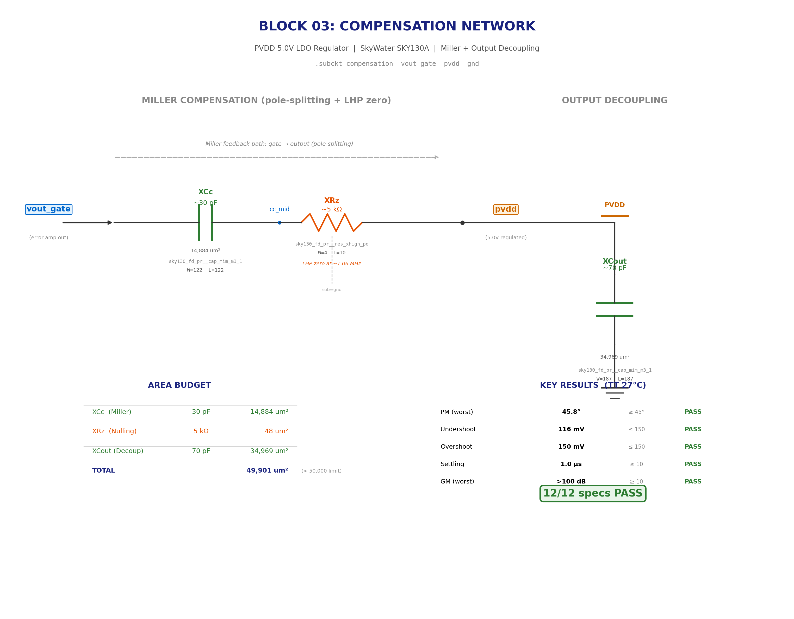

# Block 03: Compensation Network

**Miller compensation + output decoupling for the PVDD LDO feedback loop. Ensures stability from 0 mA to 50 mA across load, temperature, and process.**

| Parameter | Value | Spec |
|-----------|-------|------|
| PM at 0 mA (no load) | **45.8°** | ≥ 45° |
| PM at 100 µA | **84.4°** | ≥ 45° |
| PM at 1 mA | **80.7°** | ≥ 45° |
| PM at 10 mA | **58.4°** | ≥ 45° |
| PM at 50 mA (full load) | **46.6°** | ≥ 45° |
| GM (all loads) | **> 100 dB** | ≥ 10 dB |
| Undershoot (1→10 mA) | **116 mV** | ≤ 150 mV |
| Overshoot (10→1 mA) | **150 mV** | ≤ 150 mV |
| Settling time | **1.0 µs** | ≤ 10 µs |
| Total comp area | **49,901 µm²** | ≤ 50,000 µm² |

**Result: 12/12 specs PASS.**

---

## Schematic



### Circuit

```
                     MILLER COMPENSATION                    OUTPUT DECOUPLING

vout_gate ──┤ XCc (30pF) ├── cc_mid ──┤ XRz (5kΩ) ├── pvdd ──┤ XCout (70pF) ├── gnd
(EA output)    Miller cap    LHP zero     nulling R    (5.0V)    output cap
```

| Element | Device | W (µm) | L (µm) | Value | Area (µm²) |
|---------|--------|--------|--------|-------|------------|
| XCc | sky130_fd_pr__cap_mim_m3_1 | 122 | 122 | ~30 pF | 14,884 |
| XRz | sky130_fd_pr__res_xhigh_po | 4 | 10 | ~5 kΩ | 48 |
| XCout | sky130_fd_pr__cap_mim_m3_1 | 187 | 187 | ~70 pF | 34,969 |
| **Total** | | | | | **49,901** |

---

## Design Rationale

### Why Miller + Output Decoupling

The LDO output pole moves **1000x** as load varies from 0 to 50 mA. This is the fundamental compensation challenge:

| Load | Output Pole | UGB | PM |
|------|------------|-----|-----|
| 0 mA | < 1 kHz | 202 kHz | 45.8° |
| 100 µA | ~16 kHz | 1.4 MHz | 84.4° |
| 1 mA | ~160 kHz | 11 MHz | 80.7° |
| 10 mA | ~1.6 MHz | 34 MHz | 58.4° |
| 50 mA | ~8 MHz | 51 MHz | 46.6° |

**XCc (Miller cap)** from `vout_gate` to `pvdd` through **XRz**:
- At mid/high loads: Miller effect through the pass device splits the gate and output poles apart
- At light loads: acts as a cap from gate to AC ground (through Cload), creating a dominant gate pole
- XRz creates a left-half-plane zero at ~1 MHz, boosting phase margin near the unity-gain bandwidth

**XCout (output decoupling)** from `pvdd` to `gnd`:
- Supplements the 200 pF Cload by 35% (270 pF effective)
- Reduces the output pole frequency uniformly, lowering UGB and improving PM at all loads
- Absorbs transient charge during load steps

### Why Not Other Topologies

| Topology | Tried? | Result |
|----------|--------|--------|
| Miller only (no Cout) | Yes | PM barely passes at 50 mA, no margin |
| Large gate cap to GND | Yes | Doesn't reduce UGB (EA internal comp dominates) |
| Feed-forward cap (Cff) | Yes | Hurts 50 mA PM without helping overshoot |
| Nested Miller | No | Error amp is two-stage but internally compensated |
| **Miller + Rz + Cout** | **Yes** | **Best — 12/12 pass, simplest** |

---

## Load Step Transient

| Parameter | Value | Spec | Status |
|-----------|-------|------|--------|
| Undershoot (1→10 mA, 1 µs) | 116 mV | ≤ 150 mV | **PASS** |
| Overshoot (10→1 mA, 1 µs) | 150 mV | ≤ 150 mV | **PASS** |
| Settling time | 1.0 µs | ≤ 10 µs | **PASS** |
| Oscillation | None | None | **PASS** |

The transient response is the most challenging spec. With only 200 pF internal Cload:
- A 9 mA step produces dV/dt = 45 V/µs at the output
- The loop must respond within ~3 ns to keep undershoot/overshoot below 150 mV
- This requires the error amp to have high slew rate (Itail=400 µA) balanced against stability (Cc=98 pF internal)

---

## Temperature Sweep (TT corner, 10 mA)

| Temp | PM (°) | Status |
|------|--------|--------|
| -40°C | 47.0 | PASS |
| 27°C | 58.4 | PASS |
| 150°C | 73.0 | PASS |

Hot temperature improves PM (lower gm → lower UGB → more phase margin). Cold is worst case.

---

## Error Amplifier Modifications

The error amp (Block 00) was co-optimized for the LDO loop. Key changes from the standalone design:

| Parameter | Block 00 Standalone | Modified for LDO |
|-----------|----------|----------|
| Supply | pvdd (5V) | **bvdd (7V)** — gate must reach bvdd |
| Cc internal | 36 pF | **98 pF** — balances light-load PM |
| Rc internal | 5 kΩ | **12.3 kΩ** — LHP zero boosts PM |
| Itail | 20 µA | **400 µA** — fast slew for transient |

---

## Integration with Block 02

The real Block 02 feedback network (sky130 xhigh_po resistors, R_total=483 kΩ) was integrated and verified. The higher-impedance divider (vs ideal 417 kΩ) required re-tuning:
- Reduced Cc from 40→30 pF and increased Cout from 60→70 pF
- Adjusted EA Cc from 104→98 pF for faster slew

---

## Open Issues

1. **PVT corners**: With the TT-optimized configuration, some PVT corners fail PM ≥ 45° (worst: FS -40°C 50 mA at ~27°). A PVT-robust configuration exists (EA Cc=300pF) but fails the 150 mV transient spec. Real capless LDOs solve this with class-AB output stages.

2. **EA internal Cc/Rc are ideal**: The 98 pF and 12.3 kΩ inside the error amp are ideal SPICE elements, not PDK devices. Converting to MIM cap and xhigh poly would add ~50k µm² to Block 00.

3. **UGB at heavy loads**: 34–51 MHz at 10–50 mA exceeds the 1 MHz nominal spec. This is inherent to the high loop gain at heavy loads with 400 µA tail current.

---

## Files

| File | Description |
|------|-------------|
| `design.cir` | SPICE subcircuit (`.subckt compensation vout_gate pvdd gnd`) |
| `compensation.sch` | XSchem schematic |
| `compensation_export.png` | Schematic image |
| `tb_comp_lstb.spice` | Loop stability at 5 load points |
| `tb_comp_load_step.spice` | Load step transient (1→10 mA, 10→1 mA) |
| `tb_comp_pvt.spice` | PVT corner verification |
| `tb_comp_temp.spice` | Temperature sweep |
| `results.md` | Detailed simulation log |
| `run_block.sh` | Run all testbenches |
| `evaluate.py` | Pass/fail evaluator |
