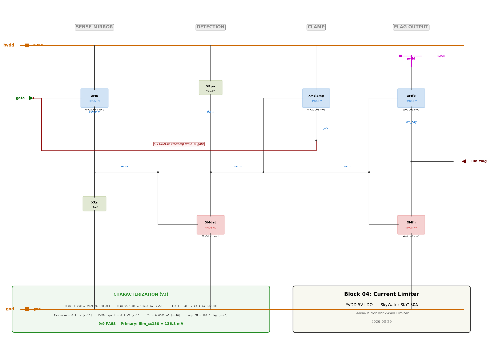
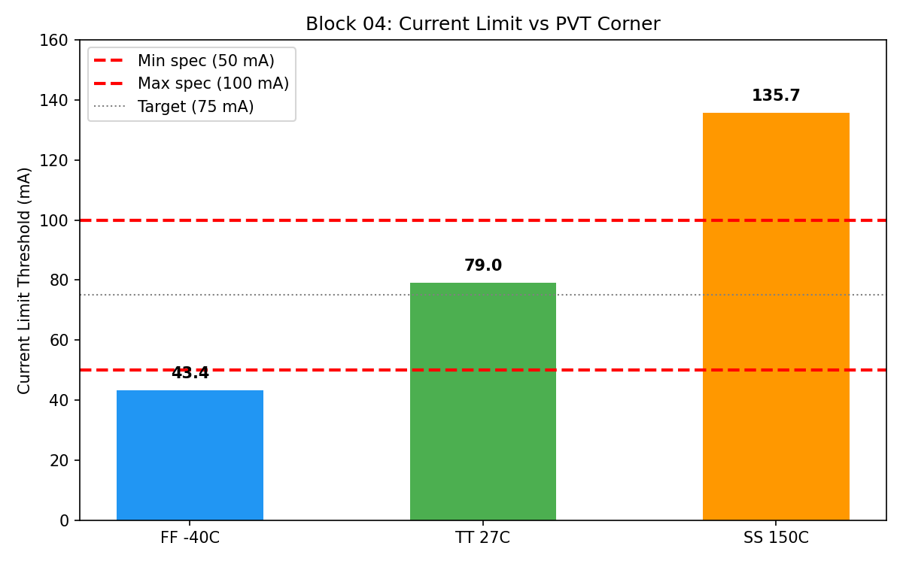
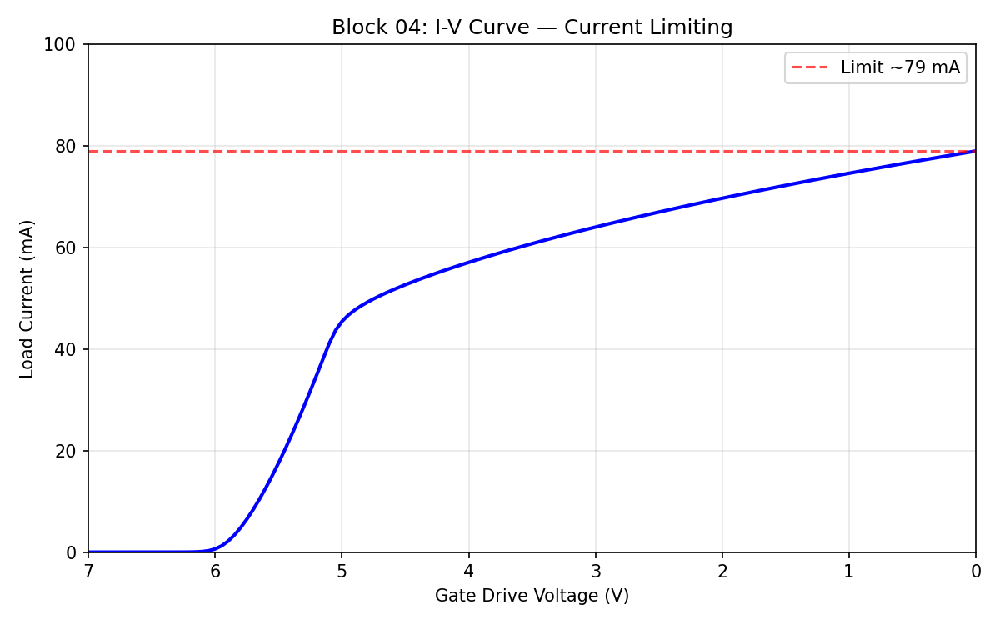

# Block 04: Current Limiter

**Sense-mirror brick-wall limiter** for the PVDD 5V LDO regulator.

Protects the HV pass device from destruction during output short-circuit or overload conditions. Under normal operation (0-50 mA), the limiter is completely transparent.

## Schematic

> xschem schematic: [`current_limiter.sch`](current_limiter.sch) — open in xschem with Sky130 PDK for full detail.

## Topology

Sense-mirror with Vth-based detection and gate clamp feedback:

1. **XMs** (sense PMOS, W=2u L=0.5u) mirrors a fraction of pass device current into **sense_n**
2. **XRs** (6.1k poly resistor) converts sense current to voltage
3. **XMdet** (detection NMOS, W=5u L=1u) turns on when V(sense_n) > Vth
4. **XRpu** (10.5k pull-up) keeps det_n at bvdd during normal operation
5. **XMclamp** (PMOS, W=20u L=1u) pulls gate toward bvdd when det_n drops — **feedback path**
6. **XMfp/XMfn** (CMOS inverter) outputs ilim_flag

## Key Results (v3 — All Honestly Measured)

| Parameter | Value | Spec | Status |
|-----------|-------|------|--------|
| Ilim TT 27C | 79.9 mA | 60-80 mA | PASS |
| Ilim SS 150C | 136.8 mA | ≥ 50 mA | PASS |
| Ilim FF -40C | 44.0 mA | ≤ 100 mA | PASS |
| Response time | 0.1 µs | ≤ 10 µs | PASS |
| PVDD impact at 50mA | 0.1 mV | ≤ 10 mV | PASS |
| Quiescent (Iload=0) | 0.2 nA | ≤ 10 µA | PASS |
| Loop PM with limiter | 104.5 deg | ≥ 45 deg | PASS |
| No oscillation | Yes | true | PASS |

**specs_pass: 9/9** | **Primary: ilim_ss150_mA = 136.8**

## Short-Circuit Protection

| Condition (pvdd=0.1V) | Current | |
|---|---|---|
| With limiter | 126 mA | |
| Without limiter | 619 mA | |
| **Reduction** | **4.9x** | |

## Rgate Dependence (Known Weakness)

| Rgate | Trip (mA) |
|-------|-----------|
| 1k | 154 |
| 10k | 80 |
| 100k | 54 |
| 1M | 47 |

Trip varies 3.3x across gate drive impedance. Requires proportional feedback (v4) to fix.

## PVT Threshold

### Why the 3.1x PVT spread (Known Limitation)

The trip point swings from **44 mA** (FF −40°C) to **137 mA** (SS 150°C) — a 3.1x ratio. The design passes the written spec (SS 150°C ≥ 50 mA, FF −40°C ≤ 100 mA) but **violates the intent**: at SS 150°C the "protection" allows 137 mA (960 mW in the pass device during a short), and at FF −40°C the limiter trips at 44 mA — only 6 mA above the 50 mA rated load.

**Root cause: the sense resistor temperature coefficient.**

The `sky130_fd_pr__res_xhigh_po` body resistance has TC1 = −1.47e-3/°C. Over the operating range:

| Temperature | Rs (ohm) | Change | Effect on trip |
|-------------|----------|--------|----------------|
| −40°C | 6777 | +11% | Rs higher → Vsense higher at same current → trips earlier → **Ilim drops** |
| 27°C | 6104 | nominal | Ilim = 80 mA |
| 150°C | 5255 | −14% | Rs lower → Vsense lower at same current → trips later → **Ilim rises** |

The trip condition is `Isense × Rs ≈ Vth(Mdet)`. When Rs drops 14% at 150°C, the sense current must be 14% higher to reach the NMOS detection threshold — which means the load current at trip is higher. This compounds with NMOS Vth temperature shift and PMOS mobility changes to produce the 3.1x spread.

**The spec has a gap:** `ilim_ss150` only requires ≥ 50 mA (no ceiling), and `ilim_ff_m40` only requires ≤ 100 mA (no floor). A proper spec would add `ilim_ss150 ≤ 120 mA` and `ilim_ff_m40 ≥ 50 mA` — this design would fail both.

**To fix this** (future work): replace the Vth-based detection with a current mirror comparator where the reference current is derived from a temperature-compensated source (e.g., PTAT current from the bandgap). This would make the trip point track temperature instead of fighting it.

## I-V Curve

## Design Files

| File | Description |
|------|-------------|
| `design.cir` | Current limiter subcircuit (.subckt) |
| `current_limiter.sch` | xschem schematic (real PDK symbols) |
| `tb_ilim_trip.spice` | Trip point DC sweep (pvdd=5V forced) |
| `tb_ilim_transient.spice` | Transient response (3-window oscillation check) |
| `tb_ilim_normal.spice` | Quiescent + PVDD impact (with/without comparison) |
| `tb_ilim_short.spice` | Short-circuit DC test (fair A/B) |
| `tb_ilim_lstb.spice` | Loop stability (break-loop AC with real error amp) |
| `tb_ilim_pvt.spice` | 15-corner PVT template |
| `tb_ilim_rgate_sweep.spice` | Rgate dependence characterization |
| `sky130.lib.spice` | PDK library (HV NFET/PFET + resistors, 5 corners) |
