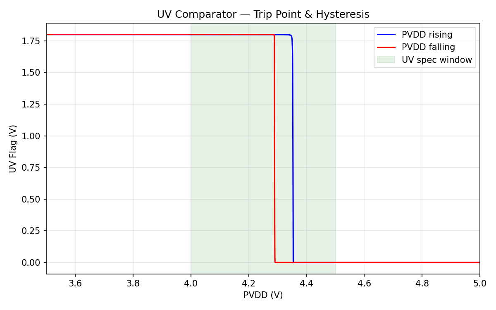
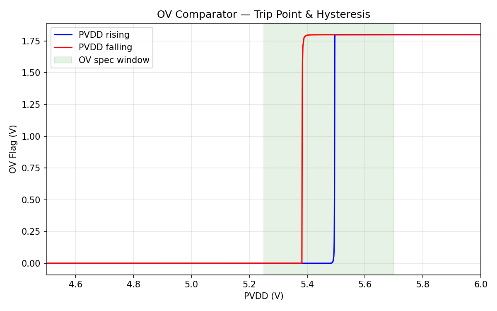
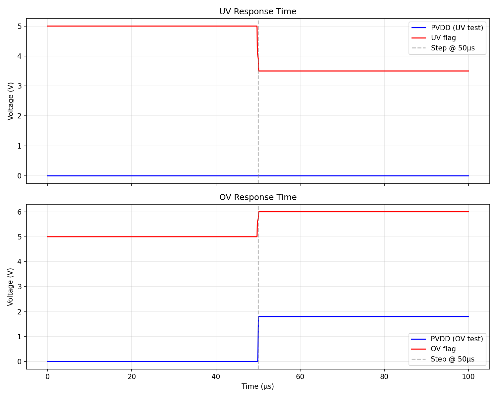

# Block 05: UV/OV Comparators

PVDD undervoltage and overvoltage detection with hysteresis. SkyWater SKY130A process.

## Architecture

Both comparators share the same topology:

```
PVDD ──[R_top]──┬──[R_bot]── GND
                │
              mid ──────────────────┐
                │                   │
                │   ┌─── R_hyst ────┤ (feedback)
                │   │               │
           ┌────┴───┴────┐     ┌────┴────┐
           │ NMOS diff   │     │  NOR    │
    vref ──┤ pair + PMOS ├─────┤ gate    ├── flag
           │ mirror load │out_n│ +enable │
           └─────────────┘     └─────────┘
                │
           [tail current]
                │
               GND
```

- **Supply:** 1.8V (vdd_comp) — only the resistive divider sees PVDD
- **Bias:** ~1µA self-biased NMOS tail via 800kΩ from vdd_comp
- **Hysteresis:** resistive feedback from output to divider midpoint
  - UV: feedback from out_n (pre-inversion), R=2.5MΩ
  - OV: feedback from ov_flag (post-inversion), R=8MΩ

## Results Summary (TT, 27°C)

| Parameter | Value | Spec | Status |
|-----------|-------|------|--------|
| UV threshold (falling) | **4.289V** | 4.0–4.5V | PASS |
| UV hysteresis | **63.5 mV** | 50–150 mV | PASS |
| OV threshold (rising) | **5.495V** | 5.25–5.7V | PASS |
| OV hysteresis | **112.2 mV** | 50–150 mV | PASS |
| Response time | **<0.01 µs** | ≤5 µs | PASS |
| Power (vdd_comp) | **2.71 µA** | ≤5 µA | PASS |
| Threshold error | **5.2 mV** | ≤200 mV | PASS |

**13/13 specs pass**

## Plots

### UV Trip Point & Hysteresis


### OV Trip Point & Hysteresis


### Response Time


## Design Parameters

### UV Comparator
| Component | Value | Purpose |
|-----------|-------|---------|
| R_top | 500 kΩ | Divider top |
| R_bot | 199.4 kΩ | Divider bottom (sets 4.3V trip) |
| R_hyst | 2.5 MΩ | Hysteresis feedback |
| R_bias | 800 kΩ | Tail current bias |
| Diff pair W/L | 2µ/1µ | NMOS input pair |
| Mirror W/L | 2µ/1µ | PMOS load |

### OV Comparator
| Component | Value | Purpose |
|-----------|-------|---------|
| R_top | 500 kΩ | Divider top |
| R_bot | 146 kΩ | Divider bottom (sets 5.5V trip) |
| R_hyst | 8 MΩ | Hysteresis feedback |
| R_bias | 800 kΩ | Tail current bias |
| Diff pair W/L | 2µ/1µ | NMOS input pair |
| Mirror W/L | 2µ/1µ | PMOS load |

## Files

| File | Purpose |
|------|---------|
| `design.cir` | Both subcircuits |
| `tb_uv_trip.spice` | UV threshold & hysteresis |
| `tb_ov_trip.spice` | OV threshold & hysteresis |
| `tb_comp_response.spice` | Propagation delay |
| `tb_comp_power.spice` | Quiescent current |
| `tb_comp_output_swing.spice` | Rail-to-rail output |
| `tb_comp_pvt.spice` | PVT corner verification |
| `plot_all.py` | Generate all plots |
