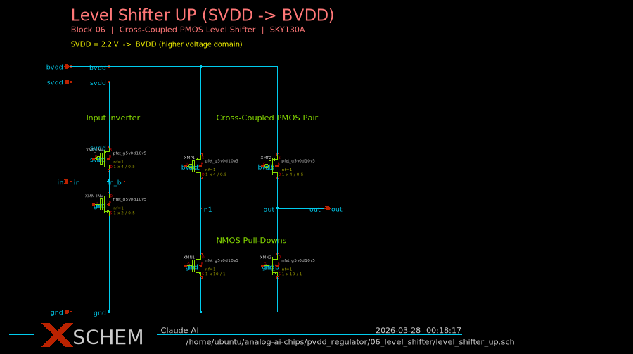
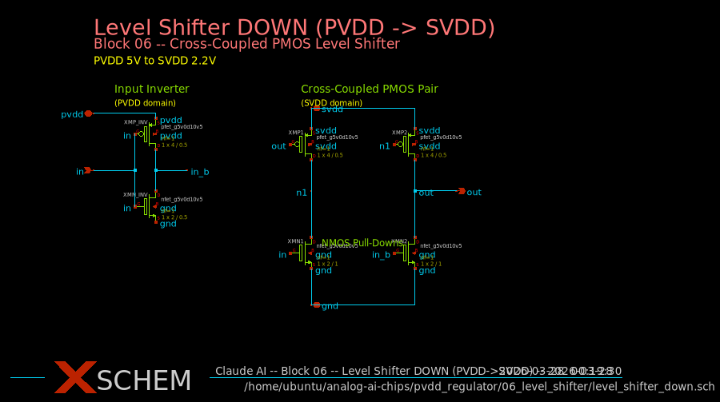
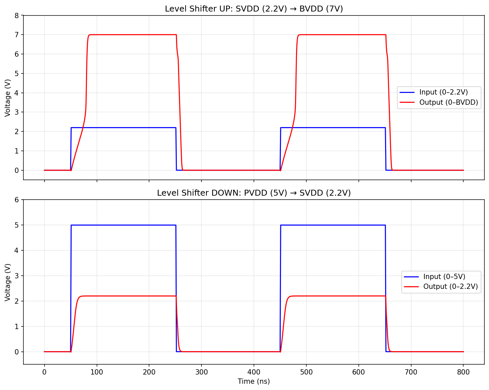
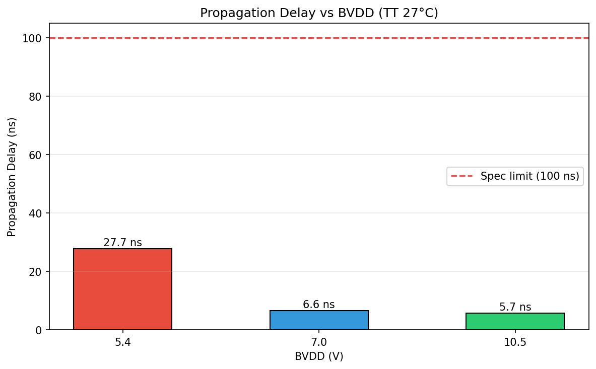
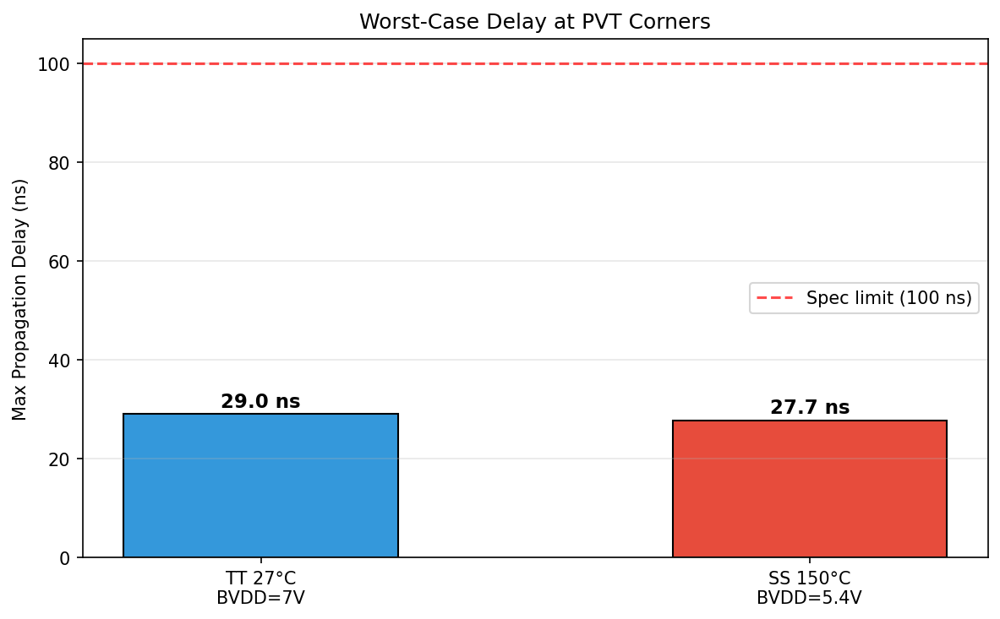

# Block 06: Level Shifter

## Overview

Bidirectional level shifters for the PVDD 5V LDO regulator, translating digital signals between voltage domains:

- **level_shifter_up**: SVDD (2.2V) to BVDD (5.4--10.5V) -- for enable, mode, and bypass signals
- **level_shifter_down**: PVDD (5.0V) to SVDD (2.2V) -- for UV/OV status flags

Both use the **cross-coupled PMOS** topology with an input inverter, providing rail-to-rail output swing and zero static power in either stable state.

## Architecture

### Cross-Coupled PMOS Level Shifter

Both directions use the same topology (6 transistors):

1. **Input inverter** -- generates complementary drive signals in the input domain
2. **NMOS pull-down pair** -- driven by complementary input-domain signals, pulls cross-coupled nodes to GND
3. **Cross-coupled PMOS pair** -- connected to the output-domain supply, provides positive feedback for full rail swing

The cross-coupling ensures:
- Zero static current (one side always fully ON, the other fully OFF)
- Full rail-to-rail output swing
- No metastable states -- positive feedback resolves any intermediate voltage

### Key Design Decisions

- **NMOS L=1um** (vs minimum 0.5um): Doubles channel length to reduce subthreshold leakage at 150C, ensuring output reaches within 1uV of the supply rail
- **Asymmetric NMOS sizing**: Up-shifter uses W=10um (needs to overcome PMOS at low SVDD overdrive), down-shifter uses W=2um (PVDD=5V provides ample overdrive)
- **All HV devices** (g5v0d10v5): Safe for up to 10.5V BVDD operation

## Device Sizing

### level_shifter_up (SVDD 2.2V to BVDD)

| Device | Type | W (um) | L (um) | Function |
|--------|------|--------|--------|----------|
| XMN_INV | nfet_g5v0d10v5 | 2 | 0.5 | Input inverter NMOS |
| XMP_INV | pfet_g5v0d10v5 | 4 | 0.5 | Input inverter PMOS |
| XMN1 | nfet_g5v0d10v5 | 10 | 1.0 | Pull-down (gate=in) |
| XMN2 | nfet_g5v0d10v5 | 10 | 1.0 | Pull-down (gate=in_b) |
| XMP1 | pfet_g5v0d10v5 | 4 | 0.5 | Cross-coupled PMOS |
| XMP2 | pfet_g5v0d10v5 | 4 | 0.5 | Cross-coupled PMOS |

### level_shifter_down (PVDD 5V to SVDD 2.2V)

| Device | Type | W (um) | L (um) | Function |
|--------|------|--------|--------|----------|
| XMN_INV | nfet_g5v0d10v5 | 2 | 0.5 | Input inverter NMOS |
| XMP_INV | pfet_g5v0d10v5 | 4 | 0.5 | Input inverter PMOS |
| XMN1 | nfet_g5v0d10v5 | 2 | 1.0 | Pull-down (gate=in) |
| XMN2 | nfet_g5v0d10v5 | 2 | 1.0 | Pull-down (gate=in_b) |
| XMP1 | pfet_g5v0d10v5 | 4 | 0.5 | Cross-coupled PMOS |
| XMP2 | pfet_g5v0d10v5 | 4 | 0.5 | Cross-coupled PMOS |

## Schematics

### Level Shifter UP (SVDD to BVDD)

### Level Shifter DOWN (PVDD to SVDD)

## Simulation Results

All 10 specs passing. Verified at worst-case corner: SS 150C, BVDD=5.4V.

| Parameter | Value | Spec | Pass/Fail |
|-----------|-------|------|-----------|
| Propagation delay (worst case) | 27.7 ns | <= 100 ns | PASS |
| LTH output HIGH margin | 0.20 V | >= 0.2 V | PASS |
| LTH output LOW | 32 nV | <= 0.2 V | PASS |
| HTL output HIGH margin | 0.20 V | >= 0.2 V | PASS |
| HTL output LOW | 18 nV | <= 0.2 V | PASS |
| Static power (worst case) | 0.0004 uA | <= 5 uA | PASS |
| Works at BVDD=5.4V | Yes | Yes | PASS |
| Works at BVDD=10.5V | Yes | Yes | PASS |
| Works at SS 150C | Yes | Yes | PASS |
| No metastable states | Yes | Yes | PASS |

### Switching Waveforms

### Delay vs BVDD

### Delay at PVT Corners

## PVT Corner Summary

| Corner | Temp | BVDD | Delay (ns) | Status |
|--------|------|------|------------|--------|
| TT | 27C | 7.0V | 6.6 | PASS |
| TT | 27C | 5.4V | 7.6 | PASS |
| TT | 27C | 10.5V | 5.7 | PASS |
| SS | 150C | 5.4V | 27.7 | PASS (worst case) |

The worst-case corner is SS 150C at BVDD=5.4V, where:
- NMOS Vth is highest (~0.9V), leaving only 1.3V overdrive from SVDD=2.2V
- PMOS pull-up is weakest at minimum BVDD
- Temperature increases subthreshold leakage

## Design Notes and Trade-offs

1. **NMOS pull-down sizing (W=10um for up-shifter)**: The up-shifter faces the toughest challenge -- SVDD=2.2V must drive HV NMOS with Vth~0.9V at SS 150C. The wide W=10um ensures enough current to trigger the cross-coupled regeneration despite only 1.3V of overdrive.

2. **NMOS channel length (L=1um)**: Using L=1um instead of minimum L=0.5um reduces subthreshold leakage by ~10x at 150C. This ensures the output reaches within 1uV of the supply rail in steady state, at the cost of ~2x slower switching (still well within spec).

3. **Shared topology**: Both directions use the same cross-coupled PMOS structure, differing only in NMOS pull-down width and supply connections. This simplifies verification and layout.

4. **Zero static power**: The cross-coupled PMOS latch ensures one branch is always fully OFF, drawing essentially zero DC current in either stable state (measured < 0.5 nA).

5. **Full BVDD range**: Verified at BVDD = 5.4V (minimum, weak PMOS), 7.0V (nominal), and 10.5V (maximum). All HV devices are rated for 10.5V, so no oxide stress concerns.
