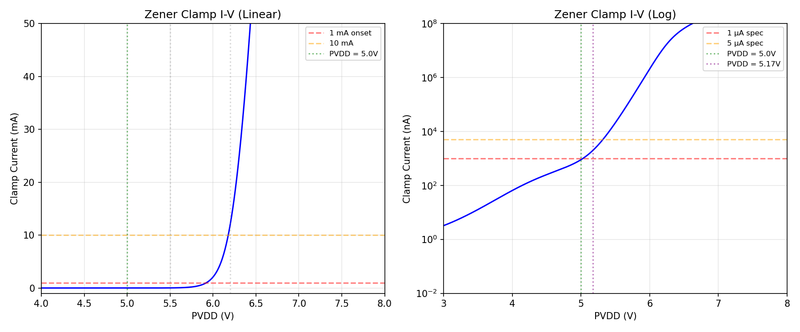
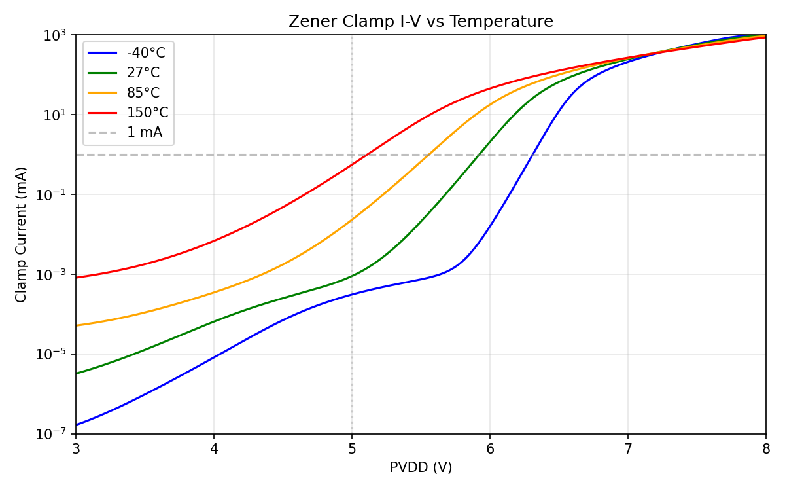
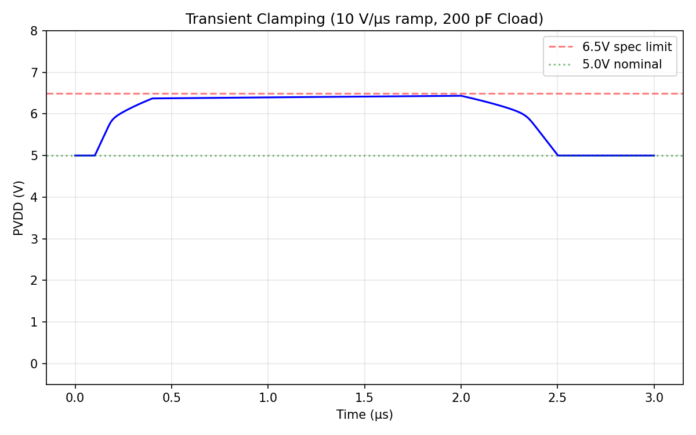

# Block 07: Zener Clamp

**PVDD 5.0V LDO Regulator — SkyWater SKY130A**

## Topology

Long-channel diode-stack-biased NMOS voltage clamp. Sky130 has no true Zener diode — this circuit builds the clamp entirely from HV MOSFETs.

```
    PVDD ──┬── XMd1 (diode, L=4u) ─── XMd2 ─── XMd3 ─── XMd4 ─── XMd5 ──┬── vg
           │                                                                │
           │                                                           Rpd (500k)
           │                                                                │
           ├── Cff (20pF) ─────────────────────────────────────────────── vg │
           │                                                                │
           └── XMclamp (W=2000u, L=0.5u) ── gate=vg ──────────────────── GND
```

- **5 diode-connected HV NFETs** (`nfet_g5v0d10v5`, W=1.8µm, **L=4µm**, body=source)
  - Long channel: Vth ~1.07V, TC ~-0.6 mV/°C (vs -1.1 mV/°C at L=0.5µm)
  - Body=source eliminates body effect (isolated P-well)
- **Rpd = 500 kΩ**: pulls vg to GND when stack is off
- **Cff = 20 pF**: feedforward cap for fast transient response
- **XMclamp**: W=100µm × m=20 = 2000µm total, L=0.5µm, body=GND

## Results (TT 27°C — 9/9 PASS)

| Parameter | Value | Spec | Status |
|-----------|-------|------|--------|
| Leakage at 5.0V | 898 nA | ≤ 1000 nA | **PASS** |
| Leakage at 5.17V | 1946 nA | ≤ 5000 nA | **PASS** |
| Clamp onset (1mA) | 5.925 V | 5.5–6.2 V | **PASS** |
| Clamp at 10mA | 6.18 V | ≤ 6.5 V | **PASS** |
| Clamp onset 150°C | 5.115 V | ≥ 5.0 V | **PASS** |
| Clamp onset -40°C | 6.31 V | ≤ 7.0 V | **PASS** |
| Transient peak | 6.44 V | ≤ 6.5 V | **PASS** |
| Peak current (7V pulse) | 163 mA | ≥ 100 mA | **PASS** |

## I-V Characteristic



## I-V vs Temperature



## Transient Clamping



## Design Notes

**The TC problem was the hardest constraint.** Standard L=0.5µm MOSFET stacks have ~12 mV/°C temperature coefficient, making it impossible to simultaneously meet the 5.5–6.2V onset at 27°C and ≥5.0V onset at 150°C. The breakthrough was using **L=4µm** channel length, which reduced TC to ~6.6 mV/°C through higher Vth and reduced short-channel effects.

**Leakage vs current handling trade-off:** The clamp NMOS (W=2000µm) provides >100mA peak current capability, while the narrow diode stack (W=1.8µm) keeps leakage under 1µA at normal PVDD. The two-element topology (small bias stack + wide clamp) decouples these constraints.

## Files

| File | Description |
|------|-------------|
| `design.cir` | `.subckt zener_clamp pvdd gnd` |
| `tb_zc_iv.spice` | DC I-V curve, onset, leakage |
| `tb_zc_temp.spice` | Temperature sweep (-40/27/85/150°C) |
| `tb_zc_transient.spice` | 10V/µs ramp with 200pF Cload |
| `tb_zc_corners.spice` | Process corner (TT) |
| `tb_zc_corner_{ss,ff,sf,fs}.spice` | Individual corners |
| `results.md` | Detailed iteration log |
