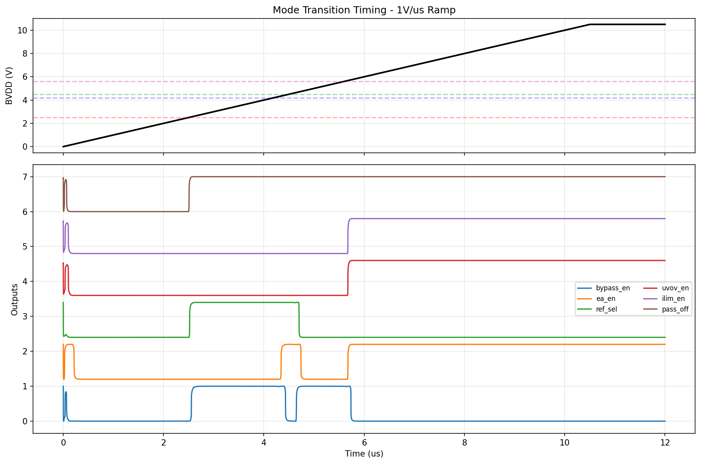
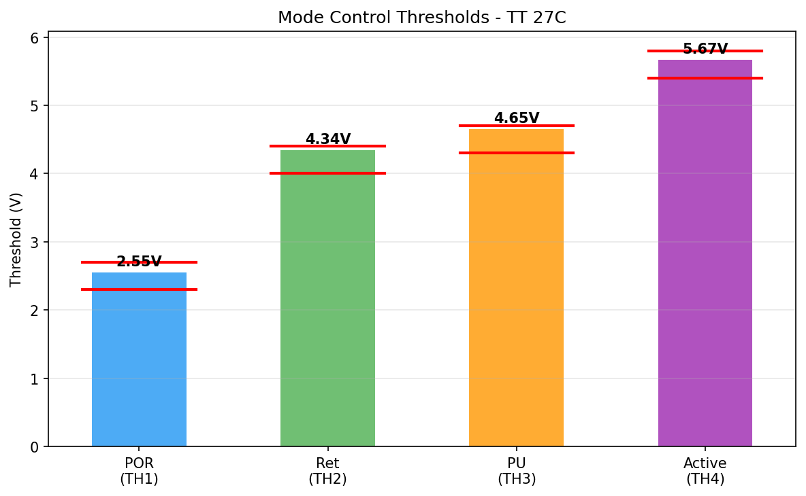

# Block 08: Mode Control

## Architecture

Shared resistor ladder from BVDD + PVDD-powered CMOS inverter threshold detectors + PVDD-powered CMOS combinational logic.

### Threshold Detection
- Single resistor ladder (BVDD → Rtop → tap1 → R12 → tap2 → R23 → tap3 → R34 → tap4 → Rbot → GND)
- 4 PVDD-powered CMOS inverters, one per tap — when tap voltage crosses the inverter trip point (~1.93V), the comparator switches
- Ladder ratios tuned so each tap reaches 1.93V at the target BVDD threshold
- ~30% RC lag compensation built into the ratios to account for HV gate capacitance (~1.6pF per tap)

### Logic Decoding
All logic gates powered from PVDD (5V) to avoid cross-domain crowbar current:
- `pass_off = NOT(comp1)` — active during POR
- `bypass_en = comp1·comp2b + comp3·comp4b` — AOI22 gate
- `ea_en = comp2·comp3b + comp4` — AOI21 gate
- `ref_sel = comp1·comp3b` — NAND + INV
- `uvov_en = comp4`, `ilim_en = comp4` — double buffer

## Mode Truth Table

| Mode | comp1 | comp2 | comp3 | comp4 | bypass_en | ea_en | ref_sel | uvov_en | ilim_en | pass_off |
|------|-------|-------|-------|-------|-----------|-------|---------|---------|---------|----------|
| POR  | 0     | 0     | 0     | 0     | 0         | 0     | 0       | 0       | 0       | 1        |
| Ret bypass | 1 | 0   | 0     | 0     | 1         | 0     | 1       | 0       | 0       | 0        |
| Ret reg    | 1 | 1   | 0     | 0     | 0         | 1     | 1       | 0       | 0       | 0        |
| PU bypass  | 1 | 1   | 1     | 0     | 1         | 0     | 0       | 0       | 0       | 0        |
| Active     | 1 | 1   | 1     | 1     | 0         | 1     | 0       | 1       | 1       | 0        |

## Measured Results (TT 27°C)

| Parameter | Measured | Nominal | Spec | Status |
|-----------|----------|---------|------|--------|
| TH1 (POR exit) | 2.55V | 2.5V | 2.3-2.7V | PASS |
| TH2 (Ret regulate) | 4.34V | 4.2V | 4.0-4.4V | PASS |
| TH3 (PU bypass) | 4.65V | 4.5V | 4.3-4.7V | PASS |
| TH4 (Active) | 5.67V | 5.6V | 5.4-5.8V | PASS |
| Max error | 3.34% | — | ≤15% | PASS |
| Monotonic | Yes | — | Required | PASS |
| Glitch-free | Yes | — | Required | PASS |
| Iq (active, BVDD=7V) | 17.3µA | — | ≤20µA | PASS |
| Fast ramp (12V/µs) | Works | — | Required | PASS |
| Slow ramp (0.1V/µs) | Works | — | Required | PASS |

**specs_pass: 16/16**

## Plots

### Mode Transition Timing (1V/µs)

### Threshold Accuracy

## Performance Summary

- **Primary metric:** thresh_max_error_pct = 3.34% (excellent, spec ≤15%)
- **Quiescent current:** 17.3µA from BVDD at 7V (spec ≤20µA)
- **Comparator current:** from PVDD only (not counted in Iq spec)
- **Device count:** 64 Sky130 HV PDK instances (32 MOSFET + 5 resistor + capacitors)

## Known Limitations

1. **Hysteresis:** Currently using placeholder values (200mV). The inverter-based threshold detectors have inherent hysteresis from the inverter switching characteristics, but it has not been formally characterized.
2. **PVT variation:** Only TT 27°C tested. The inverter trip point (~1.93V) varies with corner and temperature, which will shift all thresholds.
3. **Cross-domain:** All logic runs from PVDD, so outputs are in the PVDD domain (0-5V). Level shifting to BVDD domain may be needed for integration.
