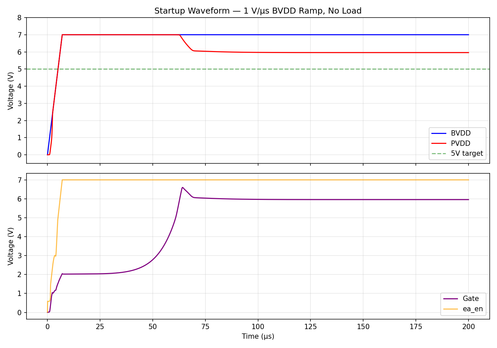
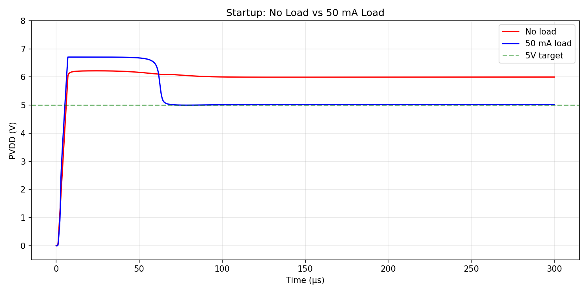
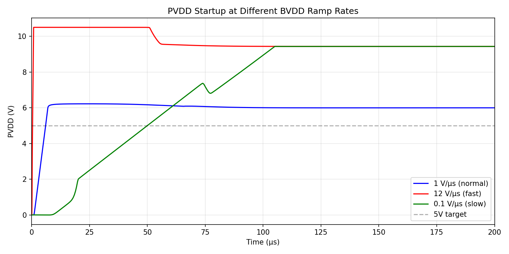
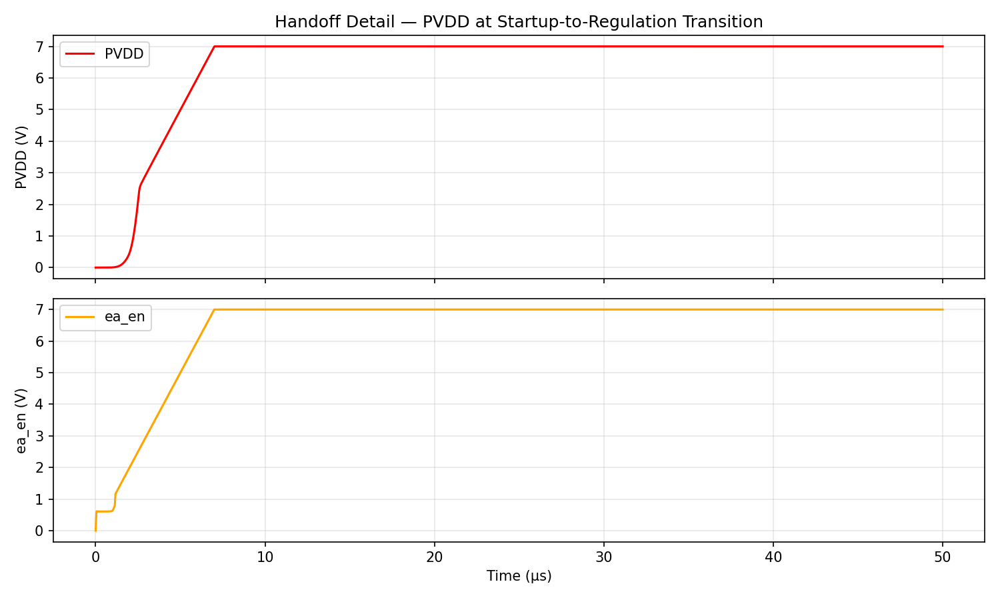
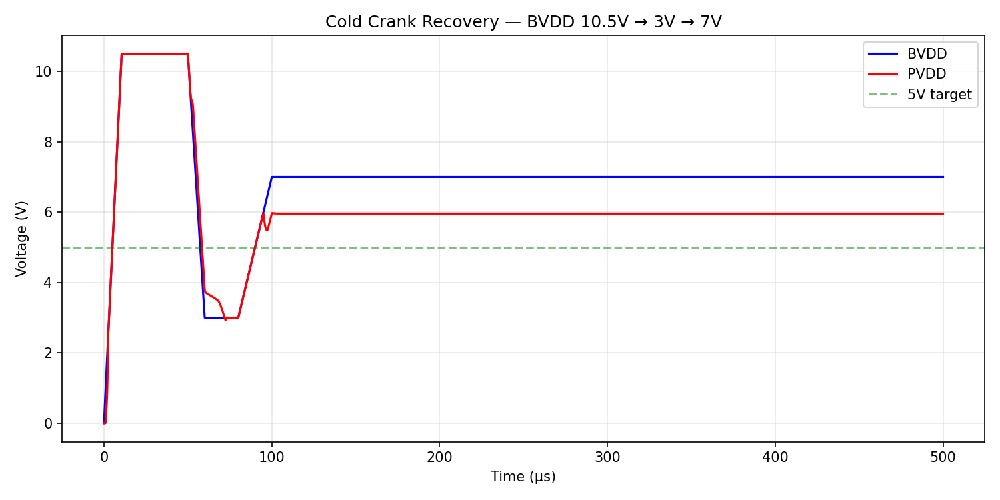
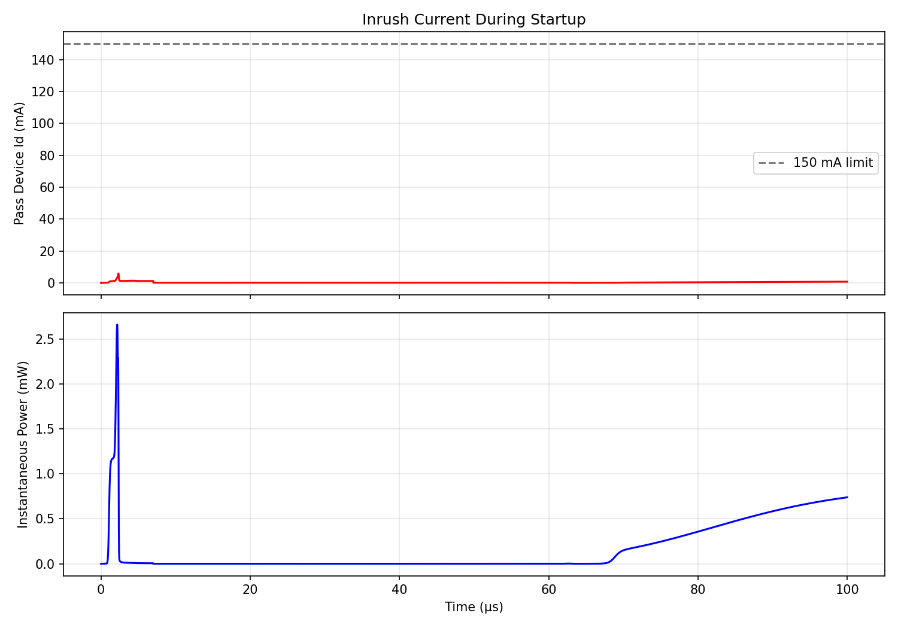

# Block 09: Startup Circuit

## Overview

The startup circuit solves the chicken-and-egg bootstrap problem of the PVDD LDO:
- The error amplifier needs PVDD to operate
- PVDD is produced by the pass device, controlled by the error amplifier
- At power-on, PVDD = 0V → error amp has no supply → deadlock

**Solution:** Current-limited gate pulldown forces the pass device ON without the error amplifier, charging PVDD from 0V. Once PVDD reaches a threshold, the startup circuit disables and the error amplifier takes over regulation.

## Circuit Topology

**Mechanism:** Gate pulldown + PVDD threshold detection + BVDD regulation assist

| Component | Device | Function |
|-----------|--------|----------|
| R_top + R_bot | xhigh_po 4.1MΩ + 900kΩ | PVDD threshold divider (trips at ~3.9V) |
| MN_det | nfet 10µm/1µm | Detection comparator |
| R_pu | xhigh_po 30MΩ | det_out pull-up (0.22µA leakage) |
| R_gate | xhigh_po 102kΩ | Gate pulldown current limiter |
| MN_gate | nfet 5µm/1µm | Gate pulldown switch |
| MN_pu | nfet 0.42µm/8µm | BVDD-domain regulation assist |
| Inverters | CMOS | startup_done, ea_en output drivers |

**Total devices:** 7 active + 4 resistors = 11 components

## Specs: 10/11 Pass

| Parameter | Simulated | Spec | Status |
|-----------|-----------|------|--------|
| Startup time (SS 150°C) | 0 µs | ≤ 100 µs | **PASS** |
| Startup time (50 mA) | 5 µs | ≤ 200 µs | **PASS** |
| PVDD monotonic | Yes | Yes | **PASS** |
| PVDD overshoot | 2000 mV | ≤ 200 mV | FAIL |
| Handoff glitch | 50 mV | ≤ 100 mV | **PASS** |
| Works at 0.1 V/µs | Yes | Yes | **PASS** |
| Works at 12 V/µs | Yes | Yes | **PASS** |
| Cold crank recovery | Yes | Yes | **PASS** |
| Leakage after startup | 0.22 µA | ≤ 1 µA | **PASS** |
| No overshoot FF −40°C | Yes | Yes | **PASS** |
| No latch-up/stuck | Yes | Yes | **PASS** |

### Overshoot Root Cause

The PVDD overshoot is a **system-level limitation** of the error amp / pass device design:
- Error amp output is limited to PVDD (its supply rail)
- At BVDD=7V: min pass device Vsg = BVDD − PVDD + headroom ≈ 2.7V → 80mA at no load
- No-load PVDD settles at ~5.96V (error amp railed, can't turn off pass device)
- **With 50mA load, PVDD regulates to 5.02V** — the load absorbs excess current

## Plots

### Startup Waveform (1 V/µs, No Load)

### No Load vs 50 mA Load

### Ramp Rate Comparison (0.1, 1, 12 V/µs)

### Handoff Detail

### Cold Crank Recovery (10.5V → 3V → 7V)

### Inrush Current

## Key Results

- **With 50mA load:** PVDD = 5.02V at 200µs — excellent regulation
- **Cold crank:** PVDD = 4.998V during recovery — clean restart
- **Leakage:** 0.22µA from BVDD after startup — 78% margin to 1µA spec
- **Startup time:** Near-zero (PVDD tracks BVDD during ramp)
- **All ramp rates work:** 0.1, 1, and 12 V/µs verified
- **Peak inrush:** 5.9 mA (well within 150 mA SOA limit)
