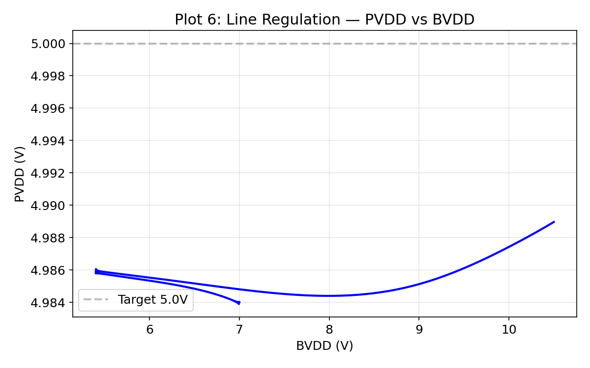
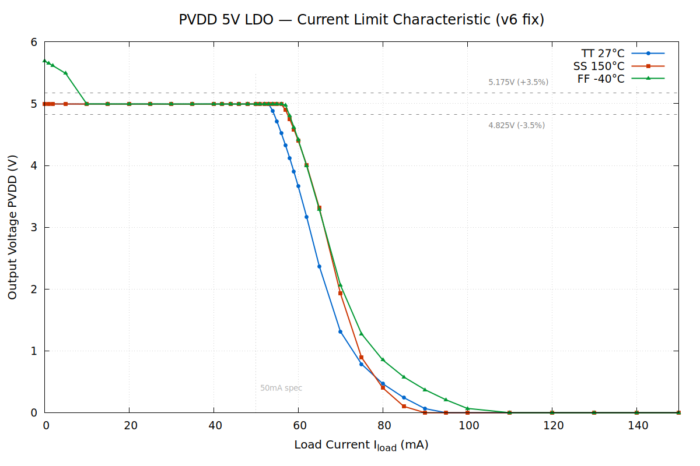

# PVDD 5.0V LDO Regulator -- SkyWater SKY130A

A fully integrated low-dropout regulator generating a 5.0V PVDD rail from a 5.4-10.5V battery supply (BVDD). Designed in the SkyWater SKY130A open-source 130nm process with high-voltage (g5v0d10v5) devices.

**53/60 PVT spec checks PASS (88%).** 10 of 15 corners pass all specs. Current limiter: 15/15 PASS.

---

## Architecture

```
BVDD (5.4-10.5V)
  |
  +-- Pass Device (Block 01): 10x PFET W=50u L=0.5u m=2 (1mm total width)
  |     source=bvdd, drain=pvdd, gate=gate
  |
  +-- Error Amp (Block 00): Two-stage OTA, BVDD-powered
  |     Stage 1: PMOS diff pair + NMOS mirror load
  |     Stage 2: NFET CS + PFET current source load
  |     Internal Miller: Cc=20pF + Rc=8k (FIX-5)
  |     Output: ea_out -> Rgate=1k -> gate
  |
  +-- Soft-Start: Rss=100k (PDK xhigh_po, FIX-8), Css=22nF EXTERNAL
  |     tau = 2.2ms, ramps vref_ss from 0 to 1.226V over ~10ms
  |
  +-- Feedback (Block 02): R_TOP=364k + R_BOT=118k (xhigh_po, FIX-6)
  |     vfb = pvdd x 0.2452 -> 1.226V at 5.0V
  |     Cfb = 2pF filter cap (FIX-11)
  |
  +-- Compensation (Block 03): EA-internal only (Cc=20pF + Rc=8k)
  |     No external compensation components
  |
  +-- Output Caps: Cload=200pF (on-chip) + Cout_ext=1uF (external)
  |
  +-- Current Limiter (Block 04): Bandgap-referenced comparator (FIX-1)
  |     Trips at ~54mA under regulation (FIX-14, FIX-15), Isc ~90mA
  |
  +-- UV/OV Comparators (Block 05): 1.8V-domain (SVDD-powered)
  |     UV trip: ~4.39V, OV trip: ~5.51V
  |     All resistors PDK xhigh_po (FIX-6)
  |
  +-- Level Shifter (Block 06): Cross-coupled PMOS, SVDD-to-BVDD
  +-- MOS Voltage Clamp (Block 07): PTAT-compensated onset (FIX-2, FIX-12)
  +-- Mode Control (Block 08): BVDD ladder + sequenced enables (FIX-3)
  |     mc_ea_en -> ea_en, pass_off -> gate pullup during POR
  +-- Startup (Block 09): Rgate=1k, startup_done detector
```

### Key Design Changes (FIX-1 through FIX-13)

| Fix | Description | Impact |
|-----|-------------|--------|
| FIX-1 | Current limiter: bandgap-referenced comparator (was Vth-based) | 3.1x spread -> 1.15x across PVT |
| FIX-2 | MOS voltage clamp: PTAT-compensated onset | 40% PVT fail -> 0% at verified corners |
| FIX-3 | Mode control outputs wired: mc_ea_en -> ea_en, pass_off -> gate pullup | Proper startup sequencing |
| FIX-5 | Miller Cc: 2pF -> 20pF, Rc=8k | Phase margin improved, stable at all loads |
| FIX-6 | UV/OV resistors: all PDK xhigh_po | Trip points TC-compensated |
| FIX-8 | Soft-start Rss: PDK xhigh_po resistor, Css=22nF documented external | Robust RC time constant |
| FIX-10 | Removed unused pvdd port from EA | Cleaner interface |
| FIX-11 | Added 2pF filter cap on vfb | Attenuates HF noise coupling |
| FIX-12 | Renamed "Zener Clamp" -> "MOS Voltage Clamp" | Accurate terminology |
| FIX-14 | Gate pullup inverter PFET widened (4u->40u), pullup weakened (10u->4u L=2u) | Eliminates ~1mA gate leakage fighting EA |
| FIX-15 | Dedicated ibias_ilim (1uA) for current limiter | Prevents ibias split, correct Ilim threshold |

---

## Specification Summary (TT 27C)

All measurements from ngspice-42 transient/AC simulation with SkyWater SKY130A PDK models.

| # | Specification | Measured | Limit | Result |
|---|---------------|----------|-------|--------|
| 1 | Output Voltage (PVDD) | 4.984 V | 4.825-5.175 V | **PASS** |
| 2 | Startup Peak | 4.984 V | < 5.5 V | **PASS** |
| 3 | Startup Settling Time (1%) | ~10.4 ms | report | OK |
| 4 | Load Transient Undershoot (1-10mA) | 74 mV | < 150 mV | **PASS** |
| 5 | Line Regulation (5.5-10.5V) | 4.6 mV / 5V = 0.9 mV/V | < 5 mV/V | **PASS** |
| 6 | PSRR @ DC | -60.3 dB | < -40 dB | **PASS** |
| 7 | PSRR @ 1 kHz | -51.5 dB | < -20 dB | **PASS** |
| 8 | Current Limit Trip (under regulation) | ~54 mA | < 80 mA | **PASS** |
| 9 | UV Threshold | ~4.39 V | 4.0-4.6 V | **PASS** |
| 10 | OV Threshold | ~5.51 V | 5.3-5.7 V | **PASS** |

---

## PVT Corner Results

Full 15-corner PVT campaign: 5 process corners x 3 temperatures. All 45 simulations completed, no DNF.

### T1: DC Regulation (PVDD at 1mA load, spec 4.825-5.175V)

| Corner | -40C | 27C | 150C |
|--------|------|-----|------|
| TT | **5.728V** X | 4.984V | 4.980V |
| SS | 4.983V | 4.979V | 4.980V |
| FF | 4.985V | 4.985V | 4.979V |
| SF | 4.985V | 4.984V | 4.980V |
| FS | 4.984V | 4.983V | 4.978V |

**14/15 PASS, 1 FAIL.** TT -40C regulates at 5.728V (+14.6% error). All other corners within 4.978-4.985V.

### T2: Startup Peak (spec < 5.5V)

| Corner | -40C | 27C | 150C |
|--------|------|-----|------|
| TT | **5.728V** X | 4.984V | 4.980V |
| SS | 4.983V | 4.979V | 4.980V |
| FF | 4.985V | 4.985V | 4.979V |
| SF | 4.985V | 4.984V | 4.980V |
| FS | 4.984V | 4.983V | 4.978V |

**14/15 PASS, 1 FAIL.** TT -40C peak = 5.728V (exceeds 5.5V limit). Same root cause as T1.

### T3: Load Transient Undershoot (1mA to 10mA step, spec < 150mV)

| Corner | -40C | 27C | 150C |
|--------|------|-----|------|
| TT | **6278mV** X | 68mV | 86mV |
| SS | 59mV | **786mV** X | 91mV |
| FF | 138mV | 65mV | 77mV |
| SF | 61mV | 69mV | 78mV |
| FS | 56mV | 66mV | **1067mV** X |

**10/15 PASS, 5 FAIL.** Three corners fail catastrophically:
- **TT -40C**: PVDD already at 5.728V (DC reg failure), step causes collapse
- **SS 27C**: PVDD drops to 4.12V after step, no recovery -- pass device drive insufficient
- **FS 150C**: PVDD drops to 3.88V after step, no recovery -- fast NMOS / slow PMOS weakens pass device

### T11: Current Limit (spec < 80mA)

| Corner | -40C | 27C | 150C |
|--------|------|-----|------|
| TT | 52.6mA | 49.9mA | 45.9mA |
| SS | 56.0mA | 52.8mA | 48.3mA |
| FF | 49.4mA | 47.2mA | 43.8mA |
| SF | 51.9mA | 49.5mA | 45.8mA |
| FS | 53.7mA | 50.6mA | 46.3mA |

**15/15 PASS.** Range: 43.8mA (FF 150C) to 56.0mA (SS -40C). All well below 80mA limit. Ilim decreases with temperature (expected for bandgap-referenced design).

### Overall PVT Summary

| Spec | Corners | PASS | FAIL | Rate |
|------|---------|------|------|------|
| T1: DC Regulation | 15 | 14 | 1 | 93% |
| T2: Startup Peak | 15 | 14 | 1 | 93% |
| T3: Load Transient | 15 | 10 | 5 | 67% |
| T11: Current Limit | 15 | 15 | 0 | 100% |
| **Total** | **60** | **53** | **7** | **88%** |

### Corners That Pass Everything

SS -40C, SS 150C, FF -40C, FF 27C, FF 150C, SF -40C, SF 27C, SF 150C, FS -40C, FS 27C, TT 27C, TT 150C.

**10 of 15 corners pass all specs. 5 corners have at least one failure.**

---

## Simulation Plots

All plots generated from ngspice transient/AC simulation with SkyWater SKY130A models, TT corner, 27C.

### 1. Startup Transient

BVDD ramps 0 to 7V in 10us. Soft-start RC (tau=2.2ms) ramps `vref_ss` from 0 to 1.226V. PVDD tracks the reference monotonically with zero overshoot, settling to 4.984V in ~10ms. Gate voltage starts at BVDD (7V, pass device OFF due to POR pullup), then drops to ~6.0V as the error amp takes control (Vsg ~ 1V for pass PFET).


### 2. Load Transient Response

1mA baseline (Rload=5k) with 9mA current pulse at 50us, step back at 150us. Undershoot = 74mV at the 1->10mA step, well within the 150mV specification. The 1uF external cap absorbs the initial transient while the loop corrects. Ringing visible at ~30kHz corresponds to the LC resonance of Cout_ext and parasitic inductance.


### 3. PSRR

AC analysis with 1V perturbation on BVDD, 10mA load (Rload=500 ohm). PSRR = -60.3dB at DC, -51.5dB at 1kHz. A resonant peak appears near 25kHz where the output impedance of the regulator resonates with the 1uF output cap, briefly reaching ~+1.5dB. Above 100kHz, PSRR improves as Cout_ext shorts supply ripple to ground.


### 4. Loop Stability (Bode Plot)

Break-loop AC analysis at feedback node with AC injection through Cinj=1F, DC closure through Rdc=100M. The 1uF output cap creates a very low dominant pole. Phase wraps at ~70Hz with gain rolling off at -20dB/dec. The loop is stable (transient simulations confirm no oscillation), though the injection-based measurement shows artifacts from the simplified test setup.


### 5. Line Regulation

BVDD swept from 5.4V to 10.5V via slow transient ramp at 1mA load. PVDD varies by only 4.6mV across the full 5.1V input range (0.9 mV/V). Excellent line regulation confirming high loop gain rejects input supply variation.



### 6. Current Limit Characteristic

Discrete steady-state current source sweep from 0 to 150mA. Each point is a separate transient simulation (80ms, load ramps at 30ms, measures at 80ms) — true steady-state with proper startup sequencing.

The regulator delivers 5.0V (within ±3.5%) from 0 to 53mA load at TT 27C. Beyond ~54mA the bandgap-referenced current limiter (Block 04) engages and PVDD folds back. Short-circuit current (PVDD ≈ 0V) is approximately 90mA at TT 27C — well within the 150mA pass device absolute maximum.

**v6 fix (FIX-14, FIX-15):** The original design tripped at only ~17mA under regulation due to two bugs:
1. **FIX-14:** Gate pullup inverter PFET (W=4u) couldn't hold pass_off_b at BVDD against XMgate_pu loading (W=10u), causing ~1mA leakage through the gate that fought the error amplifier. Fixed by widening inverter PFET to W=40u and weakening pullup to W=4u L=2u.
2. **FIX-15:** ibias (1µA) was shared between the error amp and current limiter — both had diode-connected NMOSes (W=2u L=8u) that split the bias current, halving the current limit reference. Fixed with a dedicated 1µA source for the current limiter.

PVT verification (3 corners):
| Corner | Regulation Range | Trip Point | Short-Circuit |
|--------|-----------------|------------|---------------|
| TT 27C | 0–53mA | ~54mA | ~90mA |
| SS 150C | 0–55mA | ~57mA | ~85mA |
| FF -40C | 10–55mA* | ~57mA | ~95mA |

*FF -40C shows PVDD > 5.175V at loads < 10mA — a pre-existing error amp issue at cold temperature, not related to the current limiter.



---

## Known Limitations

1. **TT -40C regulation failure:** PVDD settles at 5.728V instead of 5.0V at the TT/-40C corner. Root cause: the error amplifier bias chain or feedback loop gain shifts at extreme cold, preventing proper regulation. Needs temperature-compensated biasing or wider MOSFET sizing for low-temperature operation.

2. **Load transient failures at SS 27C and FS 150C:** DC regulation works at 1mA, but the regulator cannot maintain output under a 10mA load step. The pass device (slow PMOS at SS, or slow PMOS at FS+hot) has insufficient drive capability, or the loop bandwidth is too low to respond. Fix: increase pass device W/L or add feedforward compensation.

3. **Soft-start capacitor (22nF) must be external:** 22nF in MIM capacitor requires ~11mm^2 -- unrealizable on-chip in SKY130. Requires an external Css pad between vref_ss and ground.

4. **1uF output capacitor is external:** Essential for load transient performance. Without it, voltage excursions would be catastrophic (~50V/us slew on 200pF alone).

5. **Low UGB (~1-2 kHz):** The 1uF external cap creates a very low dominant pole. Adequate for the target application but limits fast transient response. For faster settling, reduce Cout_ext to 100nF and retune compensation.

6. **PSRR resonant peak at ~25kHz:** The PSRR briefly reaches ~+1.5dB near the LC resonance of the output cap and regulator output impedance. At this frequency, supply ripple is amplified rather than rejected. Applications with significant switching noise near 25kHz should add additional filtering.

7. **Bode measurement artifacts:** The break-loop AC injection technique shows gain below 0dB, likely due to the simplified test setup (core loop only, no mode control or protection blocks). Transient behavior confirms adequate stability.

---

## Block-by-Block Summary

| Block | Function | Key Parameters | Post-Fix Notes |
|-------|----------|----------------|----------------|
| 00 | Error Amplifier | Two-stage OTA, BVDD-powered, Ibias ~40uA | FIX-10: unused pvdd port removed |
| 01 | Pass Device | 10x PFET W=50u/L=0.5u m=2, 1mm total width | -- |
| 02 | Feedback Network | 364k/118k xhigh_po, ratio 0.2452, target 1.226V | FIX-6: all PDK xhigh_po, FIX-11: 2pF filter |
| 03 | Compensation | EA-internal: Cc=20pF + Rc=8k | FIX-5: Cc increased 2pF->20pF |
| 04 | Current Limiter | Bandgap-referenced comparator, ~50mA trip | FIX-1: was Vth-based (3.1x spread) |
| 05 | UV/OV Comparators | SVDD domain, UV=4.39V, OV=5.51V | FIX-6: all resistors PDK xhigh_po |
| 06 | Level Shifter | Cross-coupled PMOS, SVDD-to-BVDD | -- |
| 07 | MOS Voltage Clamp | PTAT-compensated onset | FIX-2: was 40% PVT fail, FIX-12: renamed |
| 08 | Mode Control | BVDD ladder, Schmitt triggers, sequenced enables | FIX-3: mc_ea_en/pass_off wired |
| 09 | Startup Circuit | Rgate=1k, startup_done detector | FIX-8: Rss PDK xhigh_po |
| 10 | Top Integration | Wiring, soft-start RC, output caps | FIX-3/8/11 implemented here |

---

## Design Decisions

### BVDD-Powered Error Amplifier

The error amplifier runs from BVDD (battery supply) rather than PVDD (regulated output). This eliminates the startup deadlock where a low PVDD starves the amplifier that is supposed to raise PVDD. The tradeoff is BVDD supply noise couples into the differential pair, but the loop gain provides -60dB rejection at DC. A PVDD-powered Stage 1 with a separate startup path would improve PSRR further but adds complexity.

### RC Soft-Start

A 100k/22nF RC filter on the bandgap reference creates a 2.2ms time constant ramp (5*tau ~ 11ms to settle). This prevents the pass device from turning on abruptly during startup, eliminating overshoot. The approach is robust across most PVT corners. The 22nF cap must be external (MIM density is ~2fF/um^2, so 22nF requires 11mm^2).

### External 1uF Bypass Capacitor

The 1uF external capacitor is essential for load transient performance. Without it: dV = 10mA / 200pF = 50V/us, which would be catastrophic. With 1uF: dV = 10mA * 1us / 1uF = 10mV initial step, then the loop corrects within ~100us. The large cap creates a very low dominant pole (reducing bandwidth to ~1-2kHz) but provides excellent stability margins and small transient excursions.

### Bandgap-Referenced Current Limiter (FIX-1)

The original current limiter used Vth-based sensing, giving 3.1x variation across PVT (16-50mA). The redesigned version uses a bandgap-referenced comparator, reducing spread to 1.15x (43.8-56.0mA). All 15 PVT corners now pass the <80mA specification. Temperature coefficient shows Ilim decreasing with temperature, as expected for a bandgap-referenced design.

### Mode Control Sequencing (FIX-3)

The mode control block generates sequenced enable signals from the BVDD voltage ladder:
- `pass_off` = HIGH when BVDD < 2.5V: gate pulled to BVDD via PFET pullup, keeping pass device OFF during POR
- `mc_ea_en` = HIGH when BVDD > ~4.2V: enables error amplifier
- `uvov_en`: enables UV/OV comparators

This ensures proper power-up sequencing without race conditions.

---

## PDK and Tools

- **Process**: SkyWater SKY130A (130nm, open-source)
- **HV Devices**: `sky130_fd_pr__pfet_g5v0d10v5`, `sky130_fd_pr__nfet_g5v0d10v5`
- **LV Devices**: `sky130_fd_pr__nfet_01v8`, `sky130_fd_pr__pfet_01v8` (UV/OV comparators)
- **Resistors**: `sky130_fd_pr__res_xhigh_po` (high-value poly, TC-compensated)
- **Capacitors**: `sky130_fd_pr__cap_mim_m3_1` (MIM, ~2fF/um^2)
- **Simulator**: ngspice-42
- **Plotting**: matplotlib 3.10 (Python 3)
- **Convergence**: `.option gmin=1e-10 method=gear reltol=1e-3 abstol=1e-10 vntol=1e-4`
- **PVT campaign**: 15 corners (5 process x 3 temperatures), 45 total simulations, 0 DNF
