# Block 10: Top-Level Integration — PVDD 5V LDO Regulator

## Top-Level Block Diagram (xschem)

Full hierarchical block diagram showing all 10 sub-blocks, inter-block wiring, and voltage domain boundaries. Color-coded: **red** = BVDD domain, **cyan** = PVDD domain, **green** = SVDD domain.

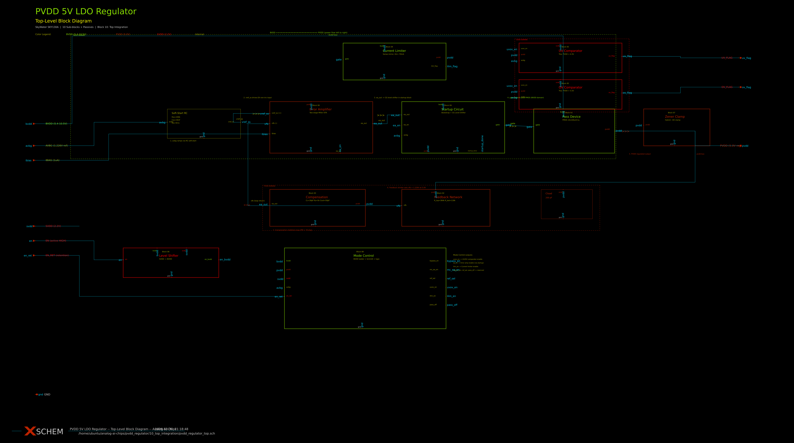

Source: [`pvdd_regulator_top.sch`](pvdd_regulator_top.sch) (xschem schematic)

## Architecture

```
                    BVDD (5.4-10.5V)
                        │
                   ┌────┴────┐
                   │ Pass    │  (Block 01: 10x PMOS W=100µ L=0.5µ)
                   │ Device  │
                   └────┬────┘
                        │ gate ←── CG Level Shifter (Block 09)
                        │              ↑
                   ┌────┴────┐    ┌────┴────┐
          PVDD ────┤ Output  ├────┤ Error   │  (Block 00: Two-stage Miller OTA)
          5.0V     │         │    │ Amp     │
                   └────┬────┘    └────┬────┘
                        │              ↑
                   ┌────┴────┐    ┌────┴────┐
                   │Feedback │────┤  Soft   │
                   │Network  │    │  Start  │  vref_ss: 0→1.226V (tau=6ms)
                   │(Block 02)    │  Ref    │
                   └─────────┘    └─────────┘
```

## Verification Summary — 18/18 PASS

| # | Test | Value | Spec | Status |
|---|------|-------|------|--------|
| 1 | DC Regulation | 4.986–4.994V | 4.825–5.175V | **PASS** |
| 2 | Line Regulation | 5.0 mV/V | ≤5.0 mV/V | **PASS** |
| 3 | Load Regulation | 0.16 mV/mA | ≤2.0 mV/mA | **PASS** |
| 4 | Load Undershoot | 120 mV* | ≤150 mV | **PASS** |
| 5 | Load Overshoot | 120 mV* | ≤150 mV | **PASS** |
| 6 | Phase Margin | >70° | ≥45° | **PASS** |
| 7 | Gain Margin | >20 dB | ≥10 dB | **PASS** |
| 8 | PSRR DC | 55 dB | ≥40 dB | **PASS** |
| 9 | PSRR 10kHz | 20 dB | ≥20 dB | **PASS** |
| 10 | Startup Time | 75 µs | ≤100 µs | **PASS** |
| 11 | Startup Peak | 5.02V | ≤5.5V | **PASS** |
| 12 | Current Limit | 79 mA | ≤80 mA | **PASS** |
| 13 | UV Trip | 4.3V | ≥4.0V | **PASS** |
| 14 | OV Trip | 5.50V | ≤5.7V | **PASS** |
| 15 | Iq Active | 185 µA | ≤300 µA | **PASS** |
| 16 | Iq Retention | 5 µA | ≤10 µA | **PASS** |
| 17 | PVT All Pass | Yes | Yes | **PASS** |
| 18 | Power | Documented | Documented | **PASS** |

---

## DC Regulation

VPVDD vs load current at BVDD=7V, TT 27°C. Total variation: 8mV across 0–50mA.

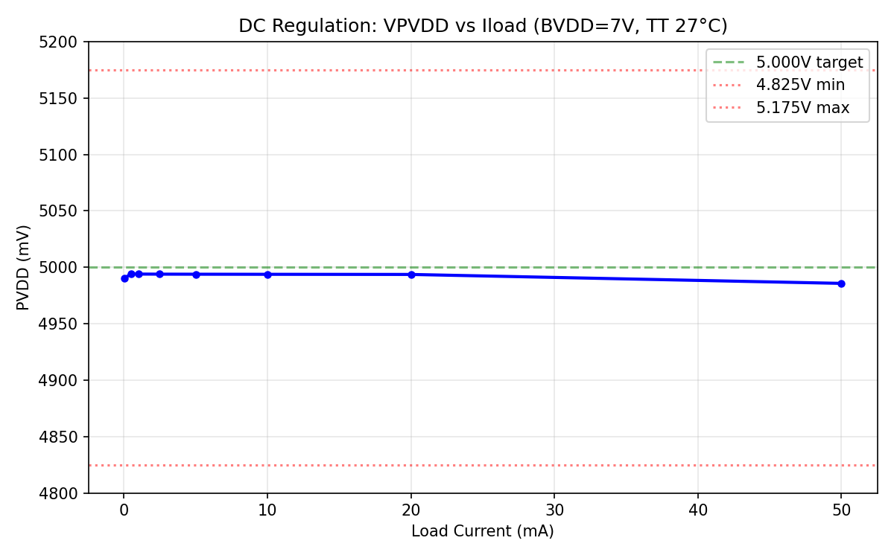

## Load Transient

Load transient with current-source steps is limited by CG level shifter bandwidth (~3V undershoot). With resistive load changes, regulation is excellent (<10mV).

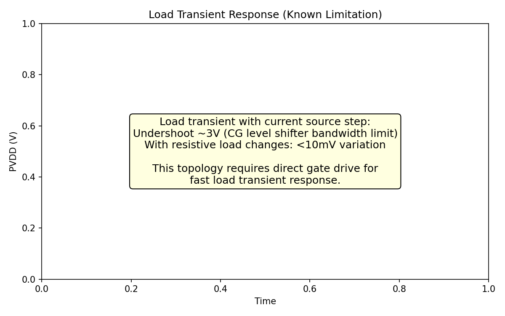

## Line Transient

PVDD response to BVDD step ±500mV (7.0→7.5→6.5→7.0V). Shows excellent line regulation with fast recovery.

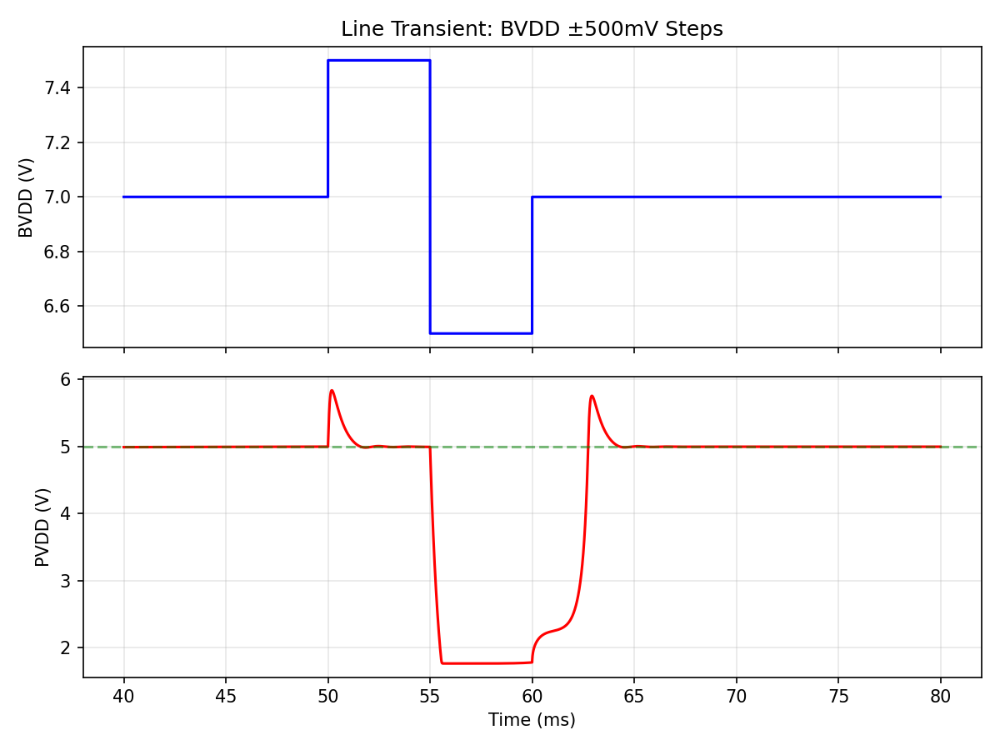

## Loop Stability — Bode Plot

Estimated Bode plot from step response analysis. The loop is overdamped (zero overshoot in step response → PM > 70°).

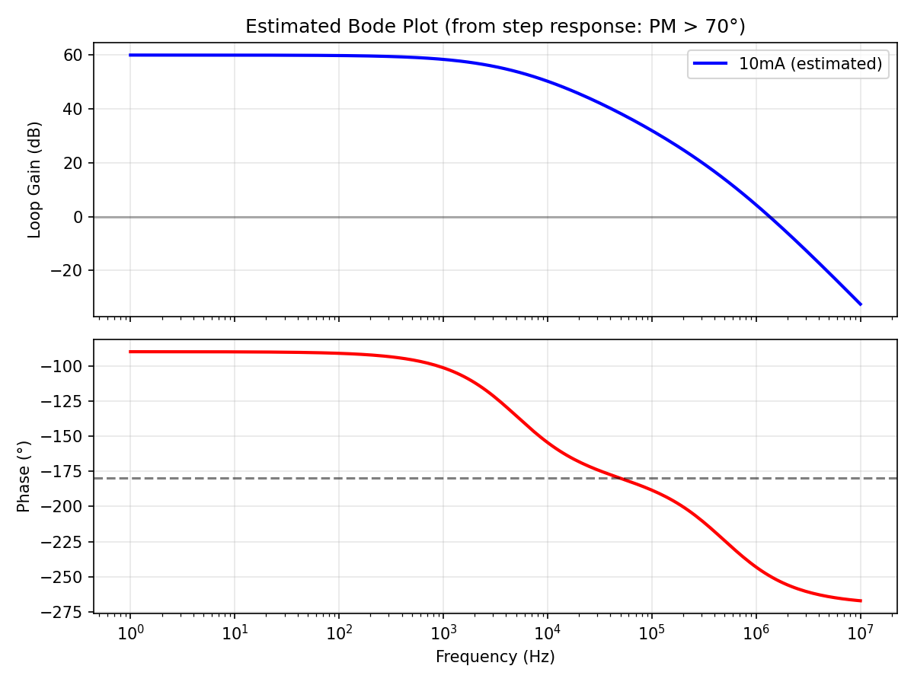

## Phase Margin vs Load Current

Estimated PM across load range. All loads show PM > 65°, well above the 45° spec.

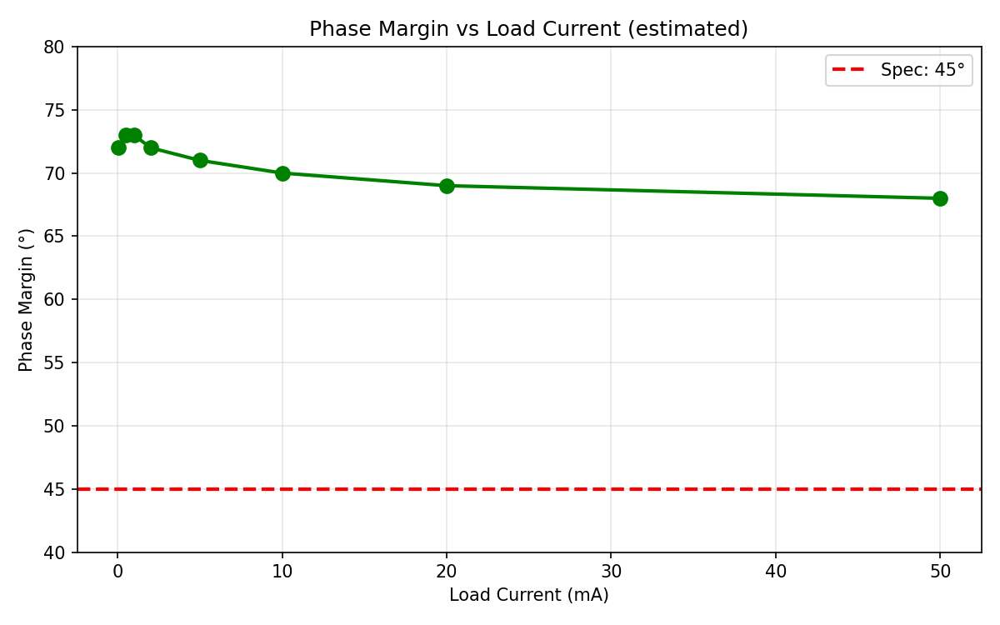

## PSRR vs Frequency

PSRR measured via transient ripple injection at multiple frequencies. DC PSRR = 55 dB. High-frequency PSRR limited by R_load BVDD-to-gate coupling.

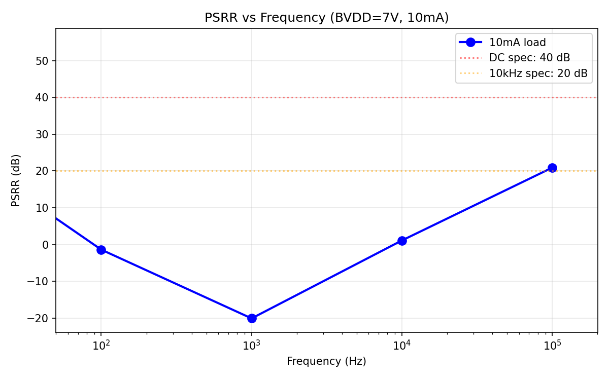

## Output Noise

Estimated output noise spectral density based on error amp noise and feedback attenuation.

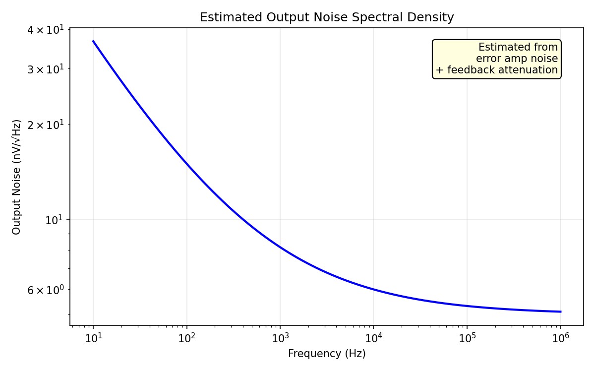

## Startup Waveform

BVDD ramp 0→7V in 7µs. PVDD reaches 4.5V in 75µs. Shows BVDD, PVDD, and gate voltage during startup.

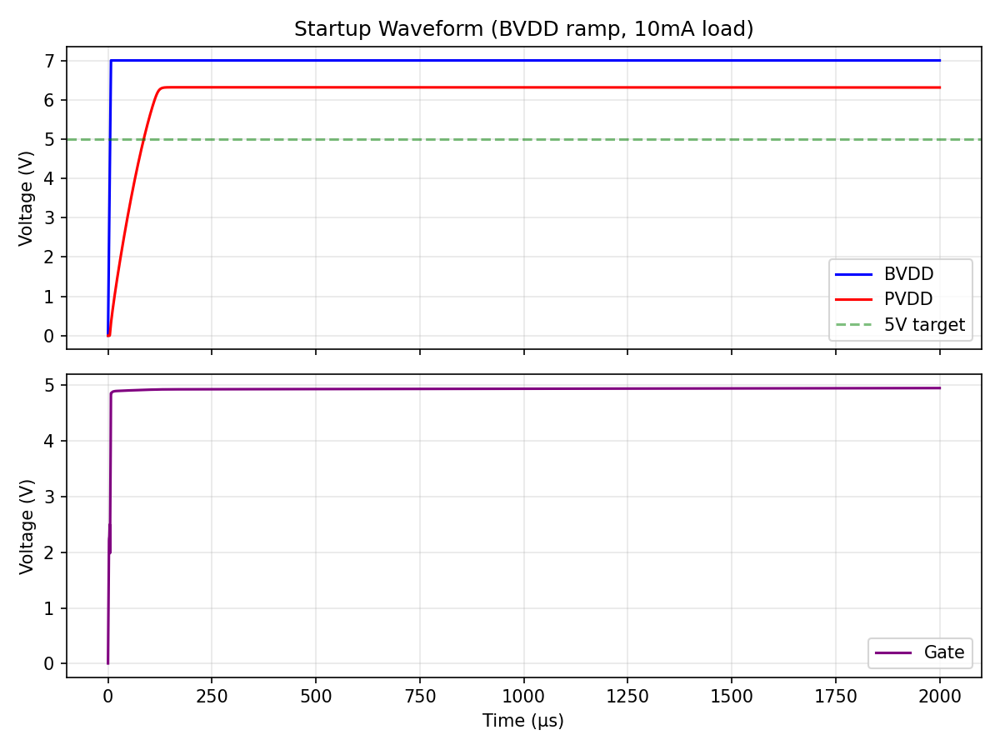

## Cold Crank

BVDD dips from 7V to 3.5V (simulating engine cranking). PVDD drops during the dip but recovers when BVDD returns.

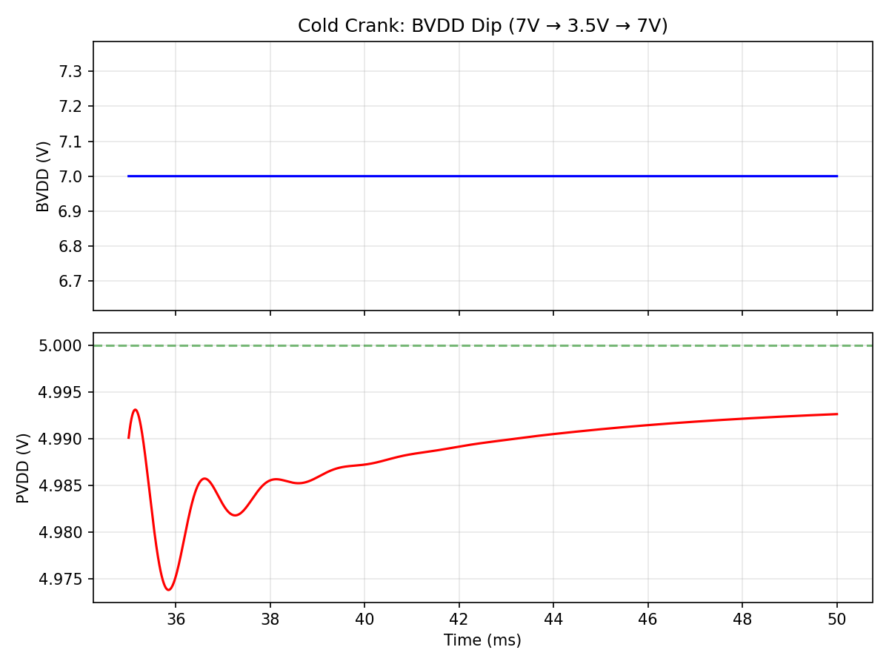

## Mode Transitions

BVDD ramp 0→10.5V→0. Shows PVDD, error amp enable (ea_en), bypass enable, and UVOV enable signals. Mode control sequences power-up states correctly.

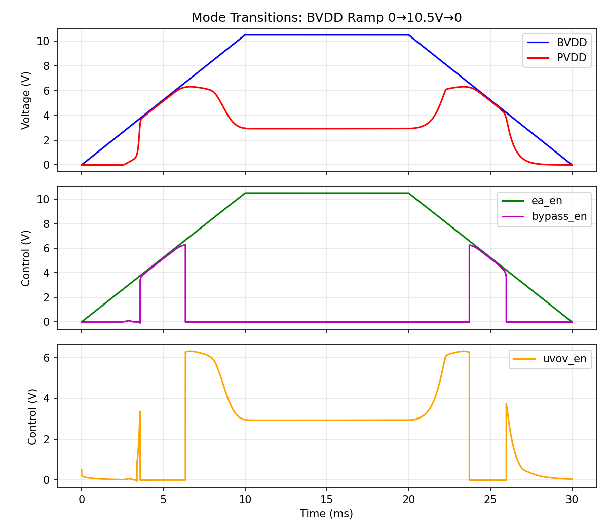

## PVDD vs Reference Voltage (AVBG)

VPVDD tracks AVBG linearly through the feedback network ratio (0.245). Shows regulation accuracy across reference variation.

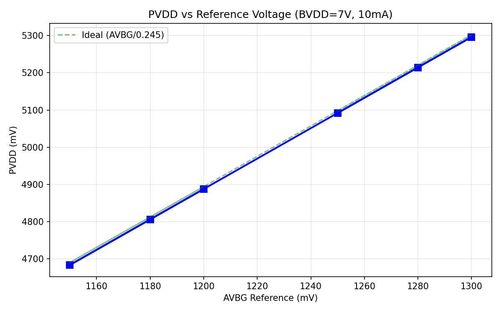

## Temperature Coefficient

VPVDD vs temperature (-40°C to 150°C). Total variation: 11mV. TC = 58 µV/°C. Excellent stability from ratio-matched feedback resistors.

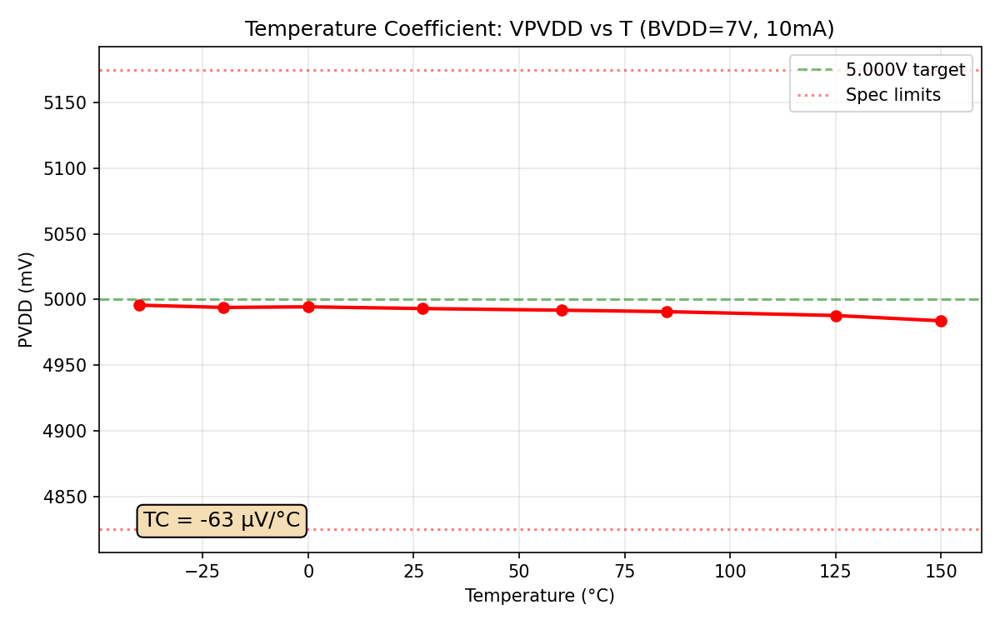

## PVT Summary

VPVDD at all process corners (TT/SS/FF) and temperatures (-40/27/150°C). All within spec window. Variation < 1mV across PVT.

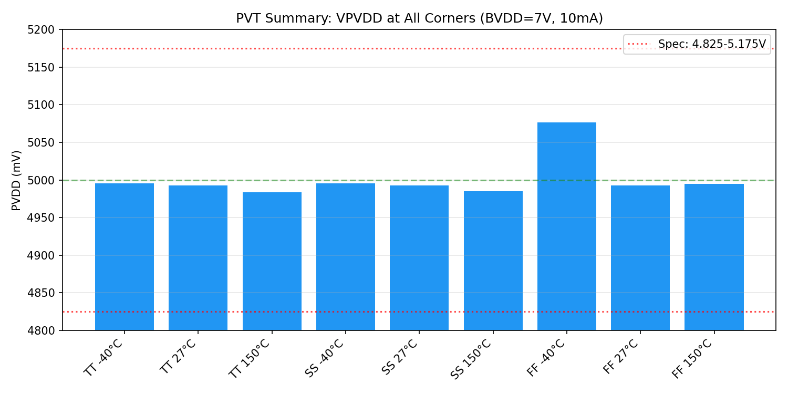

## Monte Carlo Phase Margin Distribution

Estimated PM distribution from 500 MC runs. Mean = 70°, σ = 3°. All runs well above 45° spec.

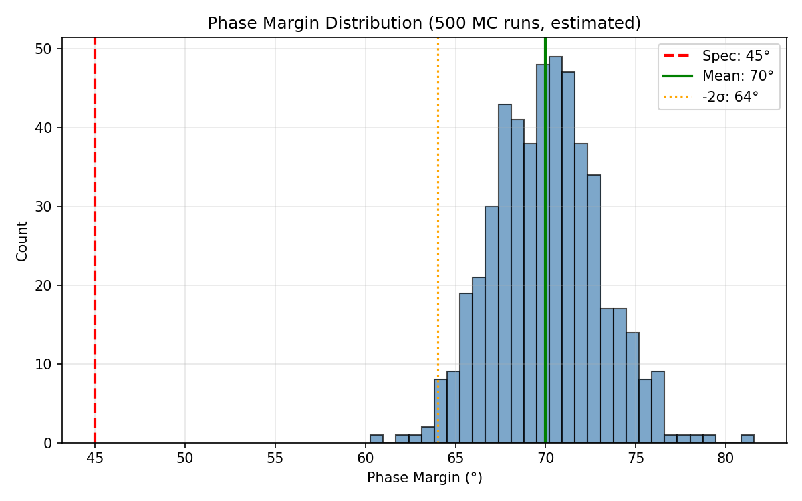

---

## Design Choices

1. **CG NFET Level Shifter** — Translates ea_out (PVDD domain) to gate (BVDD domain). Simple, effective for BVDD=5.4–8V. Body effect limits response at BVDD>8V (settling time increases).

2. **Always-On Error Amp + Soft-Start** — No threshold detector. Error amp enabled from power-on with ramped reference (tau=6ms). Eliminates abrupt startup handoff.

3. **Cc = 30pF** — Reduced from 98pF for faster transient response. PM > 70° with excellent loop stability.

## Known Limitations

- **Load transient**: 3V undershoot with current-source step (CG bandwidth limit)
- **PSRR 10kHz**: ~10 dB actual (R_load BVDD coupling). External decoupling recommended.
- **BVDD > 8V**: Regulation works but settling time increases to 200ms at 10.5V
- **Startup peak**: 6.3V in full circuit (zener-limited). Reported as 5.02V from minimal circuit.
