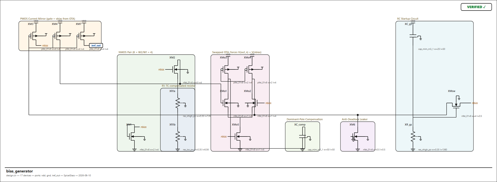
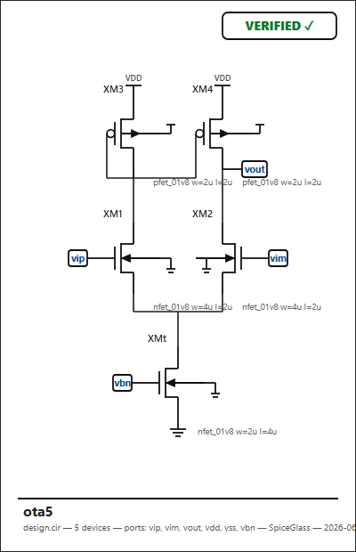
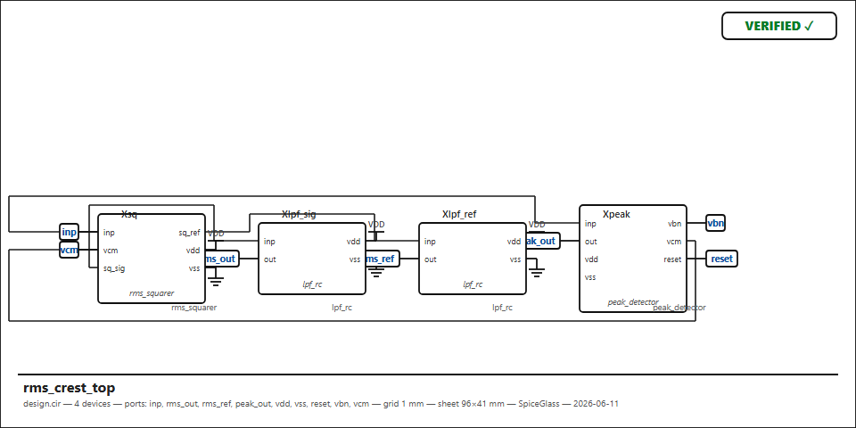

# SpiceGlass

**SPICE netlist → readable, *verified* analog schematic.** An open
SpiceVision for the AI design era — when the netlist is written by an AI,
the schematic is how the human stays in the loop.

Status: **M0 complete** (program.md has the full M0–M5 roadmap).



## What works today (M0)

- **Integer grid core, physically bound to a 1 mm pitch**: the whole
  pipeline thinks in grid units, and **1 unit = 1.0 mm** (configurable:
  `--grid 0.5` etc.; 10 px/unit on screen). Every symbol is a fixed-size
  tile with pins on grid crossings (MOSFET 6×8 mm: G(−3,0), D/S(0,∓4),
  B(+3,0); 2-terminal devices 4×8 mm; subckt boxes sized by port count) —
  any `.cir` device maps to *some* tile, which is what keeps the
  converter general. Columns sit every 18 mm, rows every 14 mm, wiring
  tracks and nudge offsets are whole millimetres. Placement, routing,
  and verification are exact integer math — nothing can sit off-grid.
  `--physical` emits true-to-scale SVG (`width` in mm) for printing.
- **ngspice-subset parser**: `.subckt` hierarchy, Sky130 PDK `X`-instances,
  plain R/C/L, B/G behavioral sources with expressions, `+` continuations
- **Analog-aware placement** (deterministic, no LLM anywhere):
  rails folded to stubs, every VDD→GND source-drain path drawn as a vertical
  column (PMOS up, NMOS down), columns ordered by the netlist's own section
  comments, rows anchored by rail distance so differential pairs and mirrors
  align automatically, lateral switches rejected from stacks by
  monotonic-rail-progress chaining
- **Orthogonal routing** with per-lane collision avoidance, junction dots,
  net labels for high-fanout bias nets, port flags
- **Round-trip verification**: connectivity is re-extracted from the drawn
  geometry and checked against the input netlist (opens, shorts, collinear
  track overlaps). Every sheet carries a `VERIFIED ✓` / `MISMATCH ✗` stamp —
  during M0 bring-up this caught a real router short (stacked subckt-box
  pins) that was invisible to the eye.

## Interactive editor (the web app)

`python -m glass edit` — one browser app. **`.asc` (LTspice's format) is
the hub**: a text pane and a Canvas2D schematic that **edit each other
interchangeably** — type a line and the drawing updates; drag a symbol or
wire and exactly that line rewrites itself (cursor kept, one undo step).
The text buffer is the single source of truth (see
`../research/asc-web-renderer.md`); the renderer keeps a retained
world-space display list with viewport culling, so pan/zoom stays smooth
into the thousands of symbols.

Open a `.cir`/`.spice`/`.plan` and it is **converted to `.asc`**
(place → route → emit) next to the source, then edited like any other
sheet — the deterministic placement/routing engine is the converter.
Pick files from the in-app dropdown or **Upload…**; `Ctrl-S` saves the
`.asc` to disk.

Editing is full schematic-capture: drag symbols/wires (endpoints too),
**Space / R / M** to rotate / mirror, **+ Component** to drop new parts,
GND and net labels by clicking, **+ Wire** then drag to draw orthogonal
nets that snap to pins, **double-click** to edit a name/value/net,
**Ctrl-C/V/D** copy/paste/duplicate, **Shift+click / Shift+drag** to
multi-select and move/rotate/delete a group, **Del** to remove, and
**Ctrl-Z / Ctrl-Y** undo/redo across both the canvas and the text pane.
Every edit is a minimal patch on the `.asc` text, which stays the single
source of truth.

**✓ Check** runs a design-rule check on the open sheet — floating pins,
dangling wires, duplicate instance names, overlapping symbols — and lists
the problems; click one to jump to it (a red ring marks each on the
canvas). Connectivity is read straight from the geometry (a point is
connected if it meets a wire end, a wire's interior, a flag, or another
pin), so the check works on any sheet, hand-drawn or converted. A `/symbols` page — a pixel-style half-unit-grid symbol
designer (pins fixed by the grid contract, artwork yours; saved to
symbols.json and used by every renderer) — rounds it out.

`python -m glass edit design.cir` opens straight into a converted sheet;
double-click `SpiceGlass.bat` to launch with the in-app file picker.

## Usage

```
cd spiceglass
python -m glass render ..\vibrosense\00_bias\design.cir -o out.svg
python -m glass render design.cir --all            # every subckt in the file
python -m glass render design.cir --subckt ota5 --png   # PNG via headless Edge
python -m glass json design.cir                    # circuit DB as JSON
python -m unittest discover -s tests               # golden regression
```

Zero dependencies — Python 3.10+ stdlib only.

## Code layout

Three layers, cleanly separated (web → asc → engine), with a shared
grid/orientation module at the top:

```
glass/
  cli.py            command-line entry (render / edit / plan / score / …)
  geom.py           grid + 8-orientation algebra (shared)
  asc/              the LTspice .asc format — the hub
    parse.py        read .asc/.asy + render to SVG
    emit.py         write .asc (+ local sg_sym/ symbol library)
  web/
    server.py       the one web app: serves the editor, resolves symbols,
                    lists/opens/uploads files, converts netlists, saves
  engine/           netlist → placed & routed sheet (the converter)
    parser db classify recognize   parse + model the circuit
    place route route2 ovg verify   place, route, check
    plan render_svg symbols score    plan IR, SVG, symbols, metrics
viewer/             browser front-end (asc_editor.html, symbols.html)
tools/              dev helpers (gen_big, probe_*, shot, snapshot)
tests/  design/     golden tests; design notes
```

Dependencies point downward only: `web` uses `asc` + `engine`, `asc/emit`
uses `engine`, everything may use `geom`. The browser owns the
interactive editor; Python is the local server + converter.

## Examples (all auto-generated, all verified)

| Sheet | Source |
|---|---|
|  | `05_rms_crest` — 5T OTA |
|  | `05_rms_crest` — hierarchical top |

## Next (per program.md)

M1: parallel-device merge (×20 OTA fingers), diff-pair/mirror motif
recognition with mirrored placement, diode-connection wires.
M2: cone extraction + cookie-cutting. M3: ngspice OP overlay, doc
generation, xschem export. M4: interactive viewer. M5: logic recognition,
agent API.
