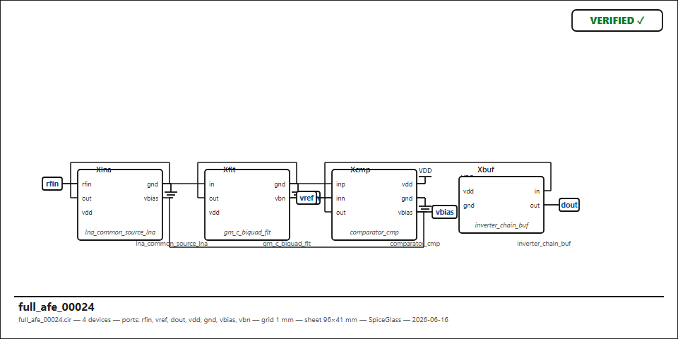
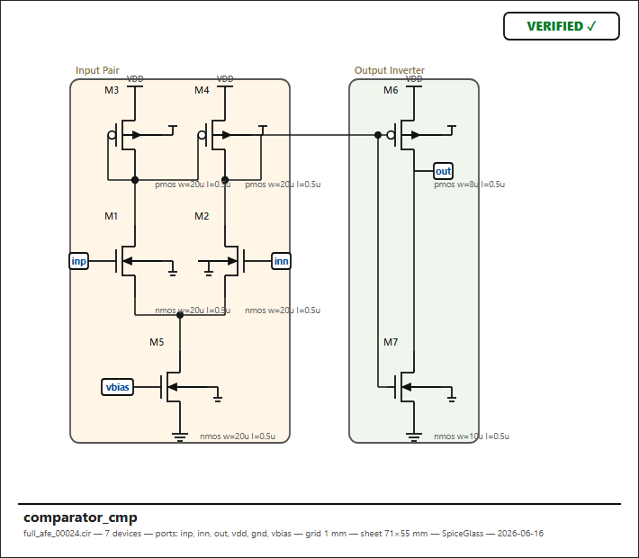

# SpiceGlass — Current State

_Last updated: 2026-06-16_

This document captures the current state of the SpiceGlass converter
engine and its realistic-circuit benchmark / dataset pipeline. For the
product overview and the M0–M5 roadmap see [`../README.md`](../README.md)
and [`../program.md`](../program.md).

---

## 1. What SpiceGlass does

Deterministic **SPICE netlist (`.cir`) → readable, round-trip-verified
schematic (`.asc` / SVG / PNG)**. No LLM in the pipeline — every step is
exact integer-grid math, and every emitted sheet carries a `VERIFIED ✓` /
`MISMATCH ✗` stamp produced by re-extracting connectivity from the drawn
geometry and comparing it to the input netlist.

### Pipeline

```
.cir ─▶ parse ─▶ classify ─▶ recognize ─▶ place ─▶ route ─▶ verify ─▶ emit
       (parser) (classify)  (recognize)  (place)  (route2  (verify)  (asc/
                                                   OVG+A*)            svg)
```

| Stage | Module | Role |
|-------|--------|------|
| parse | `glass/engine/parser.py` | ngspice-subset → devices/nets/sections |
| classify | `glass/engine/classify.py` | model → kind + terminal roles (incl. `X`→`sub`) |
| recognize | `glass/engine/recognize.py` | motif tiles: diff pairs (+tail), mirror banks, 5T cores, diodes |
| place | `glass/engine/place.py` | rail-distance rows, series columns, tile layout |
| optimize | `glass/engine/optimize.py` | left↔right object order to cut crossings (verify-gated) |
| route | `glass/engine/route.py`, `route2.py`, `ovg.py` | orthogonal-visibility-graph A* + nudging |
| verify | `glass/engine/verify.py` | round-trip: OPEN / SHORT / collinear-overlap checks |
| emit | `glass/asc/emit.py`, `render_svg.py` | LTspice `.asc`, SVG, PNG |

The live converter (`glass/web/server.py::convert_to_asc`) runs a
**verify-gated optimizer**: it routes and verifies several ranked
placement orders and keeps the best order that both verifies and beats
the seed — correctness is never traded for compactness.

---

## 2. Test & dataset pipeline

Three tools under `tools/`, all seed-reproducible:

| Tool | Purpose |
|------|---------|
| `gen_realistic.py` | **75 real leaf topologies** (parameterized; correct wiring, no floating gates) |
| `gen_hier.py` | **25 hierarchical systems** composing leaves via `X`-instances |
| `gen_netlists.py` | procedural random fuzzer — **robustness only**, NOT a dataset (electrically meaningless) |
| `benchmark.py` | scores convert+verify over a corpus; breaks down by device type / size / failure mode |
| `regress.py` | guard: in-house CORE blocks must verify (non-zero exit if regressed); WILD ngspice decks informational |

> The procedural fuzzer was explicitly demoted: it randomly stitches
> blocks via shared nets and produces floating gates / miswired tails.
> Useful to find crashes, useless as training data. The realistic +
> hierarchical generators are the dataset basis.

### Current results

**Leaf topologies** — `gen_realistic.py`, product path (optimizer on):

```
9175 netlists · 75 topologies · 0 invalid · 0 crashes · VERIFIED 100.0%
```

**Hierarchical systems** — `gen_hier.py`, product path:

```
2500 files · 25 systems · 0 crashes
TOP systems:        25/25 verify (100%)
ALL subckts:        11648/11648 verify (tops + leaves, 100%)
```

Engine health: `regress.py --core-only` → **CORE clean**; golden unit
tests (`tests/`) → **OK**.

### Reproduce

```bash
cd spiceglass
python tools/gen_realistic.py --count 7500 --out benchmark/real --seed 21
python tools/benchmark.py     --dir benchmark/real --optimize

python tools/gen_hier.py      --count 2500 --out benchmark/hier --seed 3
python tools/gen_hier.py      --list        # the 25-system catalog

# render any subckt to SVG + PNG (PNG via headless Edge screenshot)
python -m glass render benchmark/hier/full_afe_00000.cir --subckt full_afe_00000 --png
```

Bulk corpora (`benchmark/real/`, `benchmark/hier/`, `benchmark/gen*`) are
gitignored — regenerate from the seed. The generators are committed.

---

## 3. Coverage

### 75 leaf topologies (all 100%)

- **Amplifiers / OTAs** — 5T, two-stage Miller, telescopic, folded-cascode,
  fully-diff + CMFB, cascode, current-mirror OTA, rail-to-rail input,
  gain-boosted cascode, 3-stage Miller, class-AB output, super-source-follower,
  common-source, transimpedance (TIA)
- **References / bias** — cascode / Wilson / Widlar / peaking / low-voltage-
  cascode / ratioed mirrors, β-multiplier, Brokaw + core bandgaps, Vbe
  multiplier, bandgap-with-startup, PTAT temp sensor
- **Comparators** — StrongARM, double-tail, hysteresis, flash-ADC bank,
  window comparator
- **RF** — cascode & common-source LNA, differential LNA, cascode PA,
  Gilbert mixer, LC VCO
- **Data converters** — SAR cap-array, current-steering DAC, R-2R, R-string,
  Δ-Σ & switched-cap integrators
- **Filters** — Sallen-Key, multiple-feedback (Rauch), gm-C biquad, RC
  filter / ladder
- **Oscillators** — ring, Wien-bridge, Colpitts, Pierce/crystal, RC relaxation
- **Power** — LDO, buck & boost stages, H-bridge leg, Dickson charge pump,
  gate driver, push-pull driver
- **IO / misc** — inverter chain, NAND/NOR, transmission gate, Schmitt,
  level shifter, LVDS driver, open-drain output, power-on-reset, ESD clamp,
  peak detector, sample-and-hold, voltage doubler, CCII current conveyor

### 25 hierarchical systems (all 100%)

bandgap→LDO · LDO+β-bias · sensor chain (TIA→filter→comparator) · analog
frontend (TIA→filter→buffer) · full AFE (LNA→filter→comparator→buffer) ·
amp+output · two-stage & three-stage amp chains · ADC frontend (S&H→comparator)
· integrator+quantizer (Δ-Σ loop) · comparator+buffer · clock gen (osc→buffer)
· bias distribution · RF receiver (LNA→IF) · RF mixer chain (diff-LNA→Gilbert)
· filter cascade · opamp+RC · conveyor+filter · SC filter · temperature monitor
· precision bandgap buffer · data slicer · gate-drive stage · motor predriver ·
level-shift buffer.

---

## 4. Engine fixes landed this cycle

Driven by the realistic/hierarchical benchmark surfacing precise failures:

| Fix | Commit | Effect |
|-----|--------|--------|
| Router: touching foreign net = clash; no bending on a foreign wire body | `bcd9b8c` | folded-cascode SHORT |
| Caps don't set DC stack level (BFS skips capacitors) | `a85c0c3` | cascode interleave (LNA) SHORT |
| Tail-less pair source exposed as a routing tap | `5209321` | Gilbert-mixer net-split OPEN |

The cap-level and pair-tap fixes are general — they carried the whole
new RF / converter / sensor set to 100% with no further changes.

---

## 5. Example renders

A 4-block hierarchical system drawn as wired block boxes:



A leaf block (`comparator`) expanded to its transistor schematic:



Both carry the round-trip `VERIFIED ✓` stamp.

---

## 6. Known limitation / next frontier

- **Custom (non-PDK, non-primitive) `X` models** with no local `.subckt`
  definition fall back to a generic labeled box (correct, but not a
  symbol).
- The dataset is single- and multi-block; **deeper nesting** (systems of
  systems) and **mixed analog+digital control** are the next breadth steps.
- Endgame: the verified `(netlist → placed schematic)` pairs at 100% yield
  are the training basis for learned placement/recognition models.
