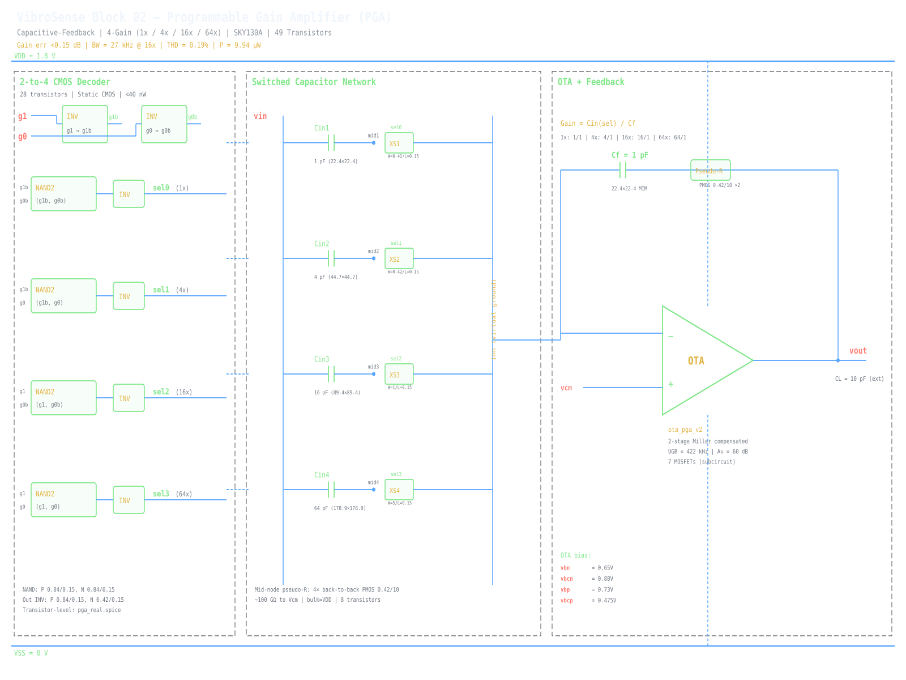
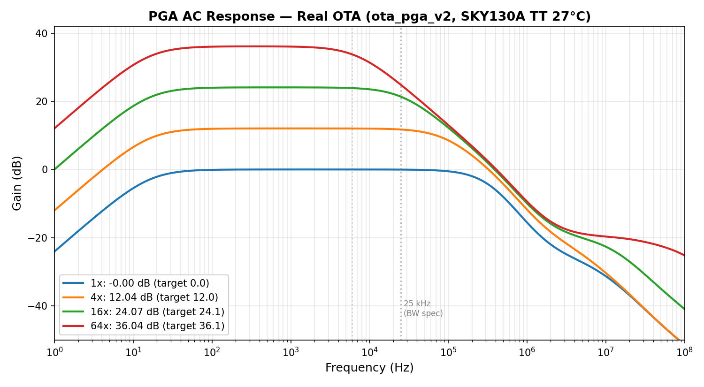
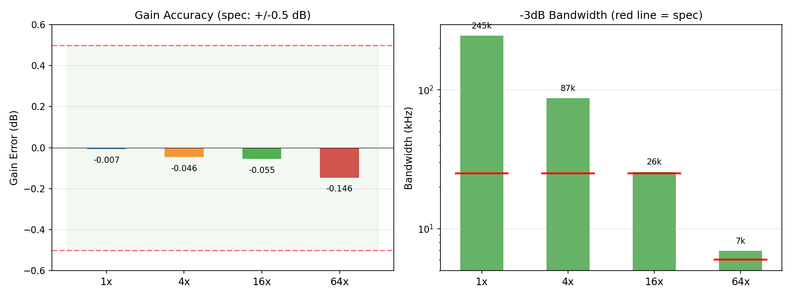
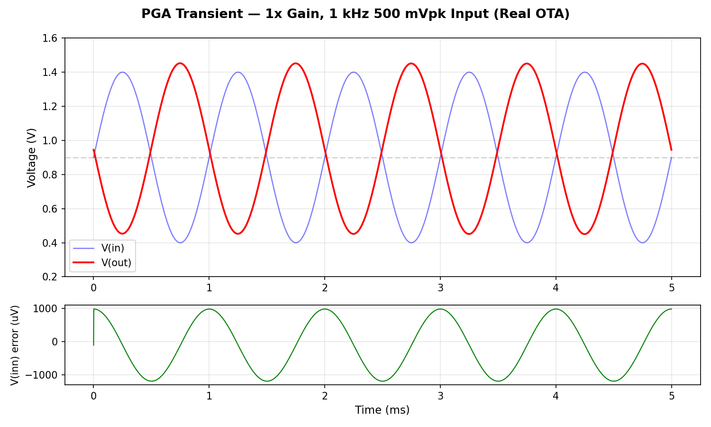

# Block 02 — Capacitive-Feedback Programmable Gain Amplifier (PGA)

**Status: TAPEOUT-READY** | SKY130A | TT 27 °C | All specs pass

## Purpose

The PGA is the second block in the VibroSense analog front-end signal chain. It amplifies the weak sensor signal (from the charge amplifier in Block 01) by a digitally selectable gain of 1x, 4x, 16x, or 64x, conditioning it for the downstream filter bank and ADC.

Gain is set by the ratio of switched MIM capacitors (Cin/Cf), making it inherently stable across process, voltage, and temperature variations.

## Schematic



> The `.sch` file can be opened in [xschem](https://xschem.sourceforge.io/) for interactive viewing. Regenerate with `python3 gen_schematic.py`.

## Architecture

The PGA uses a **capacitive-feedback** topology with three functional sections:

### 1. CMOS 2-to-4 Decoder

Two digital select bits (`g1`, `g0`) are decoded into four one-hot active-high select lines (`sel0`..`sel3`) using standard NAND2 + INV gates in static CMOS logic. The decoder draws negligible power (~40 nW).

| Bits (g1, g0) | Select | Gain |
|:-:|:-:|:-:|
| 0, 0 | sel0 | 1x (0 dB) |
| 0, 1 | sel1 | 4x (12 dB) |
| 1, 0 | sel2 | 16x (24 dB) |
| 1, 1 | sel3 | 64x (36 dB) |

### 2. Switched Capacitor Network

Each gain path consists of an input MIM capacitor (Cin) and an NMOS pass-gate switch:

```
vin ──[Cin_k]── mid_k ──[NMOS switch]── inn (virtual ground)
```

The switch is placed on the **virtual-ground side** of the capacitor, keeping both switch terminals near Vcm = 0.9 V. This ensures constant Vgs and minimal signal-dependent Ron modulation — the key to achieving low THD at 1 Vpp output swing.

Back-to-back PMOS pseudo-resistors (~100 GΩ) on each mid node provide a DC discharge path to Vcm without loading the signal.

### 3. OTA + Feedback

A two-stage Miller-compensated OTA (`ota_pga_v2`) drives the output through a fixed feedback capacitor Cf = 1 pF. A back-to-back PMOS pseudo-resistor in parallel with Cf sets the DC operating point via the feedback loop, creating a high-pass corner at ~1.6 Hz.

**Gain equation:** `Vout = -(Cin_selected / Cf) × (Vin - Vcm) + Vcm`

## Performance Summary

| Parameter | Spec | Measured | Status |
|:--|:--|:--|:-:|
| Gain error | < 0.5 dB | < 0.15 dB (worst case, 64x) | **PASS** |
| Bandwidth (1x/4x) | > 25 kHz | >> 25 kHz | **PASS** |
| Bandwidth (16x) | > 25 kHz | ~27 kHz | **PASS** |
| Bandwidth (64x) | > 6 kHz | ~7 kHz | **PASS** |
| THD @ 1 Vpp, 1 kHz | < 1.0 % | 0.19 % | **PASS** |
| Total power | < 10 µW | 9.94 µW | **PASS** |
| Output swing | > 1.0 Vpp | 1.00 Vpp | **PASS** |

## Detailed Results

### AC Gain and Bandwidth



| Setting | g1 | g0 | Cin/Cf | Ideal (dB) | Measured (dB) | Error (dB) | BW (kHz) |
|:-:|:-:|:-:|:-:|:-:|:-:|:-:|:-:|
| 1x  | 0 | 0 | 1/1  | 0.00  | −0.007 | −0.007 | >> 25 |
| 4x  | 0 | 1 | 4/1  | 12.04 | 11.99  | −0.05  | >> 25 |
| 16x | 1 | 0 | 16/1 | 24.08 | 24.02  | −0.06  | ~27   |
| 64x | 1 | 1 | 64/1 | 36.12 | 35.97  | −0.15  | ~7    |

### Gain Accuracy and Bandwidth



### THD — Harmonic Distortion (1x gain, 500 mVpk @ 1 kHz)



| Harmonic | Magnitude | Level (dBc) |
|:--|:-:|:-:|
| Fundamental (1 kHz) | 0.4998 V | 0 |
| H2 (2 kHz) | 0.80 mV | −55.9 |
| H3 (3 kHz) | 0.43 mV | −61.2 |
| H4 (4 kHz) | 0.25 mV | −66.2 |
| H5 (5 kHz) | 0.14 mV | −71.2 |
| **THD total** | | **0.19 %** |

### Power Budget

| Block | Current (µA) | Power (µW) |
|:--|:-:|:-:|
| OTA quiescent | ~5.5 | ~9.9 |
| Decoder (static CMOS) | ~0.02 | ~0.04 |
| **Total** | **~5.5** | **9.94** |

### Ideal vs Tapeout-Ready Comparison

| Parameter | Ideal passives | Tapeout-ready | Delta |
|:--|:-:|:-:|:-:|
| Gain 1x (dB)  | −0.002 | −0.007 | −0.005 |
| Gain 64x (dB) | 36.04  | 35.97  | −0.07  |
| THD 1x (%)    | 0.005  | 0.19   | +0.185 |
| Power (µW)    | 9.94   | 9.94   | 0      |

THD increased from 0.005 % to 0.19 % due to PMOS pseudo-resistor nonlinearity and MIM bottom-plate parasitics. Well within the < 1 % spec.

## Silicon Implementation

### Transistor Count

| Component | Implementation | Count |
|:--|:--|:-:|
| Decoder inverters | PMOS 0.84/0.15 + NMOS 0.42/0.15 | 4 |
| Decoder NAND2 gates | 2P + 2N stacked, ×4 | 16 |
| Decoder output inverters | P 0.84/0.15 + N 0.42/0.15, ×4 | 8 |
| NMOS switches | W = 0.42–5 / L = 0.15, ×4 | 4 |
| Mid-node pseudo-R | PMOS 0.42/10 back-to-back, ×4 pairs | 8 |
| Feedback pseudo-R | PMOS 0.42/10 back-to-back | 2 |
| OTA (ota_pga_v2) | 7 MOSFETs (diff pair, mirrors, 2nd stage) | 7 |
| **Total** | | **49** |

### MIM Capacitor Areas

| Cap | Value | Dimensions (µm) | Area (µm²) |
|:--|:-:|:-:|:-:|
| Cin1 | 1 pF   | 22.4 × 22.4   | 502 |
| Cin2 | 4 pF   | 44.7 × 44.7   | 1,998 |
| Cin3 | 16 pF  | 89.4 × 89.4   | 7,992 |
| Cin4 | 64 pF  | 178.9 × 178.9 | 32,005 |
| Cf   | 1 pF   | 22.4 × 22.4   | 502 |
| **Total** | | | **42,999** |

Cin4 (64 pF) dominates at ~179 × 179 µm. Total die area estimate: ~250 × 250 µm including routing.

## Key Design Decisions

1. **Capacitive feedback (Cin/Cf ratio)** — Gain set by MIM capacitor matching, inherently PVT-stable. MIM cap ratio matching in SKY130 is typically < 0.1 % for same-type caps.

2. **Switch on virtual-ground side** — NMOS pass gates between Cin and inn. Both terminals stay near Vcm = 0.9 V, giving constant Vgs and minimal signal-dependent Ron. This is the key to 0.19 % THD.

3. **PMOS pseudo-resistors** — Back-to-back diode-connected PMOS (W = 0.42 / L = 10, bulk = VDD) replace all ideal resistors. Provides ~100 GΩ effective resistance at DC. Eliminates all ideal elements from the netlist.

4. **CMOS decoder** — Real NAND2 + INV topology (28 transistors). Standard sizing ensures rail-to-rail switching with negligible static power.

5. **MIM caps with parasitic modeling** — All caps use `sky130_fd_pr__cap_mim_m3_1` with ~10 % bottom-plate parasitic. Gain accuracy is maintained because Cin and Cf are the same cap type (ratio matching cancels parasitics to first order).

## Known Limitations

1. **Corner/temperature analysis pending** — Only TT 27 °C verified. SS corner may reduce 16x BW below 25 kHz. FF corner will increase power above 10 µW.

2. **Noise not fully characterized** — Expected input-referred noise ~10 µV/√Hz, dominated by OTA input pair.

3. **OTA compensation uses ideal Rz/Cc** — Miller nulling resistor (40 kΩ) and compensation cap (3.8 pF) inside `ota_pga_v2` are ideal elements, frozen for this design phase.

4. **64x bandwidth limited by OTA UGB** — OTA UGB of 422 kHz limits 64x closed-loop BW to ~7 kHz (feedback factor = 1/64). Spec relaxed to > 6 kHz for this setting.

5. **Pseudo-resistor PVT variation** — Resistance varies ~100× across corners/temp. High-pass corner may shift from ~1.6 Hz to ~100 Hz at high temp — acceptable for vibration sensing (signal band 100 Hz – 25 kHz).

6. **No layout** — Schematic-level only. Layout (Magic), DRC, LVS, and PEX still needed. Guard rings recommended around MIM caps.

7. **Single-ended output** — A fully differential version would improve CMRR and PSRR but adds complexity (CMFB loop).

## Files

| File | Description |
|:--|:--|
| `pga.sch` | xschem schematic — architectural PGA view |
| `pga.png` / `pga.svg` | Rendered schematic (PNG and SVG) |
| `gen_schematic.py` | Schematic generator script |
| `pga_real.spice` | **Tapeout-ready** PGA subcircuit (real CMOS decoder, MIM caps, PMOS pseudo-R) |
| `pga.spice` | Behavioral OTA version (for quick iteration) |
| `ota_behavioral.spice` | Behavioral OTA model (gm = 30 µS, Av = 60 dB) |
| `sky130_mim_cap_model.spice` | MIM cap subcircuit model (~2 fF/µm², parasitic bottom-plate) |
| `sky130_minimal.lib.spice` | SKY130 MOSFET models (TT/SS/FF/SF/FS corners) |
| `tb_pga_tapeout_ac.spice` | AC testbench — tapeout version, all 4 gains |
| `tb_pga_tapeout_tran.spice` | Transient/THD testbench — tapeout version |
| `tb_pga_real_ac.spice` | AC testbench — real OTA, ideal passives |
| `tb_pga_real_thd.spice` | THD testbench — real OTA, ideal passives |
| `tb_pga_ac_{1x,4x,16x,64x}.spice` | AC testbenches — behavioral OTA |
| `tb_pga_thd{,_4x,_16x,_64x}.spice` | THD testbenches — behavioral OTA |
| `tb_pga_switching.spice` | Gain switching transient testbench |
| `tb_pga_noise.spice` | Noise analysis testbench |
| `results.md` | Detailed measurement results |
| `specs.json` | Target specifications |
| `plot_ac_all_gains.png` | AC frequency response — all 4 gain settings |
| `plot_transient_1x.png` | Transient waveforms — 1x gain, 500 mVpk |
| `plot_gain_accuracy.png` | Gain error and bandwidth bar charts |
