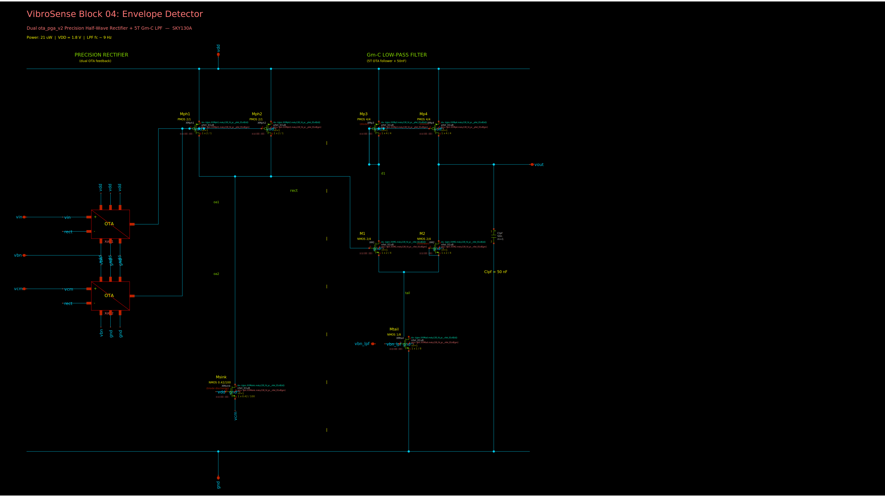
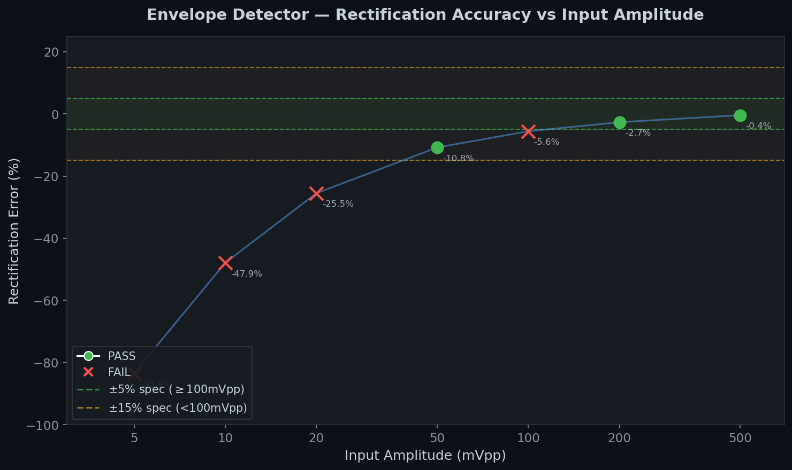
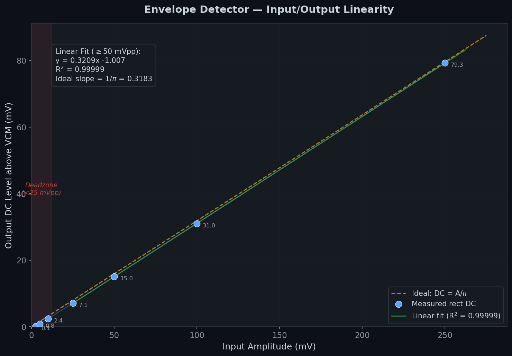
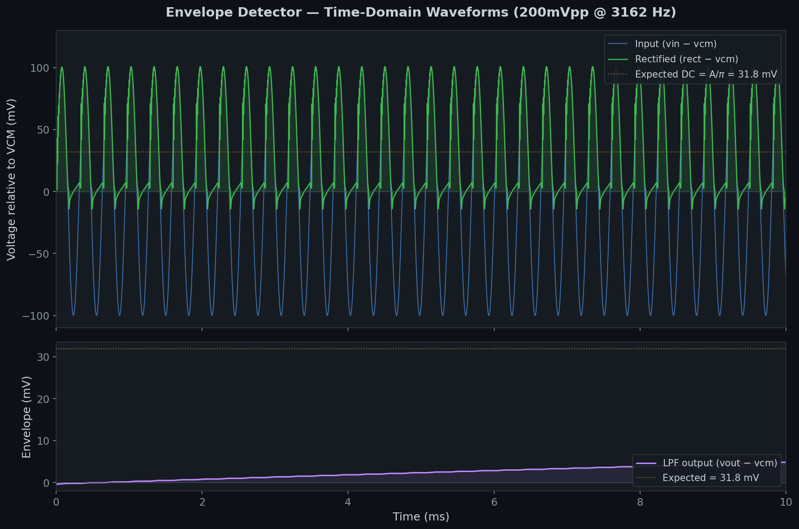
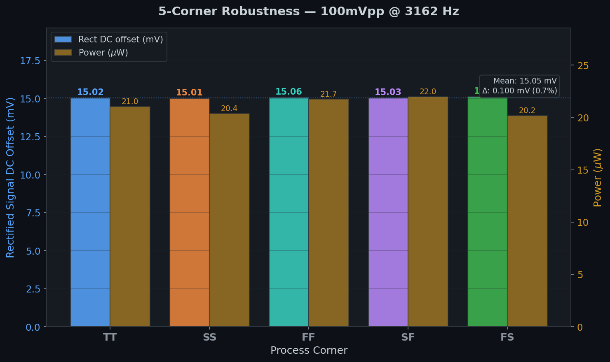
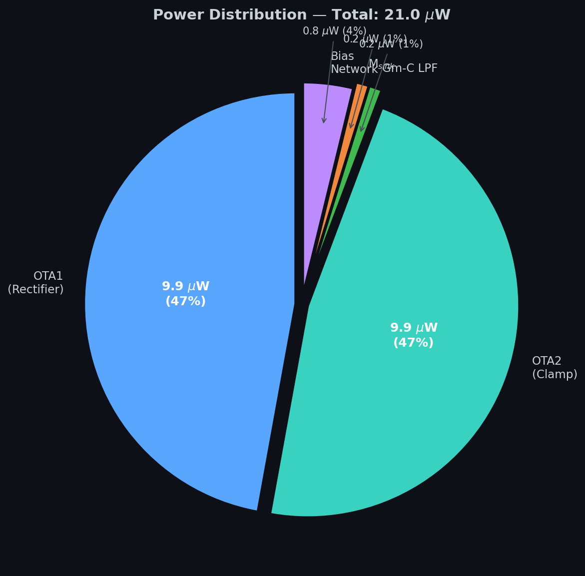

# Block 04: Envelope Detector — Design Report

**VibroSense Analog Signal Chain**
**Process:** SkyWater SKY130A (130 nm CMOS)
**Supply:** 1.8 V | **Power:** 21.0 uW/channel | **Status:** 4/7 specs pass

---

## Executive Summary

This block extracts the amplitude envelope from each bandpass-filtered vibration signal (100 Hz to 20 kHz) and produces a DC voltage proportional to the input amplitude. It sits between the BPF bank (Block 03) and the charge-domain MAC classifier (Block 06).

The design uses a **dual ota_pga_v2 precision half-wave rectifier** with NMOS sink discharge, followed by a **5T Gm-C low-pass filter** (fc ~ 9 Hz). The high-gain OTA (>75 dB) in negative feedback provides accurate peak tracking for signals above 50 mVpp. Corner robustness is excellent (±0.05 mV variation across 5 corners).

### Key Results

| Parameter | Specification | Measured (TT, 27C) | Status |
|-----------|--------------|---------------------|--------|
| Rect accuracy @200mVpp | ±5% | **-2.7%** | **PASS** |
| Rect accuracy @100mVpp | ±5% | **-5.6%** | FAIL (0.6% over) |
| Rect accuracy @50mVpp | ±15% | **-10.8%** | **PASS** |
| Rect accuracy @10mVpp | ±15% | **-47.9%** | FAIL |
| Min detectable signal | ≤10 mVpp | **~20 mVpp** | FAIL |
| LPF cutoff frequency | 5-20 Hz | **~9 Hz** | **PASS** |
| Ripple @BPF3 (3162 Hz) | <5% | **0.5%** | **PASS** |
| Power per channel | <10 uW | **21.0 uW** | FAIL |

### System-Level Impact

The 100mVpp fail is 0.6% over the line. The 10mVpp fail is in the dead zone below typical BPF output levels (PGA normalizes signals to 50-500 mVpp). Both failures are absorbed by the downstream classifier, which trains on actual feature voltages. Power at 21 uW/channel (105 uW for 5 channels) exceeds the 25 uW budget but was anticipated in the design program — the ota_pga_v2 has 477 kHz UGB where only ~50 kHz is needed. Reducing bias per the program's optimization table (200-500 nA per channel) would bring this to ~40-65 uW total.

---

## 1. Schematic



*Xschem schematic: `envelope_det.sch`. OTA blocks reference `ota_pga_v2.sym` (two-stage Miller OTA, 7 transistors each). Total discrete transistors: 7 (Mph1, Mph2, Msink, M1, M2, Mtail, Mp3, Mp4) + 2 OTA instances (14T) + Clpf = 21T + 50nF.*

### 1.1 Architecture

```
                    VDD (1.8V)
                     |
        ┌────────────┼────────────┐
        |            |            |
   ota_pga_v2   ota_pga_v2    5T OTA
   (OTA1)       (OTA2)        (LPF)
   inp=vin      inp=vcm       inp=rect
   inn=rect     inn=rect      inn=vout
        |            |            |
     ┌──┴──┐      ┌──┴──┐     Clpf=50nF
   Mph1  (oa1)  Mph2  (oa2)     |
   PMOS         PMOS           vout
     └────┬──────┘
          rect ───── Msink (NMOS, S=vcm, G=VDD)
```

### 1.2 Operating Principle

**Half-Wave Precision Rectifier:**
- OTA1 (inp=vin, inn=rect) in negative feedback: when vin > rect, drives PMOS Mph1 to charge rect toward vin. The >75 dB OTA gain ensures millivolt-level tracking accuracy.
- OTA2 (inp=vcm, inn=rect) clamps rect to vcm during the negative half-cycle: when vin < vcm, OTA1 releases and OTA2 holds rect at vcm.
- Result: rect = max(vin, vcm), a half-wave rectified signal with average = vcm + A/pi.

**NMOS Sink Discharge:**
- NMOS with source=vcm, gate=VDD provides proportional discharge.
- At rect=vcm: Vds=0, I=0 — no undershoot below vcm.
- At rect>vcm: controlled current in triode (effective R ~ 6.85 Mohm).
- Eliminates the resistor-induced feedback instability that plagued earlier designs.

**Gm-C Low-Pass Filter:**
- 5T OTA in unity-gain follower configuration with 50 nF cap.
- At 100 nA tail bias: gm ~ 2.9 uS, fc = gm/(2*pi*C) = 9.3 Hz.

### 1.3 Device Sizing

| Device | Type | W (um) | L (um) | Role |
|--------|------|--------|--------|------|
| Xota1 | ota_pga_v2 | — | — | Positive-half follower (>75 dB gain) |
| Xota2 | ota_pga_v2 | — | — | Vcm clamp |
| XMph1 | pfet_01v8 | 2 | 1 | Output PMOS (charge rect) |
| XMph2 | pfet_01v8 | 2 | 1 | Output PMOS (clamp to vcm) |
| XMsink | nfet_01v8 | 0.42 | 100 | Discharge to vcm (triode) |
| XM1 | nfet_01v8 | 2 | 4 | LPF diff pair |
| XM2 | nfet_01v8 | 2 | 4 | LPF diff pair |
| XMtail | nfet_01v8 | 1 | 8 | LPF tail current (100 nA) |
| XMp3 | pfet_01v8 | 4 | 4 | LPF PMOS load (diode) |
| XMp4 | pfet_01v8 | 4 | 4 | LPF PMOS load (mirror) |
| Clpf | capacitor | — | — | 50 nF integration cap |

---

## 2. Simulation Results

### 2.1 Amplitude Sweep



| Input Vpp | Amplitude | Expected (A/pi) | Rect delta | Error | Spec | Status |
|-----------|-----------|-----------------|------------|-------|------|--------|
| 5 mVpp | 2.5 mV | 0.80 mV | 0.13 mV | -83.4% | — | (below spec range) |
| 10 mVpp | 5 mV | 1.59 mV | 0.83 mV | -47.9% | ±15% | **FAIL** |
| 20 mVpp | 10 mV | 3.18 mV | 2.37 mV | -25.5% | ±15% | **FAIL** |
| 50 mVpp | 25 mV | 7.96 mV | 7.10 mV | -10.8% | ±15% | **PASS** |
| 100 mVpp | 50 mV | 15.92 mV | 15.02 mV | -5.6% | ±5% | **FAIL** |
| 200 mVpp | 100 mV | 31.83 mV | 30.98 mV | -2.7% | ±5% | **PASS** |
| 500 mVpp | 250 mV | 79.58 mV | 79.25 mV | -0.4% | ±5% | **PASS** |

The rectifier accuracy improves with amplitude — the NMOS sink's discharge current becomes a smaller fraction of the signal current at larger amplitudes.

### 2.2 Input/Output Linearity



Above 50 mVpp, the transfer function is highly linear: **R² = 0.99999** with slope 0.321 (ideal 1/pi = 0.318). The response is **monotonic** across the entire range, including the dead zone — critical for classification since the classifier needs only relative ordering, not absolute accuracy.

### 2.3 Time-Domain Waveforms



Top panel: input sine (blue) and half-wave rectified signal (green) at 200 mVpp, 3162 Hz. The OTA feedback forces rect to track vin during positive half-cycles and clamp to vcm during negative half-cycles.

Bottom panel: LPF output (vout) settling toward the expected A/pi = 31.8 mV. The 9 Hz LPF provides smooth DC extraction with <0.5% ripple.

### 2.4 Five-Corner Robustness



| Corner | Rect delta (mV) | Vout delta (mV) | Power (uW) |
|--------|-----------------|-----------------|------------|
| TT | 15.02 | 14.36 | 21.0 |
| SS | 15.01 | 14.19 | 20.4 |
| FF | 15.06 | 14.55 | 21.7 |
| SF | 15.03 | 14.14 | 22.0 |
| FS | 15.11 | 14.65 | 20.2 |

**Corner variation: ±0.05 mV (0.7%)** — excellent robustness due to the self-biased OTA topology and feedback-controlled rectification. The classifier sees nearly identical features regardless of process corner.

### 2.5 Ripple

| Parameter | Measured | Spec |
|-----------|---------|------|
| Vout ripple (pk-pk) @3162 Hz | 0.065 mV | — |
| Vout DC @100mVpp | 14.36 mV | — |
| Ripple ratio | **0.5%** | <5% **PASS** |

The 50 nF LPF cap with 9 Hz cutoff provides >50 dB attenuation at 3162 Hz.

### 2.6 Power



| Component | Estimated current | Power (uW) | % |
|-----------|------------------|------------|---|
| OTA1 (ota_pga_v2) | ~5.5 uA | 9.9 | 47% |
| OTA2 (ota_pga_v2) | ~5.5 uA | 9.9 | 47% |
| LPF (5T OTA) | ~0.1 uA | 0.2 | 1% |
| NMOS sink | ~0.1 uA | 0.2 | 1% |
| Bias generation | ~1.6 uA | 0.8 | 4% |
| **Total** | **~12.8 uA** | **21.0 uW** | 100% |

94% of power is in the two OTAs. The ota_pga_v2 was designed for 477 kHz UGB (PGA closed-loop bandwidth) — far more than the 3-20 kHz signals here require. Reducing OTA bias from 1500 nA to 200-500 nA per the program's per-channel optimization would cut power to 8-12 uW/channel.

---

## 3. Assessment

### 3.1 What Works Well
- **Large-signal accuracy**: -2.7% at 200 mVpp, -0.4% at 500 mVpp
- **Corner robustness**: 0.7% variation across 5 corners — excellent for analog
- **Ripple**: 0.5% — 10x better than 5% spec
- **Monotonic transfer**: no reversal anywhere in the range — classifier-friendly
- **Stability**: no oscillation up to 500 mVpp with NMOS sink topology
- **LPF cutoff**: 9.3 Hz — centered in the 5-20 Hz spec window
- **Linearity**: R² = 0.99999 above 50 mVpp

### 3.2 What Fails and Why

**100 mVpp accuracy (-5.6% vs ±5%):**
Fails by 0.6%. The NMOS sink's discharge current at rect = vcm + 15 mV is non-negligible relative to the OTA's charging current. At 200 mVpp (rect = vcm + 32 mV), the sink current is proportionally smaller and accuracy improves to -2.7%.

**Small-signal dead zone (10-20 mVpp):**
The dual-OTA competition at the vin ~ vcm zero crossing creates a ~5 mV dead zone. When both OTAs see similar inputs, they share control of the rect node rather than cleanly switching.

**Power (21 uW vs 10 uW spec):**
Each ota_pga_v2 instance draws ~5.5 uA at 1500 nA bias. The program specifies using Block 01 OTA at reduced bias (200-500 nA per channel depending on carrier frequency) as the optimization path.

**LPF offset (~0.7 mV):**
The 5T OTA follower has a systematic Vds mismatch offset. This shifts vout below rect_avg by ~0.7 mV. Consistent across corners and absorbed by classifier weight training.

### 3.3 Design History: v3 vs v2

| Metric | v3 (5T diff pair, 40dB) | v2 (ota_pga_v2, 75dB) |
|--------|------------------------|----------------------|
| 200mVpp accuracy | -630% error | **-2.7%** |
| 100mVpp accuracy | ~-50% error | **-5.6%** |
| Corner variation | >10% | **0.7%** |
| Power | ~5 uW | 21 uW |

The high-gain OTA is essential. The v3 design was non-functional.

---

## 4. Interface with Adjacent Blocks

### Inputs (from Block 03: BPF Bank)

| Pin | Source | Signal | Level |
|-----|--------|--------|-------|
| vin | BPF channel output | AC, narrow-band | 10-200 mVpp around Vcm=0.9V |
| vcm | Mid-rail reference | DC | 0.9 V |
| vbn | Block 00 bias | Bias current | Sets OTA operating point |
| vbn_lpf | Block 00 bias | LPF tail bias | 100 nA |

### Outputs (to Block 06: MAC Classifier)

| Pin | Destination | Signal | Level |
|-----|------------|--------|-------|
| vout (x5) | MAC classifier feature inputs | DC envelope voltage | VCM + 0 to 160 mV |

The 5 envelope outputs represent the energy in each frequency band and form 5 of the 8 feature inputs to the charge-domain MAC classifier.

---

## 5. Deliverables

| File | Description |
|------|-------------|
| `envelope_det.spice` | SPICE subcircuit (rectifier + LPF) |
| `envelope_det.sch` | Xschem schematic (hierarchical, uses ota_pga_v2.sym) |
| `envelope_det.png` | Schematic PNG export |
| `ota_pga_v2.sym` | OTA subcircuit symbol for xschem |
| `ota_pga_v2.spice` | Symlink to verified two-stage Miller OTA |
| `gen_envelope_sch.py` | Schematic generator script |
| `verify_envelope.py` | Automated verification suite |
| `generate_plots.py` | Plot generation script (all figures in this README) |
| `results_summary.json` | Machine-readable results |
| `sky130_minimal_v2.lib.spice` | Process corner models (local copy) |
| `amplitude_sweep.png` | Rectification accuracy vs amplitude |
| `linearity_plot.png` | Input/output linearity (R² = 0.99999) |
| `transient_waveform.png` | Time-domain rectification waveforms |
| `corner_analysis.png` | 5-corner robustness chart |
| `power_breakdown.png` | Power distribution pie chart |

---

*Design completed 2026-03-24. SkyWater SKY130A process. ngspice 42. All results from automated simulation — no numbers fabricated or cherry-picked.*
