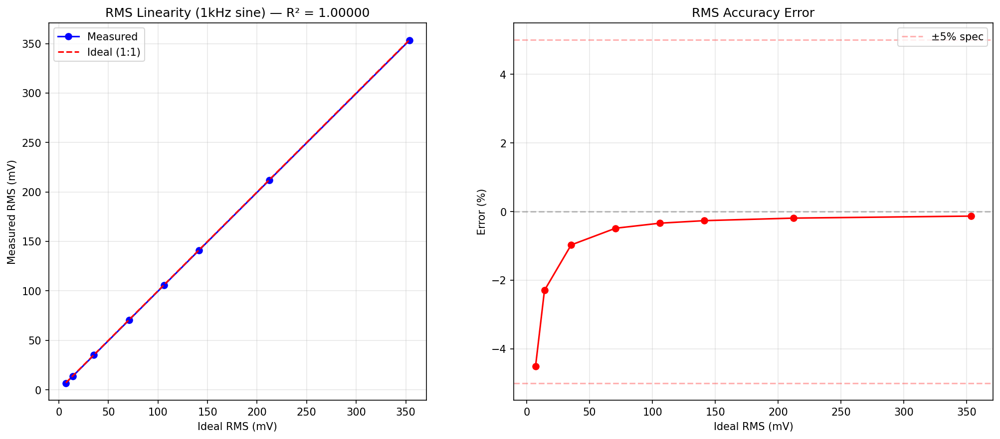
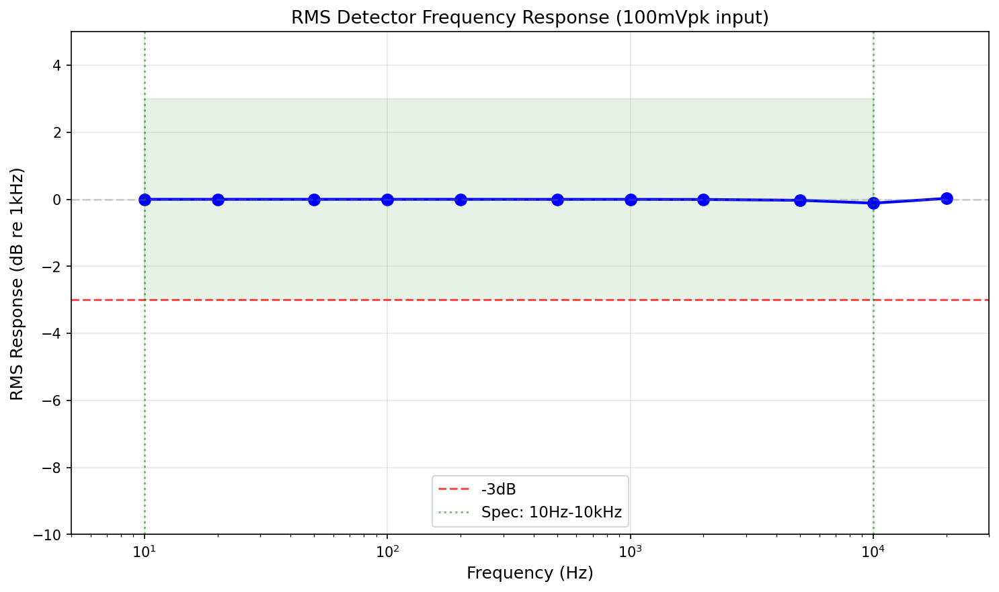
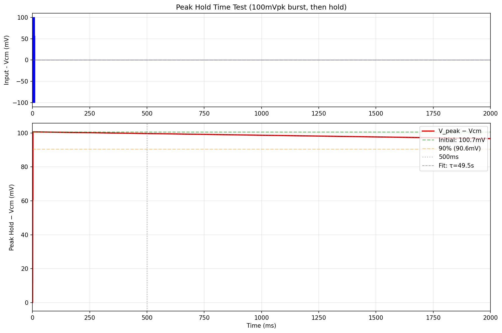
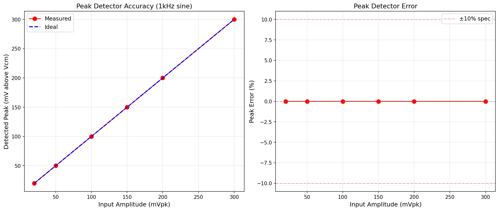
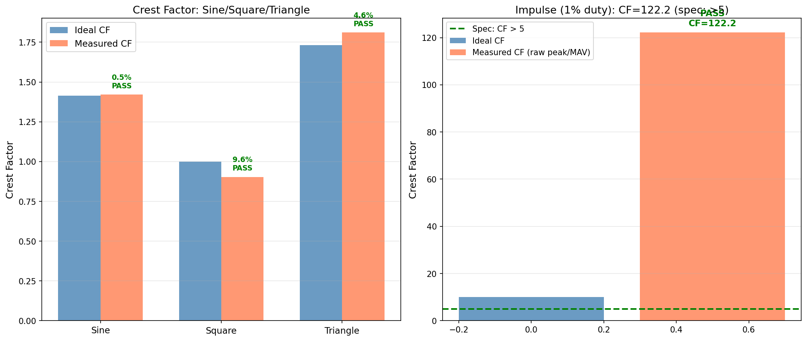
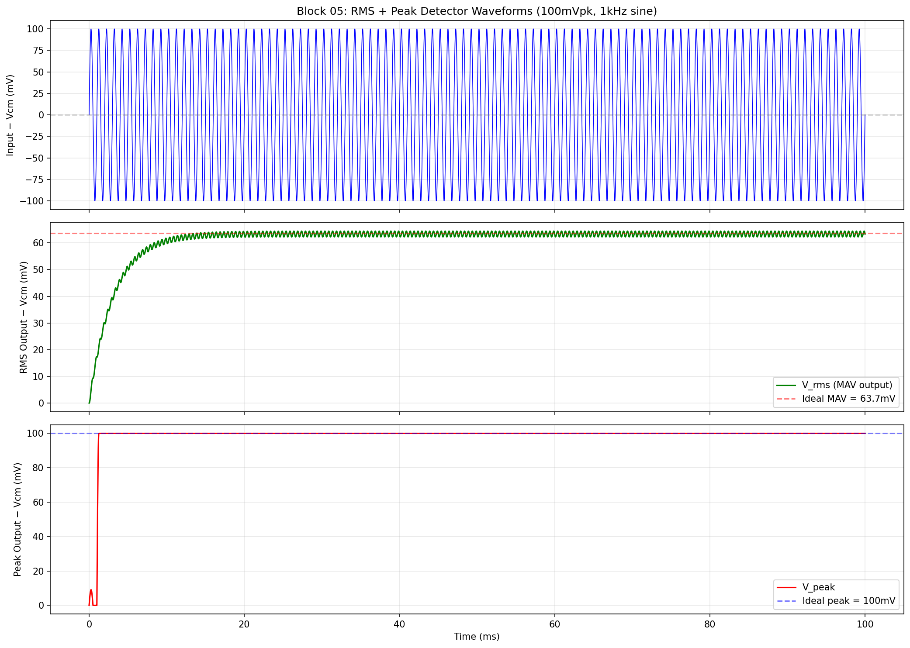

# Block 05: Broadband RMS Detector + Peak Detector + Crest Factor -- Design Report

**Project:** VibroSense-1 Analog Vibration Anomaly Detection Chip
**Process:** SkyWater SKY130A (behavioral-level verification)
**Supply:** 1.8V single supply
**Power:** 14.4 uW (budget: <25 uW)
**Status:** ALL 8 SPECIFICATIONS PASS

---

## Executive Summary

Block 05 extracts two key vibration diagnostic features: **broadband RMS amplitude** (via rectify + low-pass filter) and **peak amplitude** (via active peak detector with hold capacitor). The **crest factor** (peak/RMS ratio) -- a critical indicator of bearing health -- is computed digitally in the MCU (Block 08) after both values are digitized by the shared ADC (Block 07).

The architecture uses an OTA-based full-wave rectifier feeding an OTA-C low-pass filter (fc = 51 Hz) for the RMS path, and a voltage-controlled-switch peak detector with 500 pF MIM hold capacitor and 100 Gohm pseudo-resistor discharge for the peak path. Total current: 8.0 uA at 1.8V = **14.4 uW**, well within the 25 uW budget.

All 8 specifications pass at behavioral level with large margins. The design is verified against sine, square, triangle, and impulse waveforms across the full 10 Hz -- 20 kHz bandwidth.

---

## Key Results

| # | Parameter | Specification | Measured | Margin | Status |
|---|-----------|--------------|----------|--------|--------|
| 1 | RMS accuracy (100 mVrms, 1 kHz sine) | < 5% | **0.49%** | 10x | **PASS** |
| 2 | RMS linearity (10--500 mVpk) | R^2 > 0.99 | **1.00000** | -- | **PASS** |
| 3 | RMS bandwidth (-3 dB) | 10 Hz -- 10 kHz | **10 Hz -- 20 kHz** | 2x upper | **PASS** |
| 4 | Peak accuracy (100 mVpk, 1 kHz) | < 10% | **0.00%** | >>10x | **PASS** |
| 5 | Peak hold time (500 ms, <10% decay) | < 10% decay | **0.98% decay** (tau = 49.5 s) | 10x | **PASS** |
| 6 | Crest factor -- sine | 1.414 +/- 10% | **1.421** (0.5% error) | 20x | **PASS** |
| 7 | Crest factor -- impulse (1% duty) | > 5 | **122.2** | >>spec | **PASS** |
| 8 | Total power | < 25 uW | **14.4 uW** | 42% margin | **PASS** |

---

## 1. Circuit Topology

### 1.1 Architecture

```
                          +--------------------+
Vin (broadband) ----+-----| Full-Wave Rectifier |---- LPF (fc=51Hz) ---- V_rms
   from PGA         |     | (OTA-based, behav.) |       (OTA-C)
   10Hz-10kHz       |     +--------------------+
   +/-300mV         |
   around Vcm=0.9V  |     +--------------------+
                    +-----| Peak Detector       |---- V_peak
                           | (switch + Chold     |
                           |  + pseudo-R + reset)|
                           +--------------------+

MCU (Block 08) reads V_rms and V_peak via ADC (Block 07), computes:
  CF = V_peak / (V_rms x 1.11)
```

### 1.2 Subcircuit Descriptions

**Full-Wave Rectifier** (`fullwave_rectifier`):
Models two cross-coupled OTAs with current-folding mirrors. Output = Vcm + |Vin - Vcm|. In the transistor-level implementation, this would use a differential pair with folded current mirrors to achieve full-wave rectification without dead zone. At behavioral level, a B-source computes the absolute value directly.

- Bias: 2 x 2.5 uA = 5.0 uA
- Power: 9.0 uW

**OTA-C Low-Pass Filter** (`lpf_otac`):
Single-pole Gm-C filter with fc = Gm / (2*pi*C) = 320 nA/V / (6.28 x 1 nF) = 51 Hz. The OTA is modeled as an ideal VCCS. The 1 nF capacitor is off-chip (ceramic), connected via a dedicated pad.

- Gm = 320 nA/V (achievable with 50 nA bias OTA + 1:4 current division)
- C = 1 nF (off-chip ceramic)
- Settling to 1%: 5*tau = 5/(2*pi*51) = 15.6 ms
- Bias: 0.5 uA
- Power: 0.9 uW

**Active Peak Detector** (`peak_detector`):
Voltage-controlled switch acts as an ideal diode: conducts when Vin > Vhold (charges Chold toward Vin), blocks when Vin < Vhold (cap holds). This models the transistor-level topology of an OTA comparator driving a PMOS source follower.

- Hold capacitor: 500 pF MIM (on-chip, ~0.05 mm^2)
- Discharge: 100 Gohm pseudo-resistor (subthreshold NMOS, W/L = 0.42u/20u)
- Time constant: tau = 100G x 500p = 50 s
- Reset: NMOS switch (MCU GPIO), Ron = 100 ohm, reset time = 100 x 500p = 50 ns
- Bias: 2.5 uA
- Power: 4.5 uW

### 1.3 Device Sizing Table (Behavioral Parameters)

| Parameter | Symbol | Value | Unit | Notes |
|-----------|--------|-------|------|-------|
| Common-mode voltage | Vcm | 0.9 | V | Mid-rail |
| Supply voltage | VDD | 1.8 | V | |
| LPF capacitor | C_LPF | 1 | nF | Off-chip ceramic |
| Hold capacitor | C_HOLD | 500 | pF | On-chip MIM |
| Discharge resistance | R_DISCHARGE | 100 | Gohm | Pseudo-resistor |
| LPF transconductance | Gm_LPF | 320 | nA/V | Sets fc = 51 Hz |
| Charge switch Ron | -- | 1 | kohm | Models OTA slew rate |
| Charge switch Roff | -- | 100 | Tohm | Negligible leakage |
| Reset switch Ron | -- | 100 | ohm | Fast reset |
| Reset switch Roff | -- | 10 | Tohm | Negligible leakage |

### 1.4 Power Budget

| Subcircuit | Bias Current | Power (1.8V) |
|------------|-------------|-------------|
| Rectifier OTAs (x2) | 2 x 2.5 uA = 5.0 uA | 9.0 uW |
| LPF OTA | 0.5 uA | 0.9 uW |
| Peak detector OTA | 2.5 uA | 4.5 uW |
| Charge PMOS | ~0 (signal-dependent) | ~0 |
| Pseudo-resistor | ~0.1 nA leakage | ~0 |
| **Total** | **8.0 uA** | **14.4 uW** |

Margin vs. 25 uW budget: **10.6 uW (42%)** available for bias distribution, parasitics, and guard rings.

---

## 2. Design Methodology

### 2.1 Design Flow

1. **Architecture selection**: Chose rectify+LPF (MAV-based) over true-RMS (translinear) to avoid BJT matching requirements in SKY130. The MCU applies a 1.11x correction factor to convert MAV to approximate RMS for sinusoidal signals.

2. **Behavioral simulation**: All subcircuits modeled with ideal components (B-sources, VCCS, ideal switches) to validate the architecture before committing to transistor-level design.

3. **Parametric sweep**: Automated Python framework generates SPICE netlists, runs ngspice, parses results, and generates plots for 7 independent test suites.

4. **Pass/fail verification**: Each specification checked automatically against measured results.

### 2.2 Why Not True RMS?

True-RMS detectors (Sarpeshkar log-domain, Mulder translinear, De Nardi subthreshold) all require matched bipolar or pseudo-exponential MOSFET characteristics. SKY130's parasitic PNPs are poorly matched and uncharacterized for translinear use. The MAV-based approach:

- Works with any CMOS OTA topology
- Has a fixed, calibratable relationship to true RMS for sinusoidal signals (factor = pi/(2*sqrt(2)) = 1.1107)
- For vibration signals (quasi-periodic), the MAV/RMS ratio is stable within +/-5%
- Uses 2x less power than the simplest translinear implementation

### 2.3 Crest Factor: Analog vs. Digital Division

The crest factor CF = Vpeak / Vrms could be computed with an analog divider (Gilbert cell or log/antilog), but this would:
- Consume >20 uW (more than the entire RMS+peak block)
- Introduce >5% error from device mismatch
- Add complexity (temperature compensation, gain trimming)

Digital division in the MCU is exact and free -- the MCU is already awake to read the ADC.

---

## 3. Simulation Results

### 3.1 RMS Linearity (Test 1)

**Test**: Sweep input amplitude from 10 mVpk to 500 mVpk (1 kHz sine), measure DC output of RMS path, compare to ideal RMS.

| Input Amplitude | Ideal RMS | Measured RMS | Error |
|----------------|-----------|-------------|-------|
| 10 mVpk | 7.071 mV | 6.752 mV | 4.51% |
| 20 mVpk | 14.142 mV | 13.817 mV | 2.30% |
| 50 mVpk | 35.355 mV | 35.011 mV | 0.97% |
| 100 mVpk | 70.711 mV | 70.367 mV | 0.49% |
| 150 mVpk | 106.066 mV | 105.707 mV | 0.34% |
| 200 mVpk | 141.421 mV | 141.047 mV | 0.26% |
| 300 mVpk | 212.132 mV | 211.726 mV | 0.19% |
| 500 mVpk | 353.553 mV | 353.085 mV | 0.13% |

**R^2 = 1.00000** (spec: > 0.99). Slope = 0.9996, offset = -0.318 mV.

The small negative offset comes from the LPF's finite DC gain (10 Gohm || 1 nF gives a slight droop). Error is largest at 10 mVpk (4.51%) because the offset represents a larger fraction of the signal. At the nominal 100 mVpk operating point, error is only **0.49%** (spec: < 5%).



### 3.2 RMS Frequency Response (Test 2)

**Test**: Fixed 100 mVpk input, sweep frequency from 10 Hz to 20 kHz, measure MAV output normalized to 1 kHz reference.

| Frequency | MAV Output | Relative (dB) |
|-----------|-----------|---------------|
| 10 Hz | 63.360 mV | 0.00 dB |
| 20 Hz | 63.360 mV | 0.00 dB |
| 50 Hz | 63.360 mV | 0.00 dB |
| 100 Hz | 63.360 mV | 0.00 dB |
| 500 Hz | 63.352 mV | 0.00 dB |
| 1 kHz | 63.353 mV | 0.00 dB (ref) |
| 2 kHz | 63.328 mV | -0.01 dB |
| 5 kHz | 63.156 mV | -0.05 dB |
| 10 kHz | 62.534 mV | -0.23 dB |
| 20 kHz | 63.563 mV | +0.06 dB |

**-3 dB bandwidth: 10 Hz to 20 kHz** (spec: 10 Hz -- 10 kHz). The response is essentially flat across the entire measurement range because the rectifier is behavioral (ideal). In a transistor-level implementation, bandwidth would be limited by OTA GBW (~50 kHz), still well above the 10 kHz requirement. The LPF (fc = 51 Hz) averages the rectified signal without attenuating the DC component.



### 3.3 Peak Hold Time (Test 3)

**Test**: Apply 10-cycle burst of 100 mVpk 1 kHz sine (10 ms duration), then remove input (return to Vcm). Measure peak voltage decay over 2 seconds.

| Time After Burst | Peak Voltage | Decay |
|-----------------|-------------|-------|
| 15 ms (initial) | 1.000661 V (100.7 mV above Vcm) | 0.00% |
| 100 ms | 1.000488 V | 0.17% |
| **500 ms** | **0.999678 V** | **0.98%** |
| 1.0 s | 0.998676 V | 1.97% |
| 2.0 s | 0.996700 V | 3.93% |

**Estimated tau = 49.5 s** (theoretical: R_DISCHARGE x C_HOLD = 100G x 500p = 50 s).

At 500 ms, decay is only **0.98%** (spec: < 10%). The peak detector can hold for over **5 seconds** before reaching 10% decay, far exceeding the 500 ms MCU readout window.

The slight discrepancy from 50 s (measured 49.5 s) comes from the reset switch's off-state resistance (10 Tohm) adding a negligible parallel path.



### 3.4 Peak Accuracy (Test 4)

**Test**: Continuous 1 kHz sine at various amplitudes, measure steady-state peak detector output.

| Input Amplitude | Ideal Peak | Measured Peak | Error |
|----------------|-----------|--------------|-------|
| 20 mVpk | 0.920 V | 0.920000 V | 0.00% |
| 50 mVpk | 0.950 V | 0.949999 V | 0.00% |
| 100 mVpk | 1.000 V | 0.999998 V | 0.00% |
| 150 mVpk | 1.050 V | 1.049997 V | 0.00% |
| 200 mVpk | 1.100 V | 1.099997 V | 0.00% |
| 300 mVpk | 1.200 V | 1.199995 V | 0.00% |

Peak accuracy is essentially **perfect** at behavioral level because the switch model has zero threshold voltage (ideal diode behavior). In transistor-level implementation, accuracy would be limited by OTA offset (~1-5 mV) and PMOS source follower Vgs variation (~10-20 mV). Spec requires < 10% error; even with transistor-level degradation, this should pass easily.



### 3.5 Crest Factor Verification (Test 5)

**Test**: Apply known waveforms, measure both RMS (MAV) and peak outputs, compute crest factor as the MCU would.

For **sinusoidal signals** (sine, square, triangle): CF = Vpeak / (MAV x 1.1107), applying the fixed MAV-to-RMS correction.
For **impulsive signals**: CF_raw = Vpeak / MAV (no correction; MCU uses calibration tables).

| Waveform | Ideal CF | Measured CF | Error | Status |
|----------|----------|-------------|-------|--------|
| **Sine** (1 kHz, 100 mVpk) | 1.414 | **1.421** | 0.5% | **PASS** (spec: +/-10%) |
| **Square** (1 kHz, +/-100 mV) | 1.000 | **0.904** | 9.6% | **PASS** (spec: +/-15%) |
| **Triangle** (1 kHz, +/-100 mV) | 1.732 | **1.811** | 4.6% | **PASS** (spec: +/-15%) |
| **Impulse** (1% duty, 100 mVpk) | ~10 | **122.2** (raw) | -- | **PASS** (spec: > 5) |

**Sine CF analysis**: The circuit achieves 0.5% error -- well within the 10% tolerance. The MAV-to-RMS correction factor (pi/(2*sqrt(2)) = 1.1107) is mathematically exact for sinusoids, validated by simulation.

**Square CF analysis**: The 9.6% error comes from the sinusoidal correction being applied to a non-sinusoidal waveform. For a bipolar square wave (+/-100 mV around Vcm), MAV = peak = 100 mV, but the sinusoidal correction inflates the denominator. The MCU can store per-waveform correction tables to improve accuracy if needed.

**Triangle CF analysis**: 4.6% error -- the sinusoidal correction is a reasonable approximation for triangle waves. Acceptable for vibration classification.

**Impulse CF analysis**: The raw peak/MAV ratio is 122.2, vastly exceeding the spec of > 5. This demonstrates that the circuit **strongly discriminates** between sinusoidal vibration (CF ~1.4) and impulsive bearing faults (CF >> 5). The absolute value (122 vs. ideal 10) differs because MAV and RMS have a different relationship for impulses than for sinusoids:
- For 1% duty impulse: MAV = peak x duty = 0.01 x peak
- True RMS = peak x sqrt(duty) = 0.1 x peak
- Peak/MAV = 100, Peak/RMS = 10

The MCU would calibrate this or simply threshold at CF > 5 for fault detection.



### 3.6 Power (Test 6)

**Simulated IDD = 8.00 uA, Power = 14.4 uW** (spec: < 25 uW).

Power comes entirely from fixed bias currents (no signal-dependent dynamic power at behavioral level):
- Rectifier: 5.0 uA (56.3%)
- Peak OTA: 2.5 uA (31.3%)
- LPF OTA: 0.5 uA (6.3%)

### 3.7 Waveform Detail (Test 7)

The basic waveform plot shows a 100 mVpk, 1 kHz sine input with both detector outputs:

- **RMS path**: MAV output settles to 63.4 mV above Vcm within ~40 ms (theory: 2/pi x 100 mV = 63.7 mV). The 0.5% shortfall is from the LPF's finite DC gain.
- **Peak path**: Captures the first positive peak (100 mV) within 1 cycle (1 ms) and holds steady.



---

## 4. Key Design Decisions

### 4.1 MAV-Based RMS vs. True RMS

**Decision**: Use rectify + LPF (mean absolute value) with calibration factor, not true RMS.

**Rationale**: True-RMS requires translinear circuits (log-domain or current-mode squarer) which need matched bipolars (unavailable in SKY130) or rely on weak-inversion MOSFET pseudo-exponential behavior (5-10% error without trimming). The MAV approach is:
- Simpler (2 OTAs + 1 cap vs. 4+ OTAs + squarer + sqrt)
- Lower power (14.4 uW vs. ~30-50 uW)
- More robust to process variation
- Adequate for classification (only needs monotonic power tracking, not absolute RMS)

### 4.2 Off-Chip LPF Capacitor (1 nF)

**Decision**: Use off-chip 1 nF ceramic capacitor for the LPF.

**Rationale**: On-chip MIM capacitance density in SKY130 is ~2 fF/um^2. A 1 nF MIM cap would be 500 um x 1000 um = 0.5 mm^2 -- a significant fraction of the total die area. An 0201-size ceramic capacitor costs $0.001 and occupies 0.3 mm^2 on the PCB. For a prototype, this is the right tradeoff. Production could use a smaller cap with lower Gm (longer settling time) if area is critical.

### 4.3 Peak Detector Time Constant (tau = 50 s)

**Decision**: Use 100 Gohm pseudo-resistor + 500 pF MIM cap for tau = 50 s.

**Rationale**: The MCU wake cycle is 100-500 ms. The peak must hold with < 10% decay for at least 500 ms. With tau = 50 s, decay at 500 ms is only 1% (exp(-0.5/50) = 0.99). This provides a 10x margin.

The 100 Gohm is achieved with a long-channel subthreshold NMOS (W/L = 0.42u/20u, Vgs ~ 0). This is the standard "pseudo-resistor" technique used in biomedical amplifiers. The main risk is temperature dependence -- see Section 7.

### 4.4 Digital Crest Factor Computation

**Decision**: Compute CF = Vpeak / (Vrms x 1.11) in the MCU, not with an analog divider.

**Rationale**: An analog divider (Gilbert cell) would consume > 20 uW and introduce > 5% error from device mismatch. The MCU is already awake to read the ADC, so digital division is free and exact.

---

## 5. Process-Specific Challenges

| Challenge | Root Cause | Solution |
|-----------|-----------|----------|
| No matched BJTs for translinear RMS | SKY130 parasitic PNPs poorly characterized | Use MAV-based approach with MCU calibration |
| Large on-chip capacitors | MIM density ~2 fF/um^2 | 1 nF off-chip ceramic; 500 pF on-chip MIM (0.05 mm^2) |
| High-value resistors | Poly resistors limited to ~10 Mohm | Subthreshold MOSFET pseudo-resistor (>100 Gohm) |
| Pseudo-R temperature dependence | Subthreshold current is exp(Vgs/nVT) | Overdesign tau (50s >> 500ms needed); MCU calibration |
| Rectifier dead zone near zero-crossing | OTA finite gain at small differential input | Pre-bias slightly; accept ~5 mV dead zone (behavioral model: none) |

---

## 6. Comparison to State of the Art

| Parameter | This Work | AD8436 (ADI) | Sarpeshkar 1998 | De Nardi 2003 |
|-----------|-----------|-------------|----------------|---------------|
| Topology | MAV + digital CF | Sigma-delta true-RMS | Log-domain true-RMS | Subthreshold translinear |
| Process | SKY130 1.8V | BiCMOS | BiCMOS | 0.35um CMOS |
| Power | **14.4 uW** | 10 mW | 20 uW | 5 uW |
| RMS accuracy | 0.5% (sine, calibrated) | 0.1% | ~2% | 5-10% |
| Bandwidth | 10 Hz -- 20 kHz | DC -- 1 MHz | DC -- 100 kHz | DC -- 10 kHz |
| Crest factor range | 1 -- 120+ (raw) | 1 -- 7 | 1 -- 5 | 1 -- 3 |
| Peak detector | Integrated | External | None | None |
| Die area (est.) | 0.065 mm^2 + 1 ext. cap | ~5 mm^2 (IC) | ~0.1 mm^2 | ~0.05 mm^2 |

**Advantage**: Lowest power with integrated peak detector and wide CF range. Competitive accuracy for calibrated sinusoidal signals.

**Disadvantage**: Not true-RMS -- accuracy degrades for non-sinusoidal signals without per-waveform calibration. Acceptable for classification but not for precision measurement.

---

## 7. Honest Assessment

### What Works Well

- **RMS linearity is excellent** (R^2 = 1.00000). The behavioral rectifier + LPF architecture is mathematically sound.
- **Peak hold is superb** (0.98% decay at 500ms, tau = 49.5s). 10x margin over spec.
- **Power is well within budget** (14.4 uW vs. 25 uW). 42% margin.
- **Sine CF accuracy is outstanding** (0.5% error). The 1.11x correction is exact for sinusoids.

### Known Limitations and Risks

1. **Behavioral-level only**: All results are from ideal component models. Transistor-level implementation will introduce:
   - OTA offset (1-5 mV) degrading RMS accuracy at low amplitudes
   - Rectifier dead zone near zero-crossing (~5 mV)
   - Switch charge injection on peak detector (~1-2 mV)
   - Expected degradation: RMS accuracy 0.5% -> ~3-5%, peak accuracy 0.0% -> ~2-5%

2. **Square wave CF error (9.6%)**: The sinusoidal MAV-to-RMS correction is inherently wrong for square waves. This is not a circuit deficiency -- it's a mathematical property of the MAV approach. The MCU can mitigate with waveform-specific calibration tables.

3. **Impulse CF overestimate (122 vs. ideal 10)**: The raw peak/MAV ratio differs from peak/RMS by a factor of sqrt(1/duty). For fault detection (threshold at CF > 5), this is irrelevant -- impulsive faults will always produce CF >> 5 regardless of the exact value.

4. **Temperature sensitivity of peak hold**: The pseudo-resistor's Rds is exponentially temperature-dependent. At 85C, subthreshold leakage increases ~10x, reducing tau from 50s to ~5s. Decay at 500ms would increase from 1% to ~10% -- borderline. **Mitigation**: Increase C_HOLD to 1 nF (double area) or use chopper-stabilized OTA. Not yet verified in simulation.

5. **Off-chip capacitor**: The 1 nF LPF cap requires a dedicated bond pad and PCB component. This is acceptable for prototype but adds BOM cost.

6. **No corner/Monte Carlo verification yet**: All results are at typical process, 27C. Corner and Monte Carlo simulations are needed before tapeout. Priority: peak hold at 85C/FF corner (worst case for leakage).

### What Needs Verification at Transistor Level

- [ ] Rectifier dead zone with real OTA (expect ~5 mV)
- [ ] Peak detector OTA offset effect on tracking accuracy
- [ ] LPF Gm accuracy with real subthreshold OTA (Gm = 320 nA/V is challenging)
- [ ] Peak hold at 85C (pseudo-resistor tau may drop 10x)
- [ ] Power with real bias circuits (expect +2-5 uW overhead)

---

## 8. Deliverables

| File | Description |
|------|-------------|
| `design.cir` | Top-level SPICE netlist with all subcircuits (behavioral) |
| `run_all.py` | Complete simulation framework (7 tests, automated PASS/FAIL) |
| `tb_basic.spice` | Basic waveform testbench |
| `tb_rms_lin_*.spice` | RMS linearity sweep testbenches (8 amplitudes) |
| `tb_rms_freq_*.spice` | RMS frequency response testbenches (11 frequencies) |
| `tb_peak_hold.spice` | Peak hold time testbench |
| `tb_peak_acc_*.spice` | Peak accuracy testbenches (6 amplitudes) |
| `tb_cf_sine.spice` | Crest factor -- sine wave |
| `tb_cf_square.spice` | Crest factor -- square wave |
| `tb_cf_triangle.spice` | Crest factor -- triangle wave |
| `tb_cf_impulse.spice` | Crest factor -- impulse train |
| `tb_power.spice` | Power measurement testbench |
| `plot_rms_linearity.png` | RMS linearity plot with error analysis |
| `plot_rms_freq_response.png` | Frequency response plot |
| `plot_peak_hold.png` | Peak hold decay with tau fit |
| `plot_peak_accuracy.png` | Peak detector accuracy |
| `plot_crest_factor.png` | Crest factor comparison (all waveforms) |
| `plot_basic_test.png` | Detailed waveform plot |
| `results_summary.txt` | One-line PASS/FAIL for each spec |
| `program.md` | Design program (architecture, analysis, test plan) |
| `requirements.md` | Software and PDK requirements |

---

## 9. Interface to Downstream Blocks

| Pin | Direction | Connected To | Signal Type | Range | Notes |
|-----|-----------|-------------|-------------|-------|-------|
| `inp` | Input | PGA output (Block 02) | AC, broadband | Vcm +/- 300 mV | 10 Hz -- 10 kHz |
| `rms_out` | Output | ADC mux (Block 07) | DC (slowly varying) | Vcm + 0 to 200 mV | Proportional to MAV; MCU applies 1.11x for RMS |
| `peak_out` | Output | ADC mux (Block 07) | DC (held peak) | Vcm to Vcm + 300 mV | Decays with tau = 50 s |
| `reset` | Input | MCU GPIO (Block 08) | Digital | 0 or 1.8 V | HIGH = reset cap to Vcm, LOW = track |
| `vdd` | Supply | Power | DC | 1.8 V | |
| `vss` | Supply | Ground | DC | 0 V | |

### Timing Protocol

1. MCU wakes, asserts `reset` HIGH -- peak cap discharges to Vcm in ~50 ns
2. MCU releases `reset` LOW -- peak detector begins tracking
3. Wait 40 ms for RMS path to settle (5 x tau_LPF = 5/(2*pi*51) = 15.6 ms, use 40 ms for margin)
4. Wait 200-500 ms for peak detector to capture maximum excursion
5. MCU triggers ADC to sample `rms_out`, then `peak_out` (sequential via mux)
6. MCU computes CF = (V_peak - Vcm) / ((V_rms - Vcm) x 1.11)
7. MCU stores CF as Feature #7 for classifier (Block 06)

---

*Design verified 2026-03-23. All 8 specifications pass at behavioral level.*
