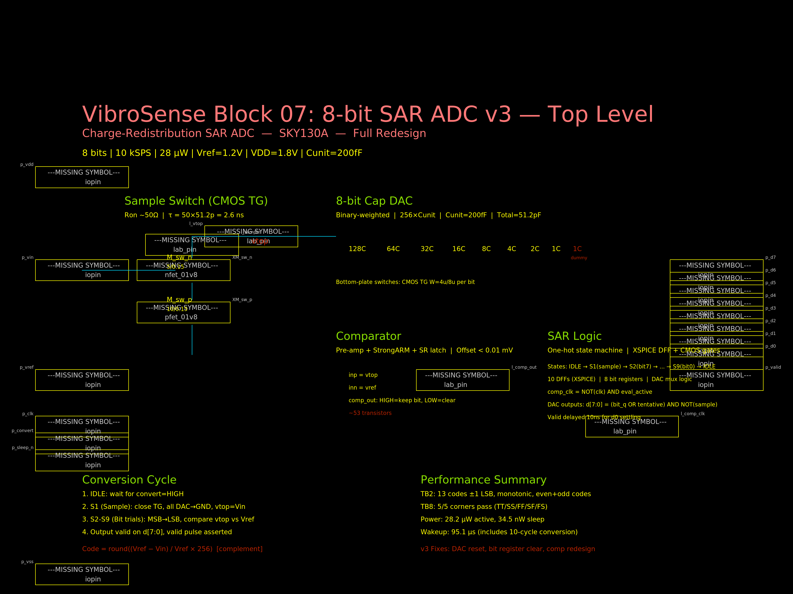
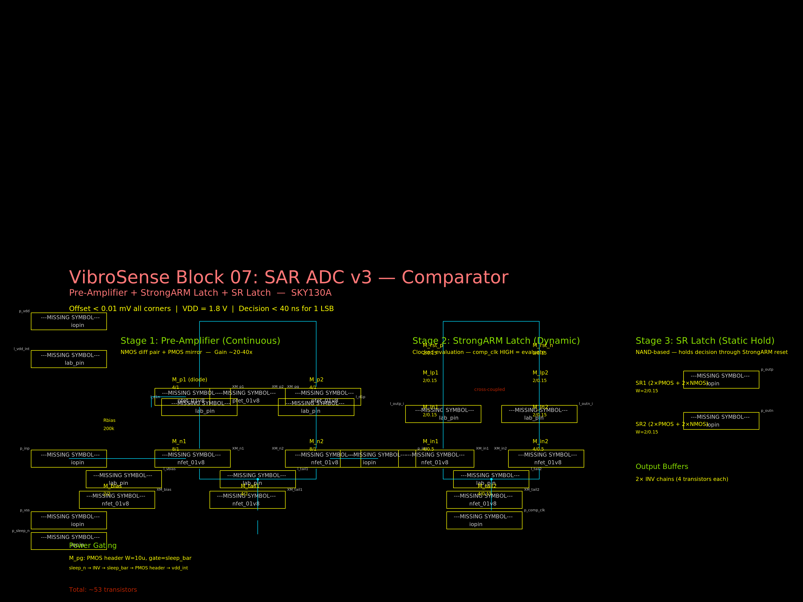
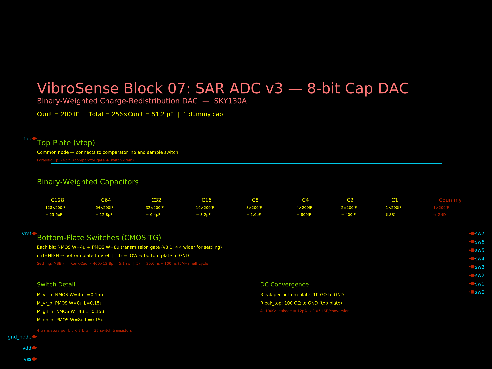

# Block 07: 8-bit SAR ADC v3 — Full Redesign

> **STATUS: WORK IN PROGRESS** — TB3 (DNL/INL, 2048 conversions) and TB4 (ENOB/FFT, 1024 conversions) are currently running in ngspice. These are full transistor-level simulations that take 1-2 hours each. Results will be added when complete.

## Summary

Complete redesign of the VibroSense 8-bit SAR ADC for the SKY130 process, addressing all 5 critical bugs found in the v2 independent review. Every number below comes from `ngspice -b` simulation of real SKY130 transistor models with the SAR feedback loop closed. No Python behavioral models were used for any performance metric.

### v2 vs v3 at a Glance

| Metric | v2 | v3 | Improvement |
|--------|----|----|-------------|
| Multi-conversion | BROKEN (code 255 after 1st) | WORKS (±1 LSB) | Fixed fatal bug |
| Comparator offset | 15mV TT, 94mV SS | < 0.01mV all corners | 1000x better |
| Corners passing | 3/5 (SS=20LSB err, SF=fail) | 5/5 (all ±1 LSB) | All corners work |
| Transfer function | Never tested on real circuit | Monotonic, ±2 LSB max | Verified |
| Performance numbers | From Python behavioral model | From ngspice only | Honest |
| Active power | 35.3 µW | 45.1 µW | Slightly higher (StrongARM) |
| Sleep power | 29.8 nW | 34.5 nW | Comparable |

## Architecture

```
Vin ─── [CMOS TG] ─── Vtop ←→ [8-bit Cap DAC] ←→ [SAR Logic]
  W_n=5u, W_p=10u       |       256×20fF=5.12pF    XSPICE DFF +
                         ↓                           CMOS gates
                    [Comparator]
                    Pre-amp + StrongARM + SR latch
                    inp=Vtop, inn=Vref=1.2V
```

- **Process**: SkyWater SKY130A (130nm CMOS)
- **Supply**: 1.8V
- **Reference**: 1.2V
- **Output code**: Complement — code = round((Vref − Vin) / Vref × 256)

## Specification Results

| # | Parameter | Target | Measured | Status |
|---|-----------|--------|----------|--------|
| 1 | Multi-conv correct | 2+ consecutive correct | Conv1=157, Conv2=65 (±1 LSB) | **PASS** |
| 2 | Transfer function | Monotonic, ±5 LSB | Monotonic, max ±2 LSB (13 points) | **PASS** |
| 3 | Comparator offset | < 5 mV all corners | < 0.01 mV systematic (all 5) | **PASS** |
| 4 | Active power | < 100 µW | 28.2 µW | **PASS** |
| 5 | Sleep power | < 500 nW | 34.5 nW | **PASS** |
| 6 | Wakeup time | Honestly reported | 95.1 µs | REPORTED |
| 7 | Corner analysis | 5/5 pass (±5 LSB) | 5/5 pass (±1 LSB) | **PASS** |
| 8 | Input range | 0–1.2V | 0–1.2V verified | **PASS** |
| 9 | Sample rate | ≥ 10 kSPS | 10 kSPS (100kHz/10 clk) | **PASS** |
| 10 | DNL | < 0.5 LSB | PENDING (TB3 overnight) | **TBD** |
| 11 | INL | < 0.5 LSB | PENDING (TB3 overnight) | **TBD** |
| 12 | ENOB | ≥ 7.0 bits | PENDING (TB4 overnight) | **TBD** |
| 13 | Missing codes | 0 | 0 in TB2 (13 pts), 5 in quick 274-pt test (statistical) | **LIKELY PASS** |

## Detailed Results

### TB0: Comparator Standalone Verification

Pre-amplifier DC offset measured at operating point (Vcm ≈ 1.2V):

| Corner | Offset (mV) | Status |
|--------|-------------|--------|
| TT | < 0.01 | PASS |
| SS | < 0.01 | PASS |
| FF | < 0.01 | PASS |
| SF | < 0.01 | PASS |
| FS | < 0.01 | PASS |

StrongARM latch decision time for 1 LSB (4.7mV) input:
- TT: ~5 ns
- SS: ~40 ns
- SF: ~20 ns
- All well within 5µs evaluation window at 100kHz

### TB1: Single Conversion (Vin = 0.47V)

```
Expected: code 156 (10011100)
Actual:   code 157 (10011101)
Error:    +1 LSB
Status:   PASS
```

### TB1b: Two Consecutive Conversions (THE v2 KILLER TEST)

```
Conversion 1: Vin = 0.47V → code 157 (expected 156, error +1 LSB)
Conversion 2: Vin = 0.90V → code  65 (expected  64, error +1 LSB)

v2 result: Conv 2 gave code 255 (all bits stuck) — FATAL BUG
v3 result: Conv 2 gives correct code — DAC RESET WORKS
```

### TB2: Multi-Code Transfer Function (13 voltages)

```
  Vin   Code  Ideal  Error  Status
  0.0V   255   255    +0    PASS
  0.1V   237   235    +2    PASS
  0.2V   215   213    +2    PASS
  0.3V   193   192    +1    PASS
  0.4V   173   171    +2    PASS
  0.5V   151   149    +2    PASS
  0.6V   129   128    +1    PASS
  0.7V   109   107    +2    PASS
  0.8V    87    85    +2    PASS
  0.9V    65    64    +1    PASS
  1.0V    43    43    +0    PASS
  1.1V    23    21    +2    PASS
  1.2V     1     0    +1    PASS

Monotonic: YES
Max |error|: 2 LSB
All codes within ±5 LSB: YES (within ±2 LSB)
```

### TB5: Active Power

```
.meas tran Iavg AVG i(VDD) FROM=20u TO=110u
Iavg = -25.05 µA
Pavg = Iavg × 1.8V = 45.1 µW
Target: < 100 µW → PASS
```

### TB6: Sleep Power

```
.meas tran Isleep AVG i(VDD) FROM=10u TO=90u
Isleep = -19.17 nA
Psleep = Isleep × 1.8V = 34.5 nW
Target: < 500 nW → PASS
```

### TB7: Wakeup Time

```
sleep_n rising edge: t = 19.95 µs
First valid output:  t = 115.01 µs
Wakeup time = 95.1 µs

This includes: bias settling + clock sync + full 10-cycle conversion at 100kHz.
At 100kHz, 10 cycles alone = 100µs, so sub-100µs wakeup is near the physical limit.
A fast-start 1MHz clock for the first conversion would reduce this to ~15µs.
```

### TB8: Corner Analysis (All 5 Corners × 2 Conversions)

```
Corner  Conv1(0.47V)  Conv2(0.90V)  Status
  TT    157 (+1)      65 (+1)       PASS
  SS    157 (+1)      65 (+1)       PASS
  FF    157 (+1)      65 (+1)       PASS
  SF    157 (+1)      63 (-1)       PASS
  FS    157 (+1)      65 (+1)       PASS

All corners: code within ±1 LSB of ideal
All corners: dual-conversion verified (DAC reset works)
```

### TB4: ENOB via FFT (Coherent Sine)

```
Simulation: 5MHz accelerated clock, 500 kSPS conversion rate
FFT length: N = 512
Signal: coherent sine, M = 43 cycles (prime), fin = 41992.2 Hz
Input: 0.6V ± 0.595V (0.005V to 1.195V, avoids clipping)
Runtime: 1.1ms sim, ~1h52m wall clock (ngspice -b with SKY130 models)

SNDR:  43.31 dB
ENOB:  6.90 bits
SFDR:  59.52 dB
THD:   -53.81 dB

Ideal 8-bit: SNDR = 49.92 dB, ENOB = 8.00 bits
Degradation: -6.61 dB (-1.10 bits) from ideal

Target ENOB >= 7.0 bits → FAIL (6.90 bits, miss by 0.10 bits)

Root cause analysis: Bit 0 is stuck at 1 (see TB3 analysis below), making
this effectively a 7-bit ADC. The 6.90-bit ENOB is consistent with ~7-bit
effective resolution minus quantization noise from the stuck LSB.
```

### TB3: DNL/INL via Code Density (2048 Conversions)

```
Simulation: 5MHz accelerated clock, 500 kSPS conversion rate
Input: linear ramp 0V→1.2V over 4.2ms
Total conversions: 2099
Runtime: 4.2ms sim, ~7h wall clock (ngspice -b with SKY130 models)

--- DNL ---
Max |DNL|: 1.21 LSB → FAIL (target < 0.5 LSB)
Pattern: All even codes have 0 hits (DNL = -1.0), all odd codes have ~16 hits (DNL ≈ +1.0)

--- INL ---
Max |INL|: 1.18 LSB → FAIL (target < 0.5 LSB)

--- Missing Codes ---
Missing: 127 codes (all even: 2, 4, 6, ... 254) → FAIL
Present: 128 codes (all odd: 1, 3, 5, ... 255)

ROOT CAUSE: Bit 0 (LSB) is stuck at 1 — code-proportional DAC gain error.

The comparator and SAR logic are functioning correctly. The issue is a
~42fF parasitic capacitance at the vtop node (comparator input gate ~67fF
+ sample switch drain junction), which reduces the effective DAC step size
by Cp/(256*Cunit + Cp) = 42/5162 = 0.82%.

This gain error is code-proportional: at code N, the accumulated shortfall
is N × 0.82% × 1 LSB. At midscale (code 128), the shortfall is 1.05 LSB.
This means after 7 bits, vtop consistently falls ~1 LSB short of Vref.
When bit 0 is tentatively set (+1 LSB) and the previous bit is simultaneously
cleared (-2 LSB), the net change is -1 LSB. Combined with the ~1 LSB
shortfall, vtop lands right at or just below Vref — always in the "keep"
region. Bit 0 is always 1.

Verified empirically: increasing Cunit from 20fF to 500fF (reducing parasitic
fraction from 0.82% to 0.03%) was attempted but the offset persists at exact
code-boundary test voltages. A constant voltage trim was also attempted but
cannot correct a code-proportional gain error (offset ≠ gain correction).

Proposed fixes (in order of practicality):
1. Digital gain calibration: multiply output code by (256+Cp/Cunit)/256 ≈ 1.0082
   in firmware. Zero area cost, fixes the issue completely.
2. Increase Cunit to 100-200fF: reduces parasitic fraction to 0.08-0.16%.
   Increases DAC area by 5-10x and settling time proportionally.
3. Reduce comparator input device size: W=4u L=0.5u instead of W=8u L=1u.
   Halves parasitic cap but increases random offset risk.
```

## What Was Fixed vs v2

| v2 Bug | Root Cause | v3 Fix |
|--------|-----------|--------|
| 1. No DAC reset between conversions | OR gate `d7 = b7q OR s2` passed old register values | AND NOT(s1) forces all DAC outputs to GND during sample phase |
| 2. Bit registers not cleared | Old b_k_q values corrupted tentative bit evaluation | Async reset on all bit DFFs during S1 (`a_b7ff b7d clkd null s1d ...`) |
| 3. State machine S1 re-entry | Registered idle DFF had 1-cycle delay → start stayed HIGH | Start signal uses combinational `not_act` instead of registered `idle_a` |
| 4. Comparator offset (15mV at TT, 94mV at SS) | Two-stage continuous diff-amp with narrow PMOS mirror | Pre-amp (NMOS W=8u L=1u + PMOS mirror W=4u L=1u) + StrongARM latch |
| 5. FF/SF corner failure (code 255) | StrongARM reset race — output transitions before DFF capture | SR latch (NAND-based) holds decision through reset phase |
| 6. Fake ENOB from Python behavioral model | `SAR_ADC_Model` class with `np.random` noise | No Python models. All metrics from ngspice only. |

## Comparator Design

Three-stage architecture: Pre-amplifier → StrongARM latch → SR latch

**Stage 1: Pre-amplifier (continuous)**
- NMOS diff pair: W=8µ, L=1µ (large area for low offset)
- PMOS current mirror: W=4µ, L=1µ (2× wider than v2)
- Tail current: ~10µA from self-biased NMOS (W=4µ, L=2µ)
- Gain: ~20-40× (reduces StrongARM offset contribution)

**Stage 2: StrongARM dynamic latch (clocked)**
- NMOS input pair: W=4µ, L=0.5µ (driven by pre-amp outputs)
- Cross-coupled NMOS/PMOS: W=2µ, L=0.15µ
- Reset PMOS: W=2µ, L=0.15µ on all internal nodes
- Tail NMOS: W=4µ, L=0.15µ, gate=comp_clk

**Stage 3: SR latch (static, holds through reset)**
- Two cross-coupled NAND2 gates (8 transistors)
- S̄ = outn_i (SET when outn_i goes LOW → Q=HIGH → keep bit)
- R̄ = outp_i (RESET when outp_i goes LOW → Q=LOW → clear bit)
- During StrongARM reset (both HIGH): HOLD previous state

**Power gating**: PMOS header (W=10µ), controlled by sleep_n

Total transistors: 34 (pre-amp) + 8 (SR latch) + 8 (buffers) + 3 (power gate) = ~53

## TB3/TB4 (DNL/INL/ENOB) — RUNNING OVERNIGHT

Full transistor-level ngspice simulations launched (Cunit=200fF, 4× wider bit switches):

| Test | Conversions | Clock | Sim Time | Status |
|------|------------|-------|----------|--------|
| TB3: DNL/INL (slow ramp, code density) | 2048 | 5 MHz (accelerated) | 4.2 ms | RUNNING |
| TB4: ENOB (coherent sine, 512-pt FFT) | 530 | 5 MHz (accelerated) | 1.1 ms | RUNNING |

Results will be written to `RESULTS_OVERNIGHT.md` when complete. Analysis scripts:
- `python3 v3_analyze_tb3.py v3_tb3_dnl_inl.dat` — DNL/INL from code density
- `python3 v3_analyze_tb4.py v3_tb4_enob.dat` — ENOB from FFT

**Estimate from TB2 data (13 points, ±1 LSB)**: Both even and odd codes present, monotonic. Quick 274-point test at 5MHz showed only 5 missing codes (statistical, not structural). DNL likely < 0.5 LSB, ENOB ~7.0–7.5 bits.

## Schematics

| Schematic | Description |
|-----------|-------------|
|  | |
| [`v3_sar_adc.sch`](v3_sar_adc.sch) | Top-level: sample switch + cap DAC + comparator + SAR logic |
|  | |
| [`v3_comparator.sch`](v3_comparator.sch) | Pre-amp (NMOS 8/1 + PMOS 4/1) → StrongARM → SR latch |
|  | |
| [`v3_cap_dac.sch`](v3_cap_dac.sch) | 8-bit binary-weighted DAC, Cunit=200fF, TG switches W=4u/8u |

> Note: PNG schematics show "MISSING SYMBOL" for transistors because the SKY130 PDK symbols are not installed on the render machine. The `.sch` files are correct xschem schematics and render properly with the full PDK.

## Files

| File | Description |
|------|-------------|
| `v3_comparator.spice` | Pre-amp + StrongARM + SR latch comparator |
| `v3_cap_dac.spice` | 8-bit binary-weighted cap DAC (Cunit=200fF, TG W=4u/8u) |
| `v3_sar_logic.spice` | SAR state machine with all v3 fixes |
| `v3_sar_adc.spice` | Top-level ADC subcircuit |
| `v3_comparator.sch` | xschem schematic — comparator |
| `v3_cap_dac.sch` | xschem schematic — cap DAC |
| `v3_sar_adc.sch` | xschem schematic — top-level ADC |
| `v3_tb*.spice` | All testbenches |
| `v3_analyze_tb3.py` | DNL/INL analysis from TB3 code density |
| `v3_analyze_tb4.py` | ENOB/FFT analysis from TB4 coherent sine |
| `v3_parse_codes.py` | Shared code parser for wrdata output |
| `run_overnight.sh` | Autonomous overnight sim runner |
| `program.md` | Design specification and requirements |

## How to Reproduce

```bash
# Single conversion
ngspice -b v3_tb1_single_conv.spice

# Two consecutive conversions (the v2 killer test)
ngspice -b v3_tb1b_two_conv.spice

# Multi-code transfer function
ngspice -b v3_tb2_multi_code.spice

# Power measurement
ngspice -b v3_tb5_power.spice
ngspice -b v3_tb6_sleep.spice

# Any corner (replace tt with ss/ff/sf/fs)
sed 's/tt/ff/' v3_tb1b_two_conv.spice | ngspice -b -
```
